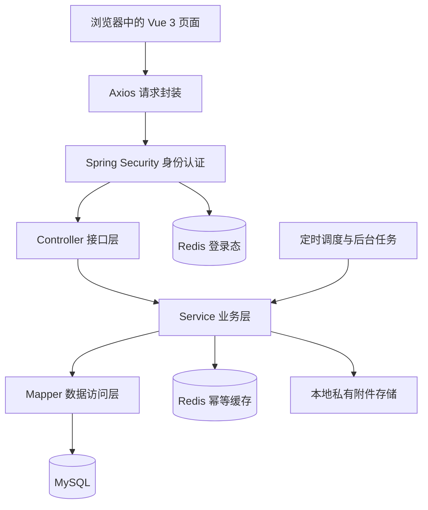

# 实验室安全与设备管理系统项目答辩完整讲解

整理日期：2026 年 9 月 6 日  
项目目录：`C:\Code\blackhorse`  
用途：理解项目、准备答辩讲稿、梳理实现细节、安排演示和复习常见问答。

> 本文根据当前项目代码和已核对的实现整理。需求池中的候选功能不等于已实现功能，代码存在也不等于已完成全量验收。此次整理没有重新运行全量测试或压测，性能和测试成绩应以对应环境下的实际报告为准。

项目可以概括为：

> 这是一个基于若依框架扩展的实验室安全与设备管理系统，围绕设备预约、领用归还、维修验收和安全巡检整改，实现多角色协作，并通过事务、并发控制、权限校验和业务追溯保证流程正确。

准备答辩时，重点掌握四个问题：为什么做这个系统、业务怎样流转、代码怎样实现、为什么采用这些设计。

## 阅读目录

1. [项目解决什么问题](#section-01)
2. [用户角色和职责](#section-02)
3. [三条主要业务流程](#section-03)
4. [整体架构与技术栈](#section-04)
5. [代码目录与分层职责](#section-05)
6. [一次预约请求的完整执行过程](#section-06)
7. [预约时间冲突的判断方法](#section-07)
8. [多人并发预约的控制机制](#section-08)
9. [幂等、事务和版本号的区别](#section-09)
10. [安全资格的校验实现](#section-10)
11. [预约状态、领用和归还](#section-11)
12. [维修、巡检和隐患整改](#section-12)
13. [登录认证与数据权限](#section-13)
14. [数据库模型和设计理由](#section-14)
15. [状态历史与可恢复通知](#section-15)
16. [异步导入导出任务中心](#section-16)
17. [其他扩展功能](#section-17)
18. [前端、附件与本地部署](#section-18)
19. [若依复用与项目业务扩展的边界](#section-19)
20. [答辩演示顺序](#section-20)
21. [常见追问和回答要点](#section-21)
22. [可直接使用的答辩开场](#section-22)
23. [源码速查索引](#section-23)

<a id="section-01"></a>

## 一、项目解决什么问题

高校实验室管理涉及几个相互关联的问题：

- 设备档案分散，不容易知道设备属于哪个实验室、由谁负责、当前能否使用。
- 多人申请同一台设备，可能发生时间冲突。
- 学生使用设备前，需要具备相应的安全准入资格。
- 设备借出、归还、故障和维修，需要保留连续记录。
- 安全检查发现的问题，需要有人整改、有人复查，最终确认解决。
- 不同实验室和不同岗位，应该只能处理自己权限范围内的数据。

项目把这些事情放进同一个系统。例如，学生申请使用某台设备时，系统同时检查设备状态、预约冲突、安全资格、重大隐患和维护安排。即使预约已经批准，实际领用时仍然要重新检查相关条件。

项目的业务价值是：**设备管理和安全管理之间存在实际约束关系。**

答辩时可以这样介绍背景：

> 本项目面向高校实验室设备共享和安全管理场景，将设备档案、资格准入、预约审批、领用归还、故障维修以及巡检整改进行关联，减少人工登记造成的信息断层，并明确不同角色的操作权限和处理责任。

<a id="section-02"></a>

## 二、用户角色和职责

系统主要围绕五类角色组织功能。

| 角色 | 主要操作 | 业务范围 |
|---|---|---|
| 学生 | 查看设备与资格、申请预约、取消本人预约、查看使用记录、提交故障、参与候补和申诉 | 本人业务及允许查询的资源 |
| 实验室管理员 | 管理设备和实验室、维护资格、审批预约、办理领还、分派和验收维修 | 所管理的实验室和设备 |
| 安全员 | 制定巡检计划、执行检查、登记隐患、安排整改、复查销号 | 授权范围内的安全业务 |
| 维修人员 | 接收工单、开始维修、提交维修结果 | 分派给本人的维修任务及必要关联信息 |
| 系统管理员 | 管理用户、角色、部门、菜单、字典和系统参数等 | 系统管理功能 |

具体能够执行哪些操作，还受角色配置、接口权限和数据范围影响。内置超级管理员有特殊权限，演示普通角色的数据隔离时，应使用对应的普通账号。

项目还有几条职责分离规则：

- 申请人不能审批自己的预约。
- 代学生提交预约的人，也不能审批这条代办预约。
- 维修人员不能验收自己的维修结果。
- 整改提交人不能复查自己提交的整改。

这些规则直接体现了业务分析。角色并不只是决定菜单颜色或页面入口，还决定业务处理责任。

<a id="section-03"></a>

## 三、三条主要业务流程

### 3.1 设备使用流程

```text
维护实验室和设备
        ↓
录入学生安全资格
        ↓
学生提交预约
        ↓
系统校验资格、状态、规则和时间冲突
        ↓
管理员审批
        ↓
管理员办理领用
        ↓
管理员办理归还
```

### 3.2 维修流程

```text
主动报修或异常归还
        ↓
形成维修工单
        ↓
管理员分派维修人员
        ↓
维修人员开始维修
        ↓
提交维修结果
        ↓
管理员验收
        ↓
验收通过后检查设备恢复条件
```

### 3.3 安全管理流程

```text
制定巡检计划
        ↓
生成巡检任务
        ↓
逐项检查
        ↓
登记隐患
        ↓
责任人整改
        ↓
提交复查
        ↓
复查通过后销号
```

三条流程之间会互相影响。异常归还会进入维修流程；未销号的重大隐患会阻止相关预约和领用；维修验收完成后，仍需检查是否存在其他阻断设备恢复的原因。

老师如果问“什么叫闭环”，可以回答：

> 每个业务都有明确的发起、处理、确认和结束环节，并保留状态变化记录。例如隐患登记后，还必须经过整改和复查，复查通过才能销号。

<a id="section-04"></a>

## 四、整体架构与技术栈

项目采用 **前后端分离 + Spring Boot 模块化单体**。

前端独立开发和构建，后端提供 HTTP 接口。后端内部拆成多个 Maven 模块，最终由统一的 Spring Boot 应用运行。



不支持 Mermaid 的阅读器也可以按下面的文字顺序理解：浏览器页面经过 Axios 发起请求，后端先验证身份，再进入接口层、业务层和数据访问层，最终读写 MySQL；Redis 支撑登录态及部分缓存，后台任务也通过业务服务执行操作。

| 技术 | 在项目中的用途 |
|---|---|
| Java 17 | 后端开发语言 |
| Spring Boot 3 | 应用启动、配置和组件管理 |
| Spring Security | 登录认证、接口权限控制 |
| JWT | 请求携带登录标识 |
| MyBatis / MyBatis-Plus | 数据库访问 |
| MySQL | 存储业务数据、执行事务和加锁 |
| Redis | 保存登录态、验证码、部分缓存及预约幂等提示 |
| PageHelper | 分页查询 |
| Quartz | 预约过期、巡检生成、通知补偿等周期任务 |
| Flyway | 数据库结构和基础数据的版本迁移 |
| Vue 3 | 前端页面与交互 |
| Element Plus | 表格、表单、弹窗等界面组件 |
| Pinia | 前端用户等共享状态 |
| Axios | 前后端接口通信 |
| Vite | 前端开发和构建 |

**多个 Maven 模块不等于微服务。** 这里的业务仍然在同一个后端应用中运行，可以直接使用本地方法调用和数据库事务。答辩时说“模块化单体”更准确。

项目规模和业务关联程度适合这种结构：部署相对简单，预约、设备状态和使用记录之间的事务也容易管理。

<a id="section-05"></a>

## 五、代码目录与分层职责

### 5.1 项目目录

| 目录 | 职责 |
|---|---|
| `ruoyi-admin` | Spring Boot 启动入口、Controller 接口、部分应用集成和运行管理 |
| `ruoyi-framework` | 安全配置、认证过滤器、Token 服务等框架能力 |
| `ruoyi-system` | 用户、角色、部门、菜单等系统管理业务 |
| `ruoyi-common` | 公共注解、工具类、基础响应和通用模型 |
| `ruoyi-quartz` | 定时任务管理及实验室业务调度入口 |
| `ruoyi-lab` | 实验室系统的主要业务实现 |
| `ruoyi-ui` | Vue 前端 |
| `docs` | 需求、设计、架构决策和实施说明 |
| `scripts` | 本地启动、停止和验证脚本 |

答辩讲具体实现时，重点看 `ruoyi-lab` 和 `ruoyi-admin` 中的实验室接口。

### 5.2 业务内部的分层

| 类型 | 作用 | 项目中的例子 |
|---|---|---|
| Controller | 接收请求、校验参数、检查接口权限、调用业务服务 | `LabReservationController` |
| DTO / Command | 描述请求输入 | `ReservationApplyDto`、`CheckOutCommand` |
| Service | 处理业务规则、事务和状态变化 | `ReservationCommandServiceImpl` |
| Domain | 表达业务实体和状态 | `LabReservation`、`ReservationStatus` |
| Mapper | 执行查询和数据修改 | `LabReservationMapper` |
| VO | 组织返回给前端的数据 | `ReservationVo` |
| Guard / Policy | 集中处理某类校验规则 | `ReservationPolicy`、`LabQualificationGuardImpl` |

例如，预约 Controller 不需要自己写冲突 SQL，也不直接拼装维修逻辑。它把请求交给预约业务服务，由业务服务协调各项检查和数据库操作。

DTO 是输入契约，VO 是输出契约，数据库实体表达持久化数据。将它们分开，有助于明确哪些字段允许用户提交、哪些字段只能由后端生成。

<a id="section-06"></a>

## 六、一次预约请求的完整执行过程

这是最应该讲熟的一部分。假设学生在页面上选择设备和预约时间，点击“提交预约”。

### 6.1 前端发起请求

前端 API 封装位于 [reservation.js](C:/Code/blackhorse/ruoyi-ui/src/api/lab/reservation.js)。请求入口是：

```http
POST /lab/reservations
X-Idempotency-Key: 本次预约请求的唯一标识
```

请求体包含设备编号、开始时间、结束时间、用途和备注等信息。请求还会经过统一的 Axios 封装，处理认证信息、响应结果和错误提示。

### 6.2 后端验证登录身份和操作权限

对应入口是 [LabReservationController.java](C:/Code/blackhorse/ruoyi-admin/src/main/java/com/ruoyi/web/controller/lab/LabReservationController.java)。预约接口使用：

```java
@PreAuthorize("@ss.hasPermi('lab:reservation:apply')")
```

含义是：当前用户必须具备预约申请权限。

Controller 中的业务调用是：

```java
commandService.apply(getUserId(), idempotencyKey, request);
```

申请人身份来自后端登录上下文。普通申请接口不会直接相信前端传来的“申请人编号”。

### 6.3 进入业务事务

核心实现是 [ReservationCommandServiceImpl.java](C:/Code/blackhorse/ruoyi-lab/src/main/java/com/ruoyi/lab/service/impl/ReservationCommandServiceImpl.java)。主要处理顺序如下：

1. 校验设备、时间、用途等参数。
2. 校验预约时长和提前预约规则。
3. 计算请求内容摘要。
4. 查询幂等缓存和数据库中的已有请求。
5. 获取预约限制相关锁和设备锁。
6. 校验对象权限、预约限制、设备与实验室状态。
7. 校验安全资格和重大隐患。
8. 校验维护窗口、开放规则和候补占位。
9. 查询已有有效预约是否重叠。
10. 创建 `PENDING` 状态的预约。
11. 记录规则版本、规则快照和状态历史。
12. 事务提交后更新幂等缓存，并触发后续通知处理。

这份顺序概括了主要分支。代码还包含代办、候补确认、重复请求回放和异常分支。

### 6.4 返回结果

首次创建成功返回 HTTP `201`。识别为已有预约的幂等重放时，返回 HTTP `200` 和已有预约的当前表示。

这条请求链能把前端、接口、业务规则、事务、数据库和通知全部串起来，适合当答辩的主要讲解案例。

<a id="section-07"></a>

## 七、预约时间冲突的判断方法

项目统一采用左闭右开的区间：

```text
[开始时间, 结束时间)
```

例如：

```text
预约 A：10:00—11:00
预约 B：11:00—12:00
```

两条预约可以相邻，不算冲突。

判断重叠的条件是：

```text
已有开始时间 < 新结束时间
并且
已有结束时间 > 新开始时间
```

新建预约时，对应 SQL 的核心条件是：

```sql
SELECT COUNT(1)
FROM lab_reservation r
WHERE r.device_id = #{deviceId}
  AND r.status IN ('PENDING', 'APPROVED', 'CHECKED_OUT')
  AND r.start_time < #{newEnd}
  AND r.end_time > #{newStart}
  AND r.del_flag = '0';
```

这是便于讲解的新建预约查询核心条件，实际 Mapper 还包含用于审批等场景的“排除当前预约”条件。源码位于 [LabReservationMapper.xml](C:/Code/blackhorse/ruoyi-lab/src/main/resources/mapper/lab/LabReservationMapper.xml)。

**待审批预约也占用时段。** 系统在提交阶段就阻止重叠申请。被驳回、取消或过期的预约，不再按有效预约占用时段。

这与“允许多人先申请同一时段，最后由管理员选一个”的设计不同，答辩要按当前代码讲。

<a id="section-08"></a>

## 八、多人并发预约的控制机制

### 8.1 为什么只查询冲突还不够

如果两个请求同时执行，可能出现：

```text
请求 A：查询，无冲突
请求 B：查询，无冲突
请求 A：插入预约
请求 B：插入预约
```

两个请求各自判断都能预约，但合在一起就发生重复占用。

### 8.2 通过设备记录建立共同加锁点

项目在事务中调用：

```java
deviceMapper.selectByIdForUpdate(deviceId);
```

其核心含义是通过 `SELECT ... FOR UPDATE` 锁定目标设备记录。

同一设备的其他加锁请求，需要等待当前事务释放锁。`FOR UPDATE` 获取的锁在事务提交或回滚后释放，这是 MySQL 的锁定读机制。参见 [MySQL 锁定读说明](https://dev.mysql.com/doc/refman/8.0/en/innodb-locking-reads.html)。

请求执行因此变成：

```text
请求 A：拿到设备锁
请求 B：等待

请求 A：检查冲突 → 插入预约 → 提交
请求 B：拿到锁 → 再次检查 → 发现冲突 → 拒绝
```

为什么锁设备记录？因为设备本身是已经存在、可以明确定位的一条记录。即使它暂时没有任何预约，也能先锁住这个共同对象，再检查预约情况。

### 8.3 READ COMMITTED 在这里的作用

项目显式使用：

```java
@Transactional(isolation = Isolation.READ_COMMITTED)
```

在 `READ COMMITTED` 下，每次普通一致性读取得新的快照。结合设备锁，后一个请求等待结束后执行冲突查询，可以看到前一个事务刚提交的预约。参见 [MySQL 事务隔离级别说明](https://dev.mysql.com/doc/refman/8.0/en/innodb-transaction-isolation-levels.html)。

**READ COMMITTED 本身不会自动阻止预约冲突。这里需要它与共同加锁规则配合。** 所有参与同一资源竞争的相关操作，都必须遵守相应的锁协议。

### 8.4 当前扩展实现的锁顺序与取舍

当前预约限制模块增加了更外层的锁顺序：

```text
统一入口锁
    ↓
按顺序锁申请人相关记录
    ↓
设备锁
    ↓
业务记录锁
```

实现位于 [RestrictionGuard.java](C:/Code/blackhorse/ruoyi-lab/src/main/java/com/ruoyi/lab/restriction/RestrictionGuard.java)。

这样做是为了协调预约限制、候补成员变化等操作，但统一入口锁也可能让不同设备的操作互相等待。

答辩应表述为：

> 当前实现优先保证预约、候补和限制状态之间的一致性。统一入口锁的竞争范围较大，是后续性能测试和优化需要重点评估的部分。

不能直接说“不同设备完全并行”或“已经支持很高的并发量”。

<a id="section-09"></a>

## 九、幂等、事务和版本号的区别

### 9.1 四类机制的分工

| 机制 | 主要解决的问题 |
|---|---|
| 幂等 | 同一请求重复发送，避免重复创建预约 |
| 数据库事务 | 一次操作涉及多次数据修改时，保证一起提交或回滚 |
| 版本号校验 | 用户拿着旧页面数据操作时，防止覆盖已经发生的变化 |
| 加锁与冲突查询 | 多个不同请求争用同一资源时，保证按规则处理 |

### 9.2 预约幂等的具体实现

项目使用：

- 请求头 `X-Idempotency-Key`。
- 申请人编号。
- 请求内容摘要 `request_hash`。
- 数据库唯一约束。
- 24 小时的幂等有效期。
- Redis 中的缓存提示。

数据库有唯一键：

```sql
UNIQUE KEY uk_lab_reservation_idempotency
    (applicant_id, idempotency_key)
```

有效幂等记录对应的主要处理分支是：

| 情况 | 处理 |
|---|---|
| 同一用户、同一幂等键、相同请求内容 | 返回已有预约 |
| 同一用户、同一幂等键、不同请求内容 | 返回冲突 |
| 不同幂等键申请重叠时段 | 仍需经过预约冲突检查 |

请求仍须通过入口和参数等校验，幂等机制不意味着重复请求可以跳过所有规则。

Redis 命中后，业务代码还会查询数据库确认记录有效性。Redis 读写失败时，预约幂等逻辑有数据库回退路径。

需要准确区分：**预约幂等缓存失败可以回退，不代表 Redis 完全不可用时整个应用仍能正常工作。登录态等功能也依赖 Redis。**

### 9.3 版本号的具体实现

例如，审批时前端提交自己看到的版本：

```json
{
  "expectedVersion": 3,
  "reason": "符合使用条件"
}
```

后端检查当前状态和版本，更新 SQL 也带条件。下面保留核心并发条件，省略审批人、审批时间等其他更新字段：

```sql
UPDATE lab_reservation
SET status = #{target},
    version = version + 1
WHERE id = #{reservationId}
  AND status = #{expected}
  AND version = #{expectedVersion}
  AND del_flag = '0';
```

如果影响行数不是 `1`，说明记录状态或版本已经改变，应拒绝本次操作并要求刷新。

<a id="section-10"></a>

## 十、安全资格的校验实现

资格记录主要包含：

- 用户编号。
- 所属实验室。
- 资格范围：实验室或设备类别。
- 生效时间。
- 失效时间。
- 撤销时间与原因。

校验时，需要满足：

```text
用户匹配
+ 资格未删除、未撤销
+ 校验时间处于有效期内
+ 资格所属实验室与设备一致
+ 实验室范围或设备类别范围覆盖目标设备
```

当前代码有一个值得讲准确的时间细节：

- 提交预约和批准预约时，传入的是预约开始时间。
- 实际领用时，传入的是当前领用时间。

所以不能把它笼统讲成“提交时看一下资格就行”，也不能声称当前逻辑校验了整个预约时段都被资格有效期覆盖。

主要实现是 [LabQualificationGuardImpl.java](C:/Code/blackhorse/ruoyi-lab/src/main/java/com/ruoyi/lab/service/impl/LabQualificationGuardImpl.java)。

答辩可以说：

> 资格校验被封装为独立服务，在申请、审批和领用环节复用，并根据不同业务节点传入对应的校验时间，避免前一步通过后，后续步骤无条件放行。

<a id="section-11"></a>

## 十一、预约状态、领用和归还

### 11.1 预约状态

预约的主要状态关系是：

```text
PENDING 待审批
 ├─ APPROVED 已批准
 │   ├─ CHECKED_OUT 已领用
 │   │   └─ COMPLETED 已完成
 │   ├─ CANCELLED 已取消
 │   └─ NO_SHOW 爽约
 ├─ REJECTED 已驳回
 ├─ CANCELLED 已取消
 └─ EXPIRED 已过期
```

这些变化通过专门业务命令完成，不是让前端随意传一个 `status` 来覆盖数据库。预约申请与审批等变化由预约业务处理，领用到归还完成的变化由使用业务处理。

### 11.2 领用时的数据变化

领用时同时改变三类数据：

| 数据 | 变化 |
|---|---|
| 使用记录 | 创建领用记录，记录使用人、操作人和时间 |
| 预约 | `APPROVED → CHECKED_OUT` |
| 设备 | `AVAILABLE → IN_USE` |

业务会重新检查：

- 管理员是否有权操作该设备。
- 预约是否已批准。
- 是否已经办理领用。
- 是否处于允许的领用时间窗口。
- 资格是否有效。
- 实验室和设备是否可用。
- 是否存在预约限制或重大隐患。

这些写入位于同一个数据库事务中。

### 11.3 正常归还与异常归还

正常归还时：

```text
关闭使用记录
预约变为 COMPLETED
设备从 IN_USE 恢复 AVAILABLE
记录状态历史
```

异常归还时：

```text
关闭使用记录
预约变为 COMPLETED
设备进入 FAULT
创建或关联维修工单
将使用记录与维修工单关联
记录状态历史
```

异常归还要求填写故障说明。领用通过预约关联的唯一性等措施防止重复创建使用记录；归还通过“尚未归还”等条件和状态校验，防止同一记录再次办理。

主要代码是 [UsageCommandServiceImpl.java](C:/Code/blackhorse/ruoyi-lab/src/main/java/com/ruoyi/lab/service/impl/UsageCommandServiceImpl.java)。

老师问“为什么要事务”，可以回答：

> 如果使用记录创建成功，但设备状态更新失败，就会出现业务数据矛盾。因此领用和归还中有关联的数据库修改必须处于同一个事务。

<a id="section-12"></a>

## 十二、维修、巡检和隐患整改

### 12.1 维修状态与验收

维修有五个主要状态：

```text
WAIT_ASSIGN 待分派
    ↓
WAIT_REPAIR 待维修
    ↓
IN_PROGRESS 维修中
    ↓
WAIT_ACCEPTANCE 待验收
    ├─ 通过 → CLOSED 已关闭
    └─ 不通过 → IN_PROGRESS 继续维修
```

维修人员开始工作时，设备从故障状态进入维修状态。提交维修结果之后，设备不会立即恢复可用，还需要管理员验收。

验收通过后，系统会检查设备是否还存在其他阻断条件，例如开放维修、未销号重大隐患、维护窗口或未结束的使用记录等。

**一张维修工单关闭，不一定代表设备可以立即再次使用。**

实现入口是 [RepairOrderServiceImpl.java](C:/Code/blackhorse/ruoyi-lab/src/main/java/com/ruoyi/lab/service/impl/RepairOrderServiceImpl.java)。

### 12.2 巡检计划与实际任务

巡检管理区分“计划”和“任务”：

- 计划描述周期、负责人和检查项目。
- 任务代表某一次实际需要执行的检查。
- 任务生成时复制检查项目的快照。

例如，计划后来增加了检查项，也不应直接改变已经生成的历史任务内容。

生成任务时，还会检查相同计划和计划执行时间是否已经生成任务，避免重复调度产生重复记录。相关实现是 [InspectionScheduleServiceImpl.java](C:/Code/blackhorse/ruoyi-lab/src/main/java/com/ruoyi/lab/service/impl/InspectionScheduleServiceImpl.java)。

### 12.3 隐患整改与复查

隐患整改有四个主要状态：

```text
PENDING_RECTIFICATION 待整改
    ↓
RECTIFYING 整改中
    ↓
PENDING_REVIEW 待复查
    ├─ 通过 → CLOSED 已销号
    └─ 不通过 → RECTIFYING 继续整改
```

每次提交整改会创建一个整改轮次，保存提交说明、提交人、复查结果和原因。这样第一次整改失败、第二次整改通过的过程都能保留。

主要实现是 [RectificationServiceImpl.java](C:/Code/blackhorse/ruoyi-lab/src/main/java/com/ruoyi/lab/service/impl/RectificationServiceImpl.java)。

重大隐患在销号前参与设备预约和领用判断；销号后，系统也会检查其他条件，符合要求才恢复相关设备。

<a id="section-13"></a>

## 十三、登录认证与数据权限

### 13.1 认证与授权的区别

- 认证：你是谁。
- 授权：你能做什么、能操作哪一条数据。

### 13.2 登录和后续请求

登录的大致流程是：

```text
提交账号、密码和验证码
        ↓
登录前置检查
        ↓
Spring Security 验证身份
        ↓
创建 LoginUser
        ↓
在 Redis 保存登录态
        ↓
生成 JWT 返回前端
```

后续请求携带 Token，后端解析其中的登录标识，再到 Redis 读取登录用户信息。因此，项目的 JWT 使用方式仍然依赖服务端登录态，并不是“只验签就完全不查服务端状态”。

代码入口是 [TokenService.java](C:/Code/blackhorse/ruoyi-framework/src/main/java/com/ruoyi/framework/web/service/TokenService.java)。

### 13.3 多层权限检查

| 层次 | 例子 |
|---|---|
| 前端菜单和按钮 | 没有审批权限就不显示审批操作 |
| 后端接口权限 | `@PreAuthorize` 检查审批权限 |
| 数据范围 | 管理员只能管理授权实验室 |
| 对象归属 | 学生只能取消自己的预约 |
| 职责分离 | 不能审批本人或自己代办的预约 |

关键实现是 [LabObjectPermissionServiceImpl.java](C:/Code/blackhorse/ruoyi-lab/src/main/java/com/ruoyi/lab/security/LabObjectPermissionServiceImpl.java)。

项目会把权限条件放进列表查询，使返回的数据和统计总数来自允许访问的范围。详情、状态操作和附件下载也需要检查对应的对象权限。

### 13.4 分页与权限查询的协调

项目用 `LabPage` 延迟开启分页，先完成权限相关查询，再对最终业务列表查询分页，避免 PageHelper 把前面的权限查询当成需要分页的查询。

代码在 [LabPage.java](C:/Code/blackhorse/ruoyi-lab/src/main/java/com/ruoyi/lab/service/LabPage.java)。

这个例子可以说明，项目对既有框架做了适应业务需要的处理，而不是只添加权限注解。

<a id="section-14"></a>

## 十四、数据库模型和设计理由

### 14.1 核心业务表

| 表 | 保存什么 |
|---|---|
| `lab_laboratory` | 实验室档案 |
| `lab_device` | 设备档案、所属实验室和状态 |
| `lab_qualification` | 用户安全资格及有效期 |
| `lab_reservation` | 预约时间、申请人、审批和状态 |
| `lab_usage_record` | 实际领用归还记录 |
| `lab_repair_order` | 故障与维修工单 |
| `lab_inspection_plan` | 巡检计划 |
| `lab_inspection_plan_item` | 计划检查项 |
| `lab_inspection_task` | 实际巡检任务 |
| `lab_inspection_item` | 某次任务的检查项和结果 |
| `lab_hazard` | 隐患、责任人和状态 |
| `lab_rectification` | 整改轮次和复查结果 |
| `lab_attachment` | 附件元数据及业务关联 |
| `lab_status_history` | 业务状态变化历史 |

此外还有预约规则、候补、限制申诉、消息投递、异步任务、维护校准和 SLA 等扩展表。

### 14.2 主要数据关系

```text
一个实验室 → 多台设备
一台设备 → 多条历史预约
一条预约 → 对应实际领用记录
一台设备 → 多张历史维修工单
一个巡检计划 → 多次巡检任务
一条隐患 → 多轮整改记录
```

为什么预约与使用记录分表？

> 预约描述计划使用，使用记录描述实际发生的领用和归还。预约可能取消、驳回或爽约，因此不能把申请记录直接当成实际使用记录。

为什么另设状态历史表？

> 当前状态回答“现在到哪一步”，历史记录回答“谁在什么时间、因为什么原因把状态改成这样”。

### 14.3 预约表的关键字段

| 字段 | 用途 |
|---|---|
| `device_id` | 关联设备 |
| `applicant_id` | 申请人 |
| `start_time` / `end_time` | 预约区间 |
| `status` | 当前业务状态 |
| `idempotency_key` | 识别重复请求 |
| `request_hash` | 判断相同幂等键对应的请求内容是否一致 |
| `version` | 检测过期操作 |
| `del_flag` | 逻辑删除标识 |
| 规则版本和快照相关字段 | 保留提交时采用的规则 |

数据库还有设备资产编号唯一键、预约编号唯一键、幂等唯一键，以及支持冲突查询的组合索引。

**索引用于支持查询，任意时间区间不重叠的规则仍需靠事务内的冲突判断与锁协议保证。**

### 14.4 MyBatis 与 MyBatis-Plus 的使用边界

项目使用 MyBatis-Plus 处理适合的基础单表操作，复杂联表、聚合和加锁查询保留在 Mapper XML 中。分页沿用 PageHelper，没有再叠加 MyBatis-Plus 的分页拦截器。

这一选择的重点是兼容现有框架，避免重复分页处理和多个数据库集成入口之间的冲突。已有决策说明见 [MyBatis-Plus 与 PageHelper 共存边界](C:/Code/blackhorse/docs/architecture/adr/0001-mybatis-plus-pagehelper.md)。

<a id="section-15"></a>

## 十五、状态历史与可恢复通知

### 15.1 业务状态历史

关键业务状态变化会写入业务对象类型和编号、原状态和新状态、操作人、原因、时间，以及 `traceId` 追踪编号。

统一写入入口是 [LabStatusHistoryServiceImpl.java](C:/Code/blackhorse/ruoyi-lab/src/main/java/com/ruoyi/lab/service/impl/LabStatusHistoryServiceImpl.java)。

### 15.2 为什么在事务提交后处理通知

状态历史会触发通知事件，通知监听器绑定：

```java
@TransactionalEventListener(
    phase = TransactionPhase.AFTER_COMMIT
)
```

表示核心事务成功提交后再执行通知处理。这是 Spring 提供的事务事件阶段机制。参见 [Spring 事务事件说明](https://docs.spring.io/spring-framework/reference/data-access/transaction/event.html)。

这样，通知投递失败不会回滚已经成功提交的预约审批等核心业务。项目在监听和投递路径中处理相应异常，并用独立事务记录投递状态。

### 15.3 进程中断后的通知补偿

只使用内存事件还存在一个问题：业务已经提交，进程却在通知处理前退出，通知怎么办？

项目有补偿机制，会根据持久化的状态历史、超期事实、候补邀请等记录，重新找出需要投递的消息。

消息投递中心保存投递生命周期：

```text
待投递
    ↓
处理中
    ├─ 成功 → 已投递
    └─ 失败 → 等待重试
                  ↓
             超过自动重试范围
                  ↓
              需要人工处理
```

具体实现包括：

- 消息去重键。
- 模板版本和内容快照。
- 每次投递尝试记录。
- 处理租约和超时恢复。
- 失败后按 1、5、15、60 分钟等间隔重试。
- 人工重放和操作原因。
- 独立事务保存投递状态。

主要代码是 [MessageDeliveryStore.java](C:/Code/blackhorse/ruoyi-lab/src/main/java/com/ruoyi/lab/service/MessageDeliveryStore.java)。

答辩时可以这样说：

> 项目基于持久化业务事实、投递记录和补偿任务实现可恢复通知。通知重复执行时使用去重机制控制副作用，人工重放只处理通知，不重新执行预约审批。

当前不要把它讲成“已接入 Kafka、RabbitMQ”，也不要承诺严格的“消息只执行一次”。

<a id="section-16"></a>

## 十六、异步导入导出任务中心

### 16.1 支持范围与主要流程

目前导入主要支持实验室和设备。导出还覆盖预约、维修和隐患等业务，具体范围受当前用户权限约束。

```text
上传文件
    ↓
预检并保存逐行结果
    ↓
提交任务
    ↓
后台领取任务
    ↓
逐行处理并保存进度
    ↓
生成结果文件和错误明细
```

### 16.2 任务状态持久化

任务状态保存在数据库。后台线程停止之后，任务记录、处理进度和逐行结果仍然存在。

### 16.3 每行业务与检查点一起提交

每行业务写入和该行完成记录在同一个事务中提交，避免出现：

```text
设备已创建成功
但进度没有保存
重启后又创建一次
```

这里采用逐行事务，因此一个文件可以出现部分成功；取消任务也不会自动回滚此前已经成功提交的行。

### 16.4 租约、心跳与合作式取消

通过执行租约和心跳识别任务是否仍由当前执行者处理。当前运行入口使用两个工作线程，定期领取任务、更新心跳，并恢复失效租约。

取消请求使任务进入对应状态，工作线程在处理边界检查状态并停止后续处理，这就是合作式取消。

### 16.5 后台执行和下载仍然检查权限

不能因为任务提交时有权限，后续就永远允许导出或下载相关数据。项目在执行和下载时继续检查当前权限及关联对象范围。

主要实现是 [BusinessTaskWorker.java](C:/Code/blackhorse/ruoyi-lab/src/main/java/com/ruoyi/lab/task/BusinessTaskWorker.java)，运行调度入口是 [BusinessTaskRuntime.java](C:/Code/blackhorse/ruoyi-admin/src/main/java/com/ruoyi/web/service/BusinessTaskRuntime.java)。

答辩可以说：

> 任务中心采用数据库持久化任务和逐行检查点。每行业务变更与检查点一起提交，后台通过租约恢复中断任务，同时支持合作式取消和错误明细下载。

导出数据按批次读取，当前实现会说明它不是整个导出期间的一份数据库事务快照。

<a id="section-17"></a>

## 十七、其他扩展功能

这些功能可以作为主流程讲完后的补充。

| 功能 | 当前实现的主要思路 |
|---|---|
| 开放规则与规则版本 | 管理开放时间、提前量、时长等规则；规则有草稿、发布和停用过程；预约保存命中的版本与快照 |
| 规则模拟 | 对给定设备和时段判断规则结果；模拟不直接占用资源，实际提交仍重新校验 |
| 预约候补 | 时段释放后检查候补资格，发出有限时间的确认邀请；确认后生成待审批预约 |
| 预约限制与申诉 | 记录人工限制或爽约事实，设置有效期；用户可提交申诉，审核通过后撤销限制并保留历史 |
| 二维码资产管理 | 前端生成设备标签并支持扫码；二维码用于定位设备，后续查询和操作继续经过权限校验 |
| 维护与校准 | 建立计划、版本、周期和停用窗口；窗口与预约冲突进行统一检查，维护执行关联维修和验收 |
| SLA 时限管理 | 根据风险和任务类型确定响应、处理期限；记录暂停、恢复、临期和超时提醒 |
| 运维工作台 | 展示数据库、Redis、JVM、连接池、请求和任务积压等运行信息 |
| 业务时间线 | 关联有权访问的预约、使用、维修等记录，解释状态变化过程 |

### 17.1 候补

获得候补邀请后，会形成临时占位；用户必须在期限内确认。确认成功后仍然需要审批。候补不是直接获得设备使用资格。

相关实现是 [ReservationWaitlistCoordinator.java](C:/Code/blackhorse/ruoyi-lab/src/main/java/com/ruoyi/lab/service/ReservationWaitlistCoordinator.java)。

### 17.2 维护窗口

安排维护窗口时，要检查已有预约；提交预约时，也要检查已安排的维护窗口，避免双方分别认为自己可以占用设备。

相关实现集中在 [maintenance 目录](C:/Code/blackhorse/ruoyi-lab/src/main/java/com/ruoyi/lab/maintenance)。

### 17.3 SLA

SLA 在本项目中用于表达业务响应和处理时限。它的作用是提醒和升级处理，超时不会自动等同于维修验收通过或隐患解除。

相关实现集中在 [sla 目录](C:/Code/blackhorse/ruoyi-lab/src/main/java/com/ruoyi/lab/sla)。

### 17.4 功能范围边界

扩展需求池中还存在后续候选，例如微服务、外部消息渠道、支付、AI、IoT 和多租户等。不要因为它们出现在需求文档中，就把它们当成已完成的演示能力。

<a id="section-18"></a>

## 十八、前端、附件与本地部署

### 18.1 前端页面怎样组织

前端页面通常由筛选区域、业务表格、分页、操作弹窗和详情组件组成。以预约页面为例：

1. 用响应式变量保存筛选条件、列表和加载状态。
2. 调用 API 获取当前有权查看的数据。
3. 根据权限和预约状态显示操作。
4. 审批、取消时提交版本号。
5. 操作成功后重新加载列表。
6. 请求失败时显示对应业务原因。
7. 在详情或工作区展示时间线、日历和候补信息。

前端入口是 [预约页面 index.vue](C:/Code/blackhorse/ruoyi-ui/src/views/lab/reservation/index.vue)。

两个接口细节也值得认识：

- 部分业务 `BIGINT` 编号通过 `@LabBusinessId` 序列化为字符串，避免前端数字精度损失。
- 预约时间接口要求东八区偏移，减少前后端对时间含义理解不一致的问题。

### 18.2 附件存储与权限

项目使用本地私有存储。数据库保存元数据和业务关联，文件内容保存到存储目录。

上传会检查文件名、扩展名、声明类型、实际文件头、大小和数量。下载时重新检查用户对关联业务对象的访问权限。

由于文件系统操作不属于数据库事务，项目还处理了：

- 数据库事务回滚后，尝试清理刚写入的文件。
- 删除元数据成功提交后，再删除对应文件。

这里体现了数据库与外部存储之间的一致性考虑，不能把它简单理解成“加了数据库事务，文件操作也会自动回滚”。

相关实现是 [AttachmentServiceImpl.java](C:/Code/blackhorse/ruoyi-lab/src/main/java/com/ruoyi/lab/service/impl/AttachmentServiceImpl.java)。

### 18.3 定时任务

Quartz 调度入口会执行预约过期、爽约处理、巡检任务生成、巡检及隐患超期处理和通知补偿。候补、维护和 SLA 也有相应调度入口。

这些任务需要能够应对重复执行。例如生成巡检任务前检查相同计划及执行时间是否已经存在记录，状态变更也要带原状态等条件。

异步导入导出的后台调度另外使用 Spring `@Scheduled` 和工作线程池，不应把所有后台执行都笼统说成 Quartz。

### 18.4 Windows 本地部署与数据库迁移

项目提供 Windows 本地启动脚本。当前 README 的快速启动方式会管理独立的数据库、Redis 兼容服务和前后端进程，本地路径不依赖 Docker。

数据库由 Flyway 按版本执行迁移，迁移文件包括业务表、菜单、字典和增量结构变化。

部署说明在 [README.md](C:/Code/blackhorse/README.md)。答辩彩排前应按照这份文档确认基础软件、启动方式和演示环境，不应在业务库上临时执行重置测试数据库等操作。

讲 Flyway 时，可以这样解释：

> 数据库结构变化跟随代码版本保存，通过迁移脚本按顺序执行，减少不同环境依靠手工建表产生的差异。

<a id="section-19"></a>

## 十九、若依复用与项目业务扩展的边界

老师可能会问：“用了若依，这个项目自己的内容是什么？”

### 19.1 复用若依的主要能力

- 用户登录和认证。
- 用户、角色、部门、菜单管理。
- 基础权限框架。
- 字典、参数和操作日志。
- 通用响应、分页和任务管理基础。

### 19.2 项目扩展的主要业务

- 实验室和设备数据模型。
- 安全资格与设备使用约束。
- 预约冲突、幂等、规则版本和候补。
- 领用归还与异常报修联动。
- 维修分派、处理和验收。
- 巡检计划、隐患整改和复查。
- 业务对象的数据范围。
- 状态追踪、可靠通知和异步任务。
- 预约限制、维护校准及 SLA。

可以回答：

> 本项目在若依提供的认证和系统管理基础上扩展实验室业务，主要工作集中在业务建模、跨模块流程、一致性控制以及对象级权限。框架提供通用能力，实验室的预约、领还、维修和安全约束由项目业务代码实现。

至于其中哪些由本人完成、哪些参考已有实现，要按实际情况说明，不能把整个仓库的所有能力都写成个人独立成果。

<a id="section-20"></a>

## 二十、答辩演示顺序

围绕一个设备讲连续的业务故事，更容易让老师理解。主流程清楚之后，再介绍扩展功能。

| 顺序 | 演示内容 | 同时解释什么 |
|---|---|---|
| 1 | 查看实验室和设备详情 | 数据模型、设备状态与负责人 |
| 2 | 查看学生资格 | 安全准入和有效期 |
| 3 | 提交一条预约 | 参数校验、幂等、冲突检查 |
| 4 | 尝试提交重叠时段 | 业务拒绝路径和并发设计 |
| 5 | 切换管理员审批 | 角色权限、版本号与禁止自批 |
| 6 | 办理领用 | 使用记录、预约和设备状态一起变化 |
| 7 | 演示异常归还 | 领还流程自动关联维修工单 |
| 8 | 维修处理并验收 | 职责分离及设备恢复检查 |
| 9 | 演示一条隐患整改 | 整改轮次、复查与销号 |
| 10 | 查看状态历史和消息 | 操作追溯和通知机制 |

时间充裕，再补充候补、维护窗口或异步导出。

这是一份演示安排，不代表这些场景在此次整理中已经重新执行。正式答辩前，应使用演示数据和普通角色完整彩排一遍，确认资格、预约时间和设备状态满足所演示流程的前提。

<a id="section-21"></a>

## 二十一、常见追问和回答要点

| 老师的问题 | 回答要点 |
|---|---|
| 为什么选择这个题目？ | 设备共享与安全准入存在实际关联，适合通过多角色流程解决人工登记和责任追踪问题 |
| 为什么用前后端分离？ | 前端负责交互，后端负责接口与规则，通过明确契约协作和独立构建 |
| 是不是微服务？ | 当前是模块化单体，多个 Maven 模块最终组成统一后端应用 |
| 如何防止重复预约？ | 区分重复请求与时间冲突：幂等键处理前者，数据库锁与区间查询处理后者 |
| 为什么不只用 Redis 锁？ | 当前预约正确性以数据库事务和锁协议为准，Redis 缓存不能直接证明预约成功 |
| 加了事务就不会超卖了吗？ | 事务之外还需要正确的并发控制；两个事务都先查后写仍可能冲突 |
| 为什么既加锁又检查版本号？ | 锁协调并发执行，版本号还用于发现客户端拿着旧数据发起的操作 |
| 为什么申请、审批和领用都检查资格？ | 业务经过多个时间节点，资格、设备和安全条件可能变化 |
| 隐藏按钮能防越权吗？ | 后端还必须验证接口权限、对象归属和数据范围 |
| 消息发送失败会怎样？ | 不回滚已提交核心业务，通过投递记录、重试和业务事实补偿恢复 |
| 导入中途失败会怎样？ | 已成功行保留，未完成行根据检查点和租约恢复；可产生部分成功结果 |
| 候补确认后能直接领用吗？ | 不能。确认后生成待审批预约，仍需走审批及领用检查 |
| 维修人员提交结果后设备就可用了吗？ | 不能直接恢复。需要管理员验收，并检查设备是否仍有其他阻断条件 |
| 项目还有哪些不足？ | 统一入口锁存在竞争范围问题，完整跨角色回归、性能基线及生产恢复演练仍需持续验证 |

### 21.1 关于测试，怎样回答更准确

仓库中有时间区间、规则、状态、权限、通知、页面行为和数据库兼容等测试代码。此次整理核对了相关源码，没有重新运行全量测试或压测。

答辩可以介绍测试设计和已保存的实际报告；吞吐量、响应时间、并发承载能力，都应引用对应测试条件下的结果，不能从“代码里用了锁”推导出“已经支持高并发”。

例如可以介绍这些验证思路，但只有实际执行并保留结果之后，才能将其列为已通过的测试：

- 相邻预约区间可以提交，重叠区间被拒绝。
- 多个不同请求争用同一设备同一时段，不产生重叠有效预约。
- 同一幂等键的相同请求不重复创建预约。
- 资格失效、设备故障、重大隐患等条件能阻止对应操作。
- 普通用户修改对象编号后仍无法越权访问。
- 事务失败不会留下只更新了一部分的业务状态。
- 通知和异步任务中断后能按其恢复机制继续处理。

### 21.2 答辩中容易说错的表述

| 容易说错 | 应采用的表述 |
|---|---|
| 多模块就是微服务 | 当前是模块化单体 |
| Redis 宕机整个系统照常运行 | 预约幂等缓存有数据库回退，但登录态等功能仍依赖 Redis |
| READ COMMITTED 自动防止重复预约 | 需要与共同加锁协议和冲突查询配合 |
| JWT 完全不依赖服务端状态 | 当前实现从 Redis 读取登录态 |
| 候补成功就能直接使用设备 | 候补确认后仍需审批和领用检查 |
| 消息绝不会丢、只执行一次 | 项目采用持久化事实、补偿和去重机制，不作绝对承诺 |
| 所有后台任务都是 Quartz | 生命周期等使用 Quartz，异步任务运行器还使用 Spring 定时调度和线程池 |
| 需求池里列出的功能全部做完了 | 区分代码已有能力与未来候选需求 |
| 代码有测试就说明全部验收通过 | 需要对应环境和版本下实际执行的结果 |

<a id="section-22"></a>

## 二十二、可直接使用的答辩开场

> 各位老师好，我展示的项目是实验室安全与设备管理系统。系统基于若依框架扩展，后端采用 Spring Boot、Spring Security、MyBatis、MySQL 和 Redis，前端采用 Vue 3 与 Element Plus，整体为前后端分离的模块化单体架构。
>
> 系统面向学生、实验室管理员、安全员和维修人员等角色，围绕设备预约与领还、故障维修验收、安全巡检与隐患整改组织业务。项目将安全资格、设备状态和重大隐患纳入预约及领用判断，同时通过数据库事务、加锁、幂等和版本校验处理并发及重复操作。
>
> 接下来我会以一台设备从预约、审批、领用到异常归还和维修验收的过程，介绍系统的主要功能、数据变化和具体实现。

讲解预约实现时，可以接下面这段：

> 以学生提交预约为例，前端通过 Axios 调用预约接口，并携带幂等键。后端先验证用户身份和预约权限，然后在事务中协调预约限制和设备锁，校验资格、设备状态、重大隐患、维护安排以及时间冲突。校验通过后创建待审批预约，保存规则快照和状态历史。对于重复请求，通过幂等键、请求摘要和数据库唯一约束返回已有记录；对于多个不同请求争用同一时段，则通过数据库锁和冲突查询进行协调。

讲到工程取舍时，可以接下面这段：

> 当前系统优先保证核心业务流程的一致性，并通过对象权限、业务历史和补偿任务增强可追溯性及可恢复性。后续还需要结合真实数据量完善性能基线，重点评估统一入口锁的竞争范围，并持续进行普通角色的完整流程验证。

<a id="section-23"></a>

## 二十三、源码速查索引

建议优先按“前端请求 → Controller → 业务服务 → Mapper → 状态历史”的顺序阅读预约主线，再扩展到领还、维修和隐患。

| 要讲的内容 | 源码入口 |
|---|---|
| 前端预约 API | [reservation.js](C:/Code/blackhorse/ruoyi-ui/src/api/lab/reservation.js) |
| 前端预约页面 | [index.vue](C:/Code/blackhorse/ruoyi-ui/src/views/lab/reservation/index.vue) |
| 统一请求封装 | [request.js](C:/Code/blackhorse/ruoyi-ui/src/utils/request.js) |
| 预约接口权限及请求入口 | [LabReservationController.java](C:/Code/blackhorse/ruoyi-admin/src/main/java/com/ruoyi/web/controller/lab/LabReservationController.java) |
| 预约申请、审批、取消及幂等 | [ReservationCommandServiceImpl.java](C:/Code/blackhorse/ruoyi-lab/src/main/java/com/ruoyi/lab/service/impl/ReservationCommandServiceImpl.java) |
| 时间参数与预约基础规则 | [ReservationPolicy.java](C:/Code/blackhorse/ruoyi-lab/src/main/java/com/ruoyi/lab/service/ReservationPolicy.java) |
| 预约冲突 SQL 与条件更新 | [LabReservationMapper.xml](C:/Code/blackhorse/ruoyi-lab/src/main/resources/mapper/lab/LabReservationMapper.xml) |
| 统一入口锁与申请人锁 | [RestrictionGuard.java](C:/Code/blackhorse/ruoyi-lab/src/main/java/com/ruoyi/lab/restriction/RestrictionGuard.java) |
| 安全资格校验 | [LabQualificationGuardImpl.java](C:/Code/blackhorse/ruoyi-lab/src/main/java/com/ruoyi/lab/service/impl/LabQualificationGuardImpl.java) |
| 资格有效期与范围 SQL | [LabQualificationMapper.xml](C:/Code/blackhorse/ruoyi-lab/src/main/resources/mapper/lab/LabQualificationMapper.xml) |
| 领用与归还 | [UsageCommandServiceImpl.java](C:/Code/blackhorse/ruoyi-lab/src/main/java/com/ruoyi/lab/service/impl/UsageCommandServiceImpl.java) |
| 维修分派、处理与验收 | [RepairOrderServiceImpl.java](C:/Code/blackhorse/ruoyi-lab/src/main/java/com/ruoyi/lab/service/impl/RepairOrderServiceImpl.java) |
| 巡检任务生成 | [InspectionScheduleServiceImpl.java](C:/Code/blackhorse/ruoyi-lab/src/main/java/com/ruoyi/lab/service/impl/InspectionScheduleServiceImpl.java) |
| 隐患整改与复查 | [RectificationServiceImpl.java](C:/Code/blackhorse/ruoyi-lab/src/main/java/com/ruoyi/lab/service/impl/RectificationServiceImpl.java) |
| 对象权限 | [LabObjectPermissionServiceImpl.java](C:/Code/blackhorse/ruoyi-lab/src/main/java/com/ruoyi/lab/security/LabObjectPermissionServiceImpl.java) |
| 登录态与 Token | [TokenService.java](C:/Code/blackhorse/ruoyi-framework/src/main/java/com/ruoyi/framework/web/service/TokenService.java) |
| 延迟分页 | [LabPage.java](C:/Code/blackhorse/ruoyi-lab/src/main/java/com/ruoyi/lab/service/LabPage.java) |
| 业务状态历史 | [LabStatusHistoryServiceImpl.java](C:/Code/blackhorse/ruoyi-lab/src/main/java/com/ruoyi/lab/service/impl/LabStatusHistoryServiceImpl.java) |
| 事务提交后的通知监听 | [LabNotificationAfterCommitListener.java](C:/Code/blackhorse/ruoyi-lab/src/main/java/com/ruoyi/lab/event/LabNotificationAfterCommitListener.java) |
| 消息投递状态与重试 | [MessageDeliveryStore.java](C:/Code/blackhorse/ruoyi-lab/src/main/java/com/ruoyi/lab/service/MessageDeliveryStore.java) |
| 通知事实补偿 | [LabNotificationCompensationServiceImpl.java](C:/Code/blackhorse/ruoyi-lab/src/main/java/com/ruoyi/lab/service/impl/LabNotificationCompensationServiceImpl.java) |
| 异步任务逐行处理与检查点 | [BusinessTaskWorker.java](C:/Code/blackhorse/ruoyi-lab/src/main/java/com/ruoyi/lab/task/BusinessTaskWorker.java) |
| 异步任务调度、线程和心跳 | [BusinessTaskRuntime.java](C:/Code/blackhorse/ruoyi-admin/src/main/java/com/ruoyi/web/service/BusinessTaskRuntime.java) |
| 预约候补推进 | [ReservationWaitlistCoordinator.java](C:/Code/blackhorse/ruoyi-lab/src/main/java/com/ruoyi/lab/service/ReservationWaitlistCoordinator.java) |
| 附件上传下载与清理 | [AttachmentServiceImpl.java](C:/Code/blackhorse/ruoyi-lab/src/main/java/com/ruoyi/lab/service/impl/AttachmentServiceImpl.java) |
| 生命周期定时任务 | [LabLifecycleJob.java](C:/Code/blackhorse/ruoyi-quartz/src/main/java/com/ruoyi/quartz/task/LabLifecycleJob.java) |
| 维护与校准 | [maintenance 目录](C:/Code/blackhorse/ruoyi-lab/src/main/java/com/ruoyi/lab/maintenance) |
| SLA 时限管理 | [sla 目录](C:/Code/blackhorse/ruoyi-lab/src/main/java/com/ruoyi/lab/sla) |
| 数据库版本迁移 | [migration 目录](C:/Code/blackhorse/ruoyi-admin/src/main/resources/db/migration) |
| 本地启动与部署 | [README.md](C:/Code/blackhorse/README.md) |

源码链接指向当前本机项目位置。将文档带到其他电脑时，可按表中的类名在项目中搜索定位。
