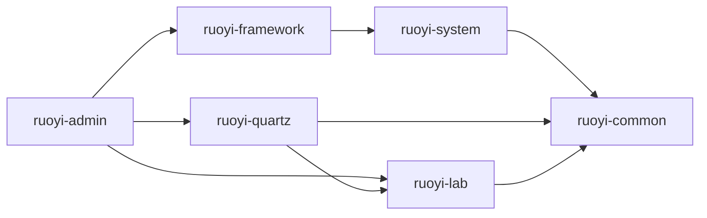
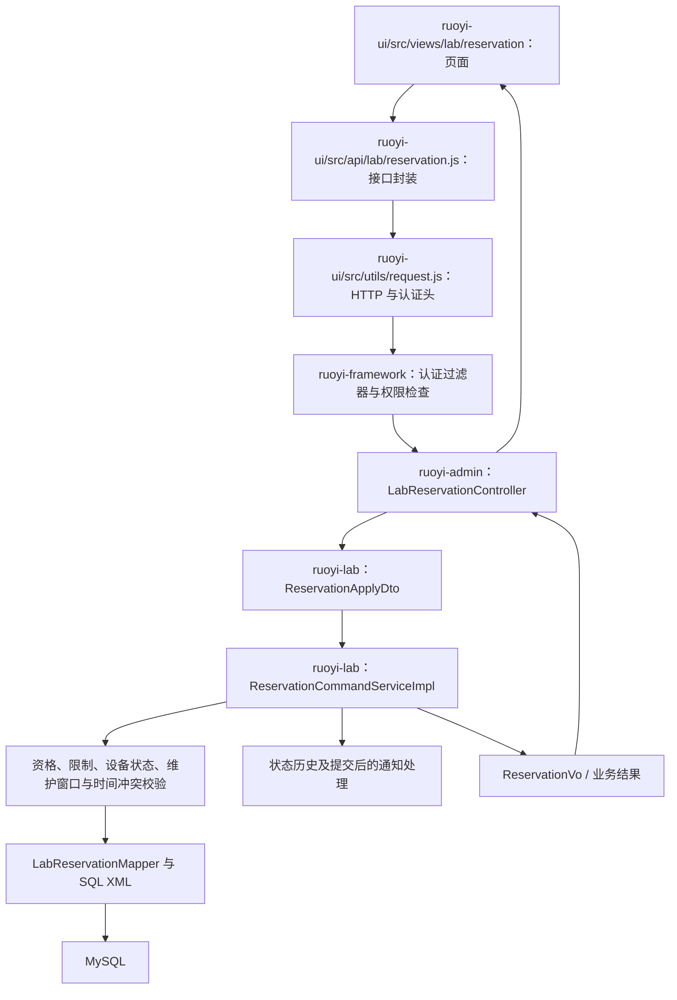

# 项目结构目录与逐层用途说明

核对日期：2026-09-06。项目位置：C:/Code/blackhorse。本文依据实际目录、Maven 模块声明、前端配置和关键源码整理。

阅读顺序建议：先看项目总览，再看 ruoyi-admin、ruoyi-lab 和 ruoyi-ui，最后结合一次预约请求理解其他模块如何配合。

覆盖范围：展开全部源码、配置、脚本、测试和文档文件夹，每个目录均标注用途；关键文件另列说明。第三方依赖、Git 内部对象、历史快照、编译产物和运行数据的内部目录折叠，并单独解释。末尾附完整源码文件名索引，方便逐文件查找。目录存在、测试文件存在，都不代表相应功能已完成生产验证或本次已运行测试。

- [一、根目录和整体架构](#overview)
- [二、先认识通用的目录与文件类型](#conventions)
- [三、ruoyi-admin：后端入口与控制层](#admin)
- [四、ruoyi-lab：核心业务模块](#lab)
- [五、ruoyi-ui：前端工程](#ui)
- [六、ruoyi-framework：框架与安全](#framework)
- [七、ruoyi-system：系统基础管理](#system)
- [八、ruoyi-common：公共能力](#common)
- [九、ruoyi-quartz：定时任务](#quartz)
- [十、文档、脚本、SQL 与辅助目录](#support)
- [十一、编译产物和本地运行数据](#runtime)
- [十二、一次请求如何穿过这些目录](#request)
- [十三、答辩与改代码时如何定位](#lookup)
- [十四、完整源码文件名索引](#files)

<a id="overview"></a>

## 一、根目录和整体架构

这是基于若依改造的前后端分离项目，后端采用 Maven 多模块组织，运行入口集中在 ruoyi-admin。各后端模块是同一个应用中的代码模块，不是六个独立部署的微服务。

```text
blackhorse/  # 项目根目录
├── .git/  # Git 版本历史、分支和索引；内部结构折叠
├── .github/  # 仓库平台辅助配置；当前有赞助配置和 Java 升级工具钩子
├── .history/  # 编辑器本地历史快照；折叠
├── .playwright-cli/  # 浏览器自动化过程中生成的记录与证据；折叠
├── .vscode/  # VS Code 工作区设置
├── bin/  # 上游风格的 Windows 清理、打包、运行批处理
├── doc/  # 若依环境使用手册等上游参考文档
├── docs/  # 本项目需求、设计、部署和答辩资料
├── logs_preview/  # 本次为空；按命名推测用于预览，未确认具体用途
├── output/  # 工具生成的输出目录，当前包含浏览器验证产物；折叠
├── ruoyi-admin/  # 后端启动、HTTP 接口、应用装配、集成测试
├── ruoyi-common/  # 各后端模块共享的模型、注解、异常和工具
├── ruoyi-framework/  # 认证、安全、框架配置、拦截器和横切能力
├── ruoyi-generator/  # 当前仅剩 target 构建残留；没有源码，也未列入 Maven modules
├── ruoyi-lab/  # 实验室管理核心业务：预约、领用、维修、巡检、隐患等
├── ruoyi-quartz/  # 定时任务管理和业务生命周期调度
├── ruoyi-system/  # 用户、角色、部门、菜单、字典和系统参数
├── ruoyi-ui/  # Vue 3 前端工程
├── scripts/  # 项目专用的本地启停、数据库迁移及验证脚本
├── sql/  # 独立保存的 SQL 参考材料
├── target/  # 根级本地运行和测试数据；含真实数据库与附件，不能当普通缓存清理
└── 实训日志_每日独立Word/  # 另行生成的十份实训日志文档，不参与本系统运行
```

| 文件 | 用途 |
|---|---|
| [pom.xml](<C:/Code/blackhorse/pom.xml>) | Maven 父工程：统一依赖版本、Java 版本、编译测试插件和 6 个参与构建的子模块 |
| [README.md](<C:/Code/blackhorse/README.md>) | 项目介绍、Windows 启动、部署、配置和常见问题 |
| [.gitignore](<C:/Code/blackhorse/.gitignore>) | 声明 Git 忽略的本地配置、构建目录、历史和运行产物 |
| [LICENSE](<C:/Code/blackhorse/LICENSE>) | 项目许可证 |
| [build_training_logs.py](<C:/Code/blackhorse/build_training_logs.py>) | 另外生成实训 Word 文档的 Python 脚本，内容涉及中州养老课程，不是实验室业务后端 |
| [实训日志_10个独立Word.zip](<C:/Code/blackhorse/实训日志_10个独立Word.zip>) | 独立实训日志的交付压缩包 |

实际 Maven 项目依赖如下，箭头表示“左侧直接依赖右侧”，仅画本仓库模块：



ruoyi-ui 通过 HTTP 调用后端，不进入 Maven 模块依赖链。ruoyi-generator 当前没有 pom.xml 和源码，仅有 target 残留，不能把它描述成当前可用的代码生成功能。

<a id="conventions"></a>

## 二、先认识通用的目录与文件类型

| 结构或名称 | 在本项目中表示什么 | 与其他结构的关系 |
|---|---|---|
| src/main/java | Java 正式代码 | 编译成 class，随后端打包 |
| src/main/resources | 配置、SQL 映射、迁移等资源 | 随应用放入 classpath |
| src/test/java | 测试代码 | 验证规则、接口、权限和事务等 |
| src/test/resources | 测试配置与数据 | 支持测试环境装配 |
| com/ruoyi/... | Java 包名对应的目录层级 | com 和 ruoyi 本身不是业务功能 |
| controller | HTTP 请求入口 | 调用 service，处理接口层参数和响应 |
| service | 业务接口、策略、协调器和部分具体服务 | 组织业务处理；不全是接口 |
| service/impl | 多数服务接口的实现 | 通常在这里处理事务和调用 Mapper |
| domain | 实体、业务状态和值对象 | 表达系统保存的数据和业务概念 |
| dto / Command | 输入、查询条件和操作命令 | 通常由前端提交或内部流程构造 |
| vo | 输出给前端的数据 | 可组合多个实体及显示字段 |
| mapper/*.java | 数据访问接口 | 使用 XML、注解或通用 Mapper 能力执行 SQL |
| resources/mapper/*.xml | SQL 与结果映射 | 不是数据库迁移文件 |
| db/migration/*.sql | 数据库版本化变更 | 建表、建索引、初始化或调整数据 |
| views | 页面级 Vue 组件 | 组合公共组件并调用 api |
| components | 可复用或页面内部子组件 | 服务于页面展示和交互 |
| api | 前端接口封装 | 经 utils/request.js 发出 HTTP 请求 |
| store | Pinia 全局状态 | 保存登录用户、菜单、主题、通知等 |
| target / dist | 构建或运行输出 | 根目录 target 还承载本地数据库，需区别对待 |
| package-info.java | Java 包说明 | 不承担具体业务请求处理 |

文件类型也可以帮助定位：Java 文件处理后端逻辑；Vue 文件定义页面与组件；JavaScript 文件承载前端逻辑和配置；XML 文件可能是 Maven 配置或 MyBatis 映射；YAML 文件主要是环境配置；SQL 文件处理数据库结构或数据变更；PowerShell/BAT 文件负责开发运行辅助；Markdown/Word 文件属于文档。

<a id="admin"></a>

## 三、ruoyi-admin：后端入口与控制层

ruoyi-admin 是后端应用入口。多数实验室 Controller 放在这里，复杂业务交给 ruoyi-lab；Quartz 的任务管理 Controller 则位于 ruoyi-quartz。

```text
ruoyi-admin/  # 后端启动、HTTP 接口、应用装配、集成测试
├── logs/  # 后端信息、错误和用户行为日志
├── src/  # 源码总目录
│   ├── main/  # 随应用发布的代码和资源
│   │   ├── java/  # Java 源代码根目录
│   │   │   └── com/  # Java 包名第一层，与 com.ruoyi 命名空间对应
│   │   │       └── ruoyi/  # com.ruoyi 命名空间；admin 主代码下同时放置启动类
│   │   │           └── web/  # Web 接口和应用运行适配层
│   │   │               ├── controller/  # HTTP 控制器总目录：接收请求、校验输入、调用业务服务
│   │   │               │   ├── common/  # 验证码及通用文件等基础接口
│   │   │               │   ├── lab/  # 实验室业务接口入口；预约、设备、资格、维修、巡检等
│   │   │               │   ├── monitor/  # 登录日志与操作日志查询、管理接口
│   │   │               │   └── system/  # 登录、用户、角色、部门、菜单、字典、参数及个人资料接口
│   │   │               ├── core/  # 应用专用配置、初始化和异常适配
│   │   │               │   ├── config/  # OpenAPI/Knife4j 配置及 Druid 监控凭据配置
│   │   │               │   ├── demo/  # 演示账号和演示业务数据初始化器，受启动配置控制
│   │   │               │   └── handler/  # 把实验室业务异常转换为统一 HTTP 错误响应
│   │   │               ├── ops/  # 运行状态接口、HTTP 指标、数据库/Redis/JVM/任务队列状态采集
│   │   │               └── service/  # 后台任务运行器和操作者上下文适配；业务处理主体位于 ruoyi-lab/task
│   │   └── resources/  # 运行时配置、SQL 映射及其他类路径资源
│   │       ├── db/  # 数据库版本化管理资源
│   │       │   └── migration/  # Flyway 按版本执行的建表、索引、字典、菜单和权限迁移
│   │       ├── i18n/  # 后端国际化消息资源
│   │       ├── META-INF/  # 开发工具等类路径元信息配置
│   │       └── mybatis/  # MyBatis 全局映射配置
│   └── test/  # 测试代码和测试资源，不作为业务入口
│       ├── java/  # Java 源代码根目录
│       │   └── com/  # Java 包名第一层，与 com.ruoyi 命名空间对应
│       │       └── ruoyi/  # com.ruoyi 命名空间；admin 主代码下同时放置启动类
│       │           ├── architecture/  # 模块与分层依赖规则测试，防止业务层越界依赖
│       │           ├── integration/  # 数据库、Spring 装配及多组件集成测试
│       │           │   ├── discovery/  # 验证普通测试及 IT 测试能被测试运行器发现
│       │           │   ├── lab/  # 核心流程、并发、可靠消息、任务恢复、维护、限制和 SLA 集成测试
│       │           │   │   └── migration/  # 业务表结构及菜单、权限迁移契约测试
│       │           │   ├── security/  # 角色种子数据、系统操作者和登录验证
│       │           │   └── web/  # Web 层在应用装配环境下的集成验证
│       │           │       ├── demo/  # 演示初始化行为测试
│       │           │       ├── exception/  # 业务错误与 HTTP 响应契约测试
│       │           │       └── openapi/  # 开发与生产环境接口文档开放策略测试
│       │           └── web/  # Web 层局部测试
│       │               ├── controller/  # 控制器路由及响应行为测试
│       │               │   └── lab/  # 实验室路由与预约首次创建/重放响应测试
│       │               ├── core/  # Web 核心配置测试
│       │               │   └── config/  # Druid 监控配置相关测试
│       │               └── ops/  # 运行指标统计和健康信息采集测试
│       └── resources/  # 测试配置及数据资源
│           └── sql/  # 测试专用 SQL；用于 MyBatis/MyBatis-Plus 兼容性探针
└── target/  # 该模块的编译、打包及测试输出；内部生成目录折叠
```

| 文件 | 用途 |
|---|---|
| [pom.xml](<C:/Code/blackhorse/ruoyi-admin/pom.xml>) | 装配框架、调度及实验室模块，并生成可运行的后端 JAR |
| [src/main/java/com/ruoyi/RuoYiApplication.java](<C:/Code/blackhorse/ruoyi-admin/src/main/java/com/ruoyi/RuoYiApplication.java>) | Spring Boot main 启动入口 |
| [src/main/java/com/ruoyi/RuoYiServletInitializer.java](<C:/Code/blackhorse/ruoyi-admin/src/main/java/com/ruoyi/RuoYiServletInitializer.java>) | 传统 Servlet 容器启动适配类；当前 pom 的打包类型仍为 JAR |
| [src/main/java/com/ruoyi/web/controller/lab/LabBaseController.java](<C:/Code/blackhorse/ruoyi-admin/src/main/java/com/ruoyi/web/controller/lab/LabBaseController.java>) | 实验室控制器的公共响应和分页等辅助 |
| [src/main/java/com/ruoyi/web/controller/lab/LabReservationController.java](<C:/Code/blackhorse/ruoyi-admin/src/main/java/com/ruoyi/web/controller/lab/LabReservationController.java>) | 预约申请、代办、审批、拒绝和取消的 HTTP 入口 |
| [src/main/java/com/ruoyi/web/controller/lab/LabUsageRecordController.java](<C:/Code/blackhorse/ruoyi-admin/src/main/java/com/ruoyi/web/controller/lab/LabUsageRecordController.java>) | 领用、归还及使用记录入口 |
| [src/main/java/com/ruoyi/web/controller/lab/LabRepairOrderController.java](<C:/Code/blackhorse/ruoyi-admin/src/main/java/com/ruoyi/web/controller/lab/LabRepairOrderController.java>) | 报修、派工、维修和验收入口 |
| [src/main/java/com/ruoyi/web/controller/lab/LabInspectionPlanController.java](<C:/Code/blackhorse/ruoyi-admin/src/main/java/com/ruoyi/web/controller/lab/LabInspectionPlanController.java>) | 巡检计划配置入口 |
| [src/main/java/com/ruoyi/web/controller/lab/LabInspectionTaskController.java](<C:/Code/blackhorse/ruoyi-admin/src/main/java/com/ruoyi/web/controller/lab/LabInspectionTaskController.java>) | 巡检任务及检查项执行入口 |
| [src/main/java/com/ruoyi/web/controller/lab/LabHazardController.java](<C:/Code/blackhorse/ruoyi-admin/src/main/java/com/ruoyi/web/controller/lab/LabHazardController.java>) | 隐患上报、整改与复核入口 |
| [src/main/java/com/ruoyi/web/controller/lab/LabBusinessTaskController.java](<C:/Code/blackhorse/ruoyi-admin/src/main/java/com/ruoyi/web/controller/lab/LabBusinessTaskController.java>) | 后台导入导出任务提交、查询、取消、重试及结果下载入口 |
| [src/main/java/com/ruoyi/web/core/handler/LabExceptionHandler.java](<C:/Code/blackhorse/ruoyi-admin/src/main/java/com/ruoyi/web/core/handler/LabExceptionHandler.java>) | 统一映射实验室错误码和 HTTP 状态 |
| [src/main/java/com/ruoyi/web/service/BusinessTaskRuntime.java](<C:/Code/blackhorse/ruoyi-admin/src/main/java/com/ruoyi/web/service/BusinessTaskRuntime.java>) | 后台任务调度、工作线程、租约心跳和清理 |
| [src/main/java/com/ruoyi/web/ops/OperationsService.java](<C:/Code/blackhorse/ruoyi-admin/src/main/java/com/ruoyi/web/ops/OperationsService.java>) | 读取系统、数据库、Redis 和任务运行信息 |
| [src/main/resources/application.yml](<C:/Code/blackhorse/ruoyi-admin/src/main/resources/application.yml>) | 应用公共配置及环境变量引用 |
| [src/main/resources/application-druid.yml](<C:/Code/blackhorse/ruoyi-admin/src/main/resources/application-druid.yml>) | 数据库与 Druid 连接池配置 |
| [src/main/resources/application-prod.yml](<C:/Code/blackhorse/ruoyi-admin/src/main/resources/application-prod.yml>) | 生产环境覆盖配置 |
| [src/main/resources/logback.xml](<C:/Code/blackhorse/ruoyi-admin/src/main/resources/logback.xml>) | 日志级别、输出位置和日志格式 |
| [src/main/resources/banner.txt](<C:/Code/blackhorse/ruoyi-admin/src/main/resources/banner.txt>) | 启动时输出的文本标识 |
| [src/main/resources/mybatis/mybatis-config.xml](<C:/Code/blackhorse/ruoyi-admin/src/main/resources/mybatis/mybatis-config.xml>) | MyBatis 全局行为配置 |
| [src/main/resources/i18n/messages.properties](<C:/Code/blackhorse/ruoyi-admin/src/main/resources/i18n/messages.properties>) | 后端提示消息 |
| [src/test/java/com/ruoyi/architecture/LabLayerArchitectureTest.java](<C:/Code/blackhorse/ruoyi-admin/src/test/java/com/ruoyi/architecture/LabLayerArchitectureTest.java>) | 验证业务分层和模块依赖约束 |
| [src/test/java/com/ruoyi/integration/lab/LabG1ConcurrencyIT.java](<C:/Code/blackhorse/ruoyi-admin/src/test/java/com/ruoyi/integration/lab/LabG1ConcurrencyIT.java>) | 预约扩展等并发场景的集成测试文件 |

数据库迁移按业务版本逐步推进：V1 为基础平台、调度及初始权限；V2 为资产和资格；V3 为预约；V4 为领用和维修；V5 为巡检和隐患；V6 为通知、菜单权限调整、项目标识和代办等；V7 为预约规则与候补；V8 为可靠消息与后台任务；V9 为预约限制与扫码菜单；V10 为维护计划和 SLA。具体变更以每个 SQL 内容为准。

<a id="lab"></a>

## 四、ruoyi-lab：核心业务模块

ruoyi-lab 是答辩最需要讲清楚的模块。基础部分按 domain、dto、service、mapper 分层；维护、限制、SLA 和后台任务则按独立业务主题集中组织。它没有单独的启动类，也不直接承担多数 HTTP Controller。

```text
ruoyi-lab/  # 实验室管理核心业务：预约、领用、维修、巡检、隐患等
├── src/  # 源码总目录
│   ├── main/  # 随应用发布的代码和资源
│   │   ├── java/  # Java 源代码根目录
│   │   │   └── com/  # Java 包名第一层，与 com.ruoyi 命名空间对应
│   │   │       └── ruoyi/  # com.ruoyi 命名空间；admin 主代码下同时放置启动类
│   │   │           └── lab/  # 该模块的 Java 包根目录
│   │   │               ├── config/  # 业务时钟、附件存储、定时批处理等参数配置
│   │   │               ├── domain/  # 数据库业务实体、状态枚举和值对象，例如预约时间区间
│   │   │               ├── dto/  # 接口输入、查询条件和业务命令，承载参数校验约束
│   │   │               ├── event/  # 业务通知事件、发布器、提交后监听器和通知去重键
│   │   │               ├── exception/  # 业务错误码及 LabBusinessException
│   │   │               ├── maintenance/  # 维护计划、版本、周期、占用窗口、执行与验收衔接
│   │   │               ├── mapper/  # 数据库访问接口；既有配套 XML，也有直接写在注解中的 SQL
│   │   │               ├── restriction/  # 预约限制、规则、申诉和限制校验；包含并发准入锁协调
│   │   │               ├── security/  # 实验室数据范围、对象访问权限、状态历史授权和重大隐患阻断
│   │   │               ├── serializer/  # 业务 ID 字符串化和业务时间序列化，统一前后端数据格式
│   │   │               ├── service/  # 业务接口、策略、协调器及部分直接实现的服务类
│   │   │               │   └── impl/  # 多数核心业务接口的实现，包含事务、状态流转、锁和跨对象协作
│   │   │               ├── sla/  # 处理时限规则、时限记录、暂停恢复、预警及升级通知
│   │   │               ├── storage/  # 附件存储接口、本地文件实现、文件策略和附件对象授权
│   │   │               ├── task/  # 批量导入导出任务、工作执行器、行进度、业务适配与 Excel 处理
│   │   │               └── vo/  # 供前端使用的响应对象、详情对象及统计结果
│   │   └── resources/  # 运行时配置、SQL 映射及其他类路径资源
│   │       └── mapper/  # MyBatis XML 映射资源总目录
│   │           └── lab/  # 本模块 Mapper 接口对应的 SQL 映射 XML
│   └── test/  # 测试代码和测试资源，不作为业务入口
│       └── java/  # Java 源代码根目录
│           └── com/  # Java 包名第一层，与 com.ruoyi 命名空间对应
│               └── ruoyi/  # com.ruoyi 命名空间；admin 主代码下同时放置启动类
│                   └── lab/  # 该模块的 Java 测试包根目录
│                       ├── domain/  # 时间区间重叠、业务状态和巡检频率等领域规则测试
│                       ├── event/  # 通知事件发布、提交后处理及去重键测试
│                       ├── mapper/  # SQL/XML 契约、对象可见性和扩展 Mapper 测试
│                       ├── security/  # 状态历史等业务对象的权限测试
│                       ├── service/  # 预约、资格、状态机、候补、分页、限制、维护和消息策略测试
│                       │   └── impl/  # 通知补偿、业务事实解析和超期通知的具体实现测试
│                       ├── sla/  # SLA 时限计算规则测试
│                       ├── storage/  # 文件限制、本地存储和维修附件访问授权测试
│                       ├── task/  # 任务规则、Excel 导入导出格式测试
│                       └── vo/  # 返回对象中 ID、时间等字段的序列化契约测试
└── target/  # 该模块的编译、打包及测试输出；内部生成目录折叠
```

下面的文件可以作为核心实现的阅读入口：

| 文件 | 用途 |
|---|---|
| [domain/LabReservation.java](<C:/Code/blackhorse/ruoyi-lab/src/main/java/com/ruoyi/lab/domain/LabReservation.java>) | 预约实体，表达预约对象、时间、状态和版本等数据 |
| [domain/ReservationInterval.java](<C:/Code/blackhorse/ruoyi-lab/src/main/java/com/ruoyi/lab/domain/ReservationInterval.java>) | 预约时间区间和值对象重叠判断 |
| [dto/ReservationApplyDto.java](<C:/Code/blackhorse/ruoyi-lab/src/main/java/com/ruoyi/lab/dto/ReservationApplyDto.java>) | 预约申请输入 |
| [dto/ReservationDecisionDto.java](<C:/Code/blackhorse/ruoyi-lab/src/main/java/com/ruoyi/lab/dto/ReservationDecisionDto.java>) | 审批或拒绝输入，包含版本等决策参数 |
| [vo/ReservationVo.java](<C:/Code/blackhorse/ruoyi-lab/src/main/java/com/ruoyi/lab/vo/ReservationVo.java>) | 返回前端的预约视图 |
| [service/ReservationCommandService.java](<C:/Code/blackhorse/ruoyi-lab/src/main/java/com/ruoyi/lab/service/ReservationCommandService.java>) | 定义预约写操作的服务接口 |
| [service/impl/ReservationCommandServiceImpl.java](<C:/Code/blackhorse/ruoyi-lab/src/main/java/com/ruoyi/lab/service/impl/ReservationCommandServiceImpl.java>) | 预约事务主流程：幂等、加锁、资格及状态检查、冲突判断和保存 |
| [service/ReservationPolicy.java](<C:/Code/blackhorse/ruoyi-lab/src/main/java/com/ruoyi/lab/service/ReservationPolicy.java>) | 时间、时长、提前量等预约输入规则 |
| [service/ReservationStateMachine.java](<C:/Code/blackhorse/ruoyi-lab/src/main/java/com/ruoyi/lab/service/ReservationStateMachine.java>) | 预约状态允许的转换规则 |
| [service/impl/ReservationQueryServiceImpl.java](<C:/Code/blackhorse/ruoyi-lab/src/main/java/com/ruoyi/lab/service/impl/ReservationQueryServiceImpl.java>) | 预约列表、详情等读取逻辑 |
| [mapper/LabReservationMapper.java](<C:/Code/blackhorse/ruoyi-lab/src/main/java/com/ruoyi/lab/mapper/LabReservationMapper.java>) | 预约数据库访问接口 |
| [service/impl/RedisLabIdempotencyStore.java](<C:/Code/blackhorse/ruoyi-lab/src/main/java/com/ruoyi/lab/service/impl/RedisLabIdempotencyStore.java>) | 预约幂等记录的 Redis 缓存实现 |
| [restriction/RestrictionGuard.java](<C:/Code/blackhorse/ruoyi-lab/src/main/java/com/ruoyi/lab/restriction/RestrictionGuard.java>) | 限制相关准入锁与用户锁协调、限制校验；当前包含全局 gate 锁 |
| [service/ReservationRuleService.java](<C:/Code/blackhorse/ruoyi-lab/src/main/java/com/ruoyi/lab/service/ReservationRuleService.java>) | 预约规则版本的维护与发布 |
| [service/ReservationRuleEvaluator.java](<C:/Code/blackhorse/ruoyi-lab/src/main/java/com/ruoyi/lab/service/ReservationRuleEvaluator.java>) | 根据规则计算能否预约等结果 |
| [service/ReservationWaitlistCoordinator.java](<C:/Code/blackhorse/ruoyi-lab/src/main/java/com/ruoyi/lab/service/ReservationWaitlistCoordinator.java>) | 候补队列、临时名额和预约提交之间的协调 |
| [service/impl/UsageCommandServiceImpl.java](<C:/Code/blackhorse/ruoyi-lab/src/main/java/com/ruoyi/lab/service/impl/UsageCommandServiceImpl.java>) | 领用、归还、异常归还转维修等事务 |
| [service/impl/RepairOrderServiceImpl.java](<C:/Code/blackhorse/ruoyi-lab/src/main/java/com/ruoyi/lab/service/impl/RepairOrderServiceImpl.java>) | 派工、开始维修、提交结果和验收流程 |
| [service/impl/DeviceAvailabilityServiceImpl.java](<C:/Code/blackhorse/ruoyi-lab/src/main/java/com/ruoyi/lab/service/impl/DeviceAvailabilityServiceImpl.java>) | 综合领用、故障、维修、维护及重大隐患判断设备能否恢复可用 |
| [service/impl/InspectionScheduleServiceImpl.java](<C:/Code/blackhorse/ruoyi-lab/src/main/java/com/ruoyi/lab/service/impl/InspectionScheduleServiceImpl.java>) | 按巡检计划生成任务及检查项快照 |
| [service/impl/RectificationServiceImpl.java](<C:/Code/blackhorse/ruoyi-lab/src/main/java/com/ruoyi/lab/service/impl/RectificationServiceImpl.java>) | 整改提交、复核、退回和隐患关闭流程 |
| [service/impl/LabQualificationGuardImpl.java](<C:/Code/blackhorse/ruoyi-lab/src/main/java/com/ruoyi/lab/service/impl/LabQualificationGuardImpl.java>) | 按用户、设备及时间验证使用资格 |
| [security/LabObjectPermissionServiceImpl.java](<C:/Code/blackhorse/ruoyi-lab/src/main/java/com/ruoyi/lab/security/LabObjectPermissionServiceImpl.java>) | 检查具体实验室或设备对象的读取和管理权限 |
| [security/LabDataScopeServiceImpl.java](<C:/Code/blackhorse/ruoyi-lab/src/main/java/com/ruoyi/lab/security/LabDataScopeServiceImpl.java>) | 解析当前用户有权管理的实验室范围 |
| [service/impl/LabStatusHistoryServiceImpl.java](<C:/Code/blackhorse/ruoyi-lab/src/main/java/com/ruoyi/lab/service/impl/LabStatusHistoryServiceImpl.java>) | 追加业务状态历史，并衔接时限记录和通知事件 |
| [event/LabNotificationAfterCommitListener.java](<C:/Code/blackhorse/ruoyi-lab/src/main/java/com/ruoyi/lab/event/LabNotificationAfterCommitListener.java>) | 业务事务提交后处理通知事件；提交后不等于自动异步执行 |
| [service/MessageDeliveryEngine.java](<C:/Code/blackhorse/ruoyi-lab/src/main/java/com/ruoyi/lab/service/MessageDeliveryEngine.java>) | 可靠消息的投递编排 |
| [service/MessageDeliveryStore.java](<C:/Code/blackhorse/ruoyi-lab/src/main/java/com/ruoyi/lab/service/MessageDeliveryStore.java>) | 投递记录、领取、完成、租约恢复等持久化处理 |
| [service/impl/LabNotificationCompensationServiceImpl.java](<C:/Code/blackhorse/ruoyi-lab/src/main/java/com/ruoyi/lab/service/impl/LabNotificationCompensationServiceImpl.java>) | 重试及按持久业务事实补偿遗漏通知 |
| [task/BusinessTaskService.java](<C:/Code/blackhorse/ruoyi-lab/src/main/java/com/ruoyi/lab/task/BusinessTaskService.java>) | 任务预检查、受理、取消、重试和结果访问等 |
| [task/BusinessTaskWorker.java](<C:/Code/blackhorse/ruoyi-lab/src/main/java/com/ruoyi/lab/task/BusinessTaskWorker.java>) | 逐行业务执行、进度保存、恢复和取消协作 |
| [task/TaskWorkbook.java](<C:/Code/blackhorse/ruoyi-lab/src/main/java/com/ruoyi/lab/task/TaskWorkbook.java>) | 导入导出工作簿的读写处理 |
| [maintenance/MaintenanceService.java](<C:/Code/blackhorse/ruoyi-lab/src/main/java/com/ruoyi/lab/maintenance/MaintenanceService.java>) | 维护计划及版本等业务处理 |
| [maintenance/MaintenanceWindowGuard.java](<C:/Code/blackhorse/ruoyi-lab/src/main/java/com/ruoyi/lab/maintenance/MaintenanceWindowGuard.java>) | 防止预约与维护窗口冲突 |
| [restriction/RestrictionService.java](<C:/Code/blackhorse/ruoyi-lab/src/main/java/com/ruoyi/lab/restriction/RestrictionService.java>) | 预约限制、规则及申诉处理 |
| [sla/SlaService.java](<C:/Code/blackhorse/ruoyi-lab/src/main/java/com/ruoyi/lab/sla/SlaService.java>) | 时限规则与时限记录相关业务 |
| [storage/LocalStorageService.java](<C:/Code/blackhorse/ruoyi-lab/src/main/java/com/ruoyi/lab/storage/LocalStorageService.java>) | 将附件等文件保存到配置的本地存储位置 |
| [storage/LabAttachmentObjectAuthorizer.java](<C:/Code/blackhorse/ruoyi-lab/src/main/java/com/ruoyi/lab/storage/LabAttachmentObjectAuthorizer.java>) | 按附件关联的业务对象检查访问权限 |
| [serializer/LabBusinessId.java](<C:/Code/blackhorse/ruoyi-lab/src/main/java/com/ruoyi/lab/serializer/LabBusinessId.java>) | 把业务 BIGINT ID 按字符串返回，避免前端数字精度问题 |
| [service/LabPage.java](<C:/Code/blackhorse/ruoyi-lab/src/main/java/com/ruoyi/lab/service/LabPage.java>) | 在权限检查后的实际列表查询处启动并清理分页 |

例如 LabReservationMapper.java 对应的复杂 SQL 在 [LabReservationMapper.xml](<C:/Code/blackhorse/ruoyi-lab/src/main/resources/mapper/lab/LabReservationMapper.xml>)。但 LabRestrictionMapper 等扩展 Mapper 直接使用 SQL 注解，因此找不到同名 XML 不代表缺少实现。

答辩时可这样解释分工：“Controller 接收请求，DTO 约束输入，Service 实现规则和事务，Domain 表达业务数据，Mapper 访问数据库，VO 组织返回结果。security 决定可以访问哪些对象，event、task 和 quartz 分别处理事件、后台批量任务与定时触发。”

<a id="ui"></a>

## 五、ruoyi-ui：前端工程

前端负责页面显示、用户交互、路由和接口调用。业务能否执行最终由后端校验；隐藏按钮不能代替接口权限校验。

```text
ruoyi-ui/  # Vue 3 前端工程
├── .github/  # 前端继承的仓库平台配置
├── bin/  # 前端开发、安装或打包的 Windows 批处理入口
├── dist/  # Vite 生产构建产物，由源码构建生成；折叠
├── html/  # 旧浏览器兼容性提示页面
├── node_modules/  # Yarn 安装的第三方依赖；内部依赖目录折叠
├── public/  # 直接发布的公共静态资源，例如站点图标
├── src/  # 前端应用源码
│   ├── api/  # 按业务封装 HTTP 调用；另含登录和菜单接口
│   │   ├── lab/  # 实验室业务接口和 ID、分页、排序等调用契约
│   │   ├── monitor/  # 任务调度、登录日志、操作日志接口
│   │   └── system/  # 用户、角色、部门、菜单、参数等基础管理接口
│   │       └── dict/  # 字典类型和字典数据接口
│   ├── assets/  # 经过前端构建处理的图片、SVG 和样式资源
│   │   ├── 401_images/  # 无权限页面配图
│   │   ├── 404_images/  # 页面不存在时的配图
│   │   ├── icons/  # 图标资源总目录
│   │   │   └── svg/  # 菜单、按钮和状态使用的 SVG 图标
│   │   ├── images/  # 登录背景、头像、明暗主题图标等图片
│   │   ├── logo/  # 项目 Logo
│   │   └── styles/  # 全局主题、变量、侧栏、动画、组件覆盖和实验室工作区样式
│   ├── components/  # 可跨页面复用的 Vue 组件
│   │   ├── Breadcrumb/  # 面包屑导航
│   │   ├── Crontab/  # Cron 表达式可视化编辑器
│   │   ├── DictTag/  # 把字典值显示成中文标签及状态样式
│   │   ├── ExcelImportDialog/  # Excel 文件导入交互组件
│   │   ├── FileUpload/  # 通用文件上传组件
│   │   ├── Hamburger/  # 侧边栏折叠按钮
│   │   ├── HeaderSearch/  # 页头菜单搜索
│   │   ├── IconSelect/  # 图标选择器
│   │   ├── ImagePreview/  # 图片预览
│   │   ├── ImageUpload/  # 图片上传
│   │   ├── lab/  # 业务共用组件：附件、状态历史、时间区间、资产标签、异步导出等
│   │   ├── Pagination/  # 分页栏
│   │   ├── ParentView/  # 嵌套路由的父级占位容器
│   │   ├── RightToolbar/  # 表格查询区切换、刷新及列显示等工具栏
│   │   ├── Screenfull/  # 全屏切换
│   │   ├── SizeSelect/  # 界面组件尺寸选择
│   │   ├── SvgIcon/  # 统一显示 SVG 图标
│   │   └── TreePanel/  # 树形导航或筛选面板
│   ├── directive/  # 自定义指令统一注册
│   │   ├── common/  # 复制文本等通用指令
│   │   └── permission/  # 按权限码或角色控制元素显示；后端仍需校验权限
│   ├── layout/  # 登录后管理后台的整体页面框架
│   │   └── components/  # 导航栏、内容区及其他布局组件
│   │       ├── Copyright/  # 页面版权信息
│   │       ├── IframeToggle/  # 内嵌页面的切换管理
│   │       ├── InnerLink/  # 内部 iframe 链接容器
│   │       ├── Settings/  # 布局与主题设置
│   │       ├── Sidebar/  # 左侧菜单、菜单项、链接和 Logo
│   │       ├── TagsView/  # 已打开页面的标签栏及滚动区域
│   │       ├── TopBar/  # 顶部操作区域
│   │       └── TopNav/  # 顶部菜单导航
│   ├── plugins/  # 统一封装权限判断、缓存、下载、弹窗和标签页操作
│   ├── router/  # 路由定义和路由基础配置
│   ├── store/  # Pinia 状态容器入口
│   │   └── modules/  # 用户、动态菜单、主题、字典、锁屏、标签和通知等全局状态
│   ├── utils/  # 请求、认证、校验、字典、主题、资产码等工具函数
│   │   └── lab/  # 实验室错误提示、幂等键和工作区导航辅助
│   └── views/  # 完整页面；根级包含首页、登录和锁屏
│       ├── error/  # 401 无权限、404 未找到页面
│       ├── lab/  # 实验室管理的业务页面
│       │   ├── asset-scan/  # 识别或解析设备资产码，跳转关联业务
│       │   ├── dashboard/  # 实验室业务概览和统计看板
│       │   ├── device/  # 设备列表、维护及详情
│       │   ├── hazard/  # 隐患列表、详情及整改复核流程
│       │   ├── inspection/  # 巡检业务页面总目录
│       │   │   ├── plan/  # 巡检计划和检查项配置
│       │   │   └── task/  # 巡检任务列表及执行记录
│       │   ├── laboratory/  # 实验室基础信息管理
│       │   ├── maintenance/  # 维护计划编辑、周期查看和执行管理
│       │   ├── message-center/  # 消息投递管理、模板、渠道及通知偏好
│       │   │   └── components/  # 投递详情、模板编辑、渠道与投递面板等局部组件
│       │   ├── notification/  # 当前用户的站内通知查看和处理
│       │   ├── operations/  # 系统运行状态、HTTP 指标和后台队列监测
│       │   │   └── components/  # 健康、HTTP 和任务队列面板
│       │   ├── qualification/  # 使用资格管理和我的资格
│       │   ├── repair/  # 维修工单列表、详情、维修处理和验收
│       │   ├── reservation/  # 预约列表、申请、详情及业务追踪
│       │   │   └── workspace/  # 预约日历、规则编辑比较、影响分析和候补工作区
│       │   ├── restrictions/  # 预约限制、规则、记录及申诉相关界面
│       │   │   └── components/  # 限制操作弹窗、详情和规则局部组件
│       │   ├── sla/  # 处理时限规则、执行记录和时限详情
│       │   ├── task-center/  # 后台导入导出任务进度、结果、取消和重试
│       │   └── usage/  # 设备领用、归还和使用记录
│       ├── monitor/  # 系统运行记录与任务管理页面
│       │   ├── job/  # 定时任务配置、详情和执行日志
│       │   ├── logininfor/  # 用户登录记录
│       │   └── operlog/  # 用户操作日志及详情
│       ├── redirect/  # 路由刷新与重定向辅助页面
│       └── system/  # 基础系统管理页面
│           ├── config/  # 系统参数配置
│           ├── dept/  # 部门组织树
│           ├── dict/  # 字典类型和字典数据
│           ├── menu/  # 菜单树、路由和权限标识配置
│           ├── role/  # 角色管理、权限分配及授权用户
│           └── user/  # 用户管理、详情及角色授权
│               └── profile/  # 个人资料、头像和密码修改
├── tests/  # 前端测试及测试环境初始化
│   └── unit/  # 业务 API、组件、权限、工作区和工具函数的单元测试
│       ├── plugins/  # 下载等前端插件测试
│       ├── utils/  # 请求封装和错误提示等工具测试
│       └── views/  # 登录、锁屏等页面测试
└── vite/  # Vite 构建辅助配置
    └── plugins/  # 自动导入、SVG、压缩和组件名称扩展等构建插件配置
```

| 文件 | 用途 |
|---|---|
| [package.json](<C:/Code/blackhorse/ruoyi-ui/package.json>) | 前端依赖、Node/Yarn 约束，以及 dev、build、test 命令 |
| [yarn.lock](<C:/Code/blackhorse/ruoyi-ui/yarn.lock>) | 锁定实际安装的依赖版本 |
| [.node-version](<C:/Code/blackhorse/ruoyi-ui/.node-version>) | Node 主版本约定 |
| [.env.development](<C:/Code/blackhorse/ruoyi-ui/.env.development>) | 开发模式的前端环境配置 |
| [.env.production](<C:/Code/blackhorse/ruoyi-ui/.env.production>) | 生产构建的前端环境配置 |
| [.env.staging](<C:/Code/blackhorse/ruoyi-ui/.env.staging>) | 预发布模式的前端环境配置 |
| [vite.config.js](<C:/Code/blackhorse/ruoyi-ui/vite.config.js>) | 路径别名、开发代理、构建输出和资源处理 |
| [vitest.config.js](<C:/Code/blackhorse/ruoyi-ui/vitest.config.js>) | 前端测试环境、测试文件匹配及覆盖率配置 |
| [index.html](<C:/Code/blackhorse/ruoyi-ui/index.html>) | 网页入口，提供 Vue 挂载容器 |
| [src/main.js](<C:/Code/blackhorse/ruoyi-ui/src/main.js>) | 创建 Vue 应用，注册路由、Pinia、Element Plus、指令和全局组件 |
| [src/App.vue](<C:/Code/blackhorse/ruoyi-ui/src/App.vue>) | 应用根组件 |
| [src/permission.js](<C:/Code/blackhorse/ruoyi-ui/src/permission.js>) | 路由访问守卫和登录、动态菜单加载衔接 |
| [src/settings.js](<C:/Code/blackhorse/ruoyi-ui/src/settings.js>) | 应用标题及界面设置 |
| [src/router/index.js](<C:/Code/blackhorse/ruoyi-ui/src/router/index.js>) | 静态路由与路由基础结构 |
| [src/store/modules/user.js](<C:/Code/blackhorse/ruoyi-ui/src/store/modules/user.js>) | 登录用户、角色权限等状态与动作 |
| [src/store/modules/permission.js](<C:/Code/blackhorse/ruoyi-ui/src/store/modules/permission.js>) | 按用户菜单构建可访问路由 |
| [src/store/modules/labNotification.js](<C:/Code/blackhorse/ruoyi-ui/src/store/modules/labNotification.js>) | 实验室通知相关全局状态 |
| [src/utils/request.js](<C:/Code/blackhorse/ruoyi-ui/src/utils/request.js>) | Axios 实例、认证请求头、响应和错误处理 |
| [src/utils/lab/idempotency.js](<C:/Code/blackhorse/ruoyi-ui/src/utils/lab/idempotency.js>) | 生成、保存或复用业务提交所需的幂等键 |
| [src/utils/labAssetCode.js](<C:/Code/blackhorse/ruoyi-ui/src/utils/labAssetCode.js>) | 资产二维码内容的编码、解析和校验辅助 |
| [src/api/lab/_contract.js](<C:/Code/blackhorse/ruoyi-ui/src/api/lab/_contract.js>) | 接口 ID 字符串与列表排序等公共参数契约 |
| [src/api/lab/reservation.js](<C:/Code/blackhorse/ruoyi-ui/src/api/lab/reservation.js>) | 预约 HTTP 请求封装 |
| [src/views/lab/reservation/index.vue](<C:/Code/blackhorse/ruoyi-ui/src/views/lab/reservation/index.vue>) | 预约列表与操作入口 |
| [src/views/lab/reservation/workspace/ReservationWorkspace.vue](<C:/Code/blackhorse/ruoyi-ui/src/views/lab/reservation/workspace/ReservationWorkspace.vue>) | 组合日历、规则、候补等预约工作区内容 |
| [src/views/lab/reservation/workspace/CalendarPanel.vue](<C:/Code/blackhorse/ruoyi-ui/src/views/lab/reservation/workspace/CalendarPanel.vue>) | 展示预约时间占用和日历交互 |
| [src/views/lab/reservation/workspace/WaitlistPanel.vue](<C:/Code/blackhorse/ruoyi-ui/src/views/lab/reservation/workspace/WaitlistPanel.vue>) | 候补状态与操作 |
| [src/components/lab/StatusHistory.vue](<C:/Code/blackhorse/ruoyi-ui/src/components/lab/StatusHistory.vue>) | 跨业务复用的状态历史显示 |
| [src/components/lab/AttachmentPanel.vue](<C:/Code/blackhorse/ruoyi-ui/src/components/lab/AttachmentPanel.vue>) | 业务附件上传、列表及访问交互 |
| [src/components/lab/AsyncExportButton.vue](<C:/Code/blackhorse/ruoyi-ui/src/components/lab/AsyncExportButton.vue>) | 提交后台导出任务的公共入口 |
| [src/layout/index.vue](<C:/Code/blackhorse/ruoyi-ui/src/layout/index.vue>) | 后台页面框架，组织菜单、导航和内容区 |
| [src/assets/styles/lab-workspace.scss](<C:/Code/blackhorse/ruoyi-ui/src/assets/styles/lab-workspace.scss>) | 实验室工作区共用样式 |
| [tests/setup.js](<C:/Code/blackhorse/ruoyi-ui/tests/setup.js>) | 前端测试初始化和环境准备 |

同一个业务通常能沿“views/lab/某业务 → api/lab/对应文件 → 后端 Controller → ruoyi-lab”继续追踪。例如设备页面在 views/lab/device，设备接口封装在 api/lab/device.js，后端入口为 LabDeviceController。

<a id="framework"></a>

## 六、ruoyi-framework：框架与安全

ruoyi-framework 把公共工具、系统用户和第三方框架装配起来，使后端具备认证、权限、数据访问和统一异常处理能力。

```text
ruoyi-framework/  # 认证、安全、框架配置、拦截器和横切能力
├── src/  # 源码总目录
│   └── main/  # 随应用发布的代码和资源
│       └── java/  # Java 源代码根目录
│           └── com/  # Java 包名第一层，与 com.ruoyi 命名空间对应
│               └── ruoyi/  # com.ruoyi 命名空间；admin 主代码下同时放置启动类
│                   └── framework/  # 该模块的 Java 包根目录
│                       ├── aspectj/  # AOP 切面：数据范围、数据源切换、日志、限流
│                       ├── config/  # Spring Security、Redis、MyBatis、Druid、线程池、过滤器等装配
│                       │   └── properties/  # 数据库连接池参数和允许匿名访问的路径配置
│                       ├── datasource/  # 动态数据源实现及当前数据源上下文
│                       ├── interceptor/  # 防重复提交拦截器抽象
│                       │   └── impl/  # 按 URL 与请求数据识别重复提交的具体实现
│                       ├── manager/  # 通用异步任务提交和应用关闭管理
│                       │   └── factory/  # 创建登录记录、操作日志等异步任务
│                       ├── security/  # 认证与安全处理组件
│                       │   ├── context/  # 当前认证信息和权限检查上下文
│                       │   ├── filter/  # JWT 请求过滤器：解析令牌并恢复登录用户上下文
│                       │   └── handle/  # 未登录访问、退出登录的安全响应处理
│                       └── web/  # 框架提供的 Web 公共能力
│                           ├── domain/  # 服务器资源信息模型
│                           │   └── server/  # CPU、JVM、内存、系统和磁盘指标模型
│                           ├── exception/  # 通用异常处理器
│                           ├── filter/  # 请求 TraceId 追踪标识过滤器
│                           └── service/  # 登录、密码校验、角色权限、用户加载和 Token/Redis 会话服务
└── target/  # 该模块的编译、打包及测试输出；内部生成目录折叠
```

| 文件 | 用途 |
|---|---|
| [config/SecurityConfig.java](<C:/Code/blackhorse/ruoyi-framework/src/main/java/com/ruoyi/framework/config/SecurityConfig.java>) | 配置请求访问规则、认证过滤器和安全处理 |
| [security/filter/JwtAuthenticationTokenFilter.java](<C:/Code/blackhorse/ruoyi-framework/src/main/java/com/ruoyi/framework/security/filter/JwtAuthenticationTokenFilter.java>) | 从请求令牌恢复用户上下文 |
| [web/service/TokenService.java](<C:/Code/blackhorse/ruoyi-framework/src/main/java/com/ruoyi/framework/web/service/TokenService.java>) | JWT 及 Redis 登录状态管理；不是只靠 JWT 的完全无状态登录 |
| [web/service/SysLoginService.java](<C:/Code/blackhorse/ruoyi-framework/src/main/java/com/ruoyi/framework/web/service/SysLoginService.java>) | 登录认证主流程 |
| [web/service/PermissionService.java](<C:/Code/blackhorse/ruoyi-framework/src/main/java/com/ruoyi/framework/web/service/PermissionService.java>) | 供接口权限表达式调用的权限判断 |
| [config/MyBatisConfig.java](<C:/Code/blackhorse/ruoyi-framework/src/main/java/com/ruoyi/framework/config/MyBatisConfig.java>) | MyBatis/MyBatis-Plus 等数据库映射配置 |
| [config/RedisConfig.java](<C:/Code/blackhorse/ruoyi-framework/src/main/java/com/ruoyi/framework/config/RedisConfig.java>) | Redis 连接与序列化等配置 |
| [config/DruidConfig.java](<C:/Code/blackhorse/ruoyi-framework/src/main/java/com/ruoyi/framework/config/DruidConfig.java>) | 数据库连接池及相关装配 |
| [aspectj/RateLimiterAspect.java](<C:/Code/blackhorse/ruoyi-framework/src/main/java/com/ruoyi/framework/aspectj/RateLimiterAspect.java>) | 框架已有的注解限流能力；存在此类不代表所有预约接口已配置限流 |
| [interceptor/impl/SameUrlDataInterceptor.java](<C:/Code/blackhorse/ruoyi-framework/src/main/java/com/ruoyi/framework/interceptor/impl/SameUrlDataInterceptor.java>) | 框架通用防重复提交实现；和预约业务幂等约束职责不同 |
| [web/filter/TraceIdFilter.java](<C:/Code/blackhorse/ruoyi-framework/src/main/java/com/ruoyi/framework/web/filter/TraceIdFilter.java>) | 为请求建立日志追踪标识 |
| [web/exception/GlobalExceptionHandler.java](<C:/Code/blackhorse/ruoyi-framework/src/main/java/com/ruoyi/framework/web/exception/GlobalExceptionHandler.java>) | 框架通用异常响应处理 |

<a id="system"></a>

## 七、ruoyi-system：系统基础管理

ruoyi-system 提供管理系统的基础数据和服务。实验室业务以这些用户、角色、部门和权限作为身份基础。部分公共实体放在 ruoyi-common/core/domain/entity，避免多模块复制同一实体。

```text
ruoyi-system/  # 用户、角色、部门、菜单、字典和系统参数
├── src/  # 源码总目录
│   └── main/  # 随应用发布的代码和资源
│       ├── java/  # Java 源代码根目录
│       │   └── com/  # Java 包名第一层，与 com.ruoyi 命名空间对应
│       │       └── ruoyi/  # com.ruoyi 命名空间；admin 主代码下同时放置启动类
│       │           └── system/  # 该模块的 Java 包根目录
│       │               ├── domain/  # 系统参数、日志、通知、岗位和用户角色关联等实体
│       │               │   └── vo/  # 返回前端的路由和菜单元数据结构
│       │               ├── mapper/  # 用户、角色、部门、菜单、字典、日志等数据库访问接口
│       │               └── service/  # 系统基础管理服务接口
│       │                   └── impl/  # 系统服务实现，处理查询、校验和关联数据维护
│       └── resources/  # 运行时配置、SQL 映射及其他类路径资源
│           └── mapper/  # MyBatis XML 映射资源总目录
│               └── system/  # 本模块 Mapper 接口对应的 SQL 映射 XML
└── target/  # 该模块的编译、打包及测试输出；内部生成目录折叠
```

| 文件 | 用途 |
|---|---|
| [service/impl/SysUserServiceImpl.java](<C:/Code/blackhorse/ruoyi-system/src/main/java/com/ruoyi/system/service/impl/SysUserServiceImpl.java>) | 用户查询与维护 |
| [service/impl/SysRoleServiceImpl.java](<C:/Code/blackhorse/ruoyi-system/src/main/java/com/ruoyi/system/service/impl/SysRoleServiceImpl.java>) | 角色、关联用户和权限维护 |
| [service/impl/SysMenuServiceImpl.java](<C:/Code/blackhorse/ruoyi-system/src/main/java/com/ruoyi/system/service/impl/SysMenuServiceImpl.java>) | 菜单树和前端路由数据生成 |
| [service/impl/SysDeptServiceImpl.java](<C:/Code/blackhorse/ruoyi-system/src/main/java/com/ruoyi/system/service/impl/SysDeptServiceImpl.java>) | 部门树管理 |
| [service/impl/SysConfigServiceImpl.java](<C:/Code/blackhorse/ruoyi-system/src/main/java/com/ruoyi/system/service/impl/SysConfigServiceImpl.java>) | 系统参数读取与维护 |
| [domain/vo/RouterVo.java](<C:/Code/blackhorse/ruoyi-system/src/main/java/com/ruoyi/system/domain/vo/RouterVo.java>) | 前端动态路由返回结构 |
| [mapper/SysUserMapper.java](<C:/Code/blackhorse/ruoyi-system/src/main/java/com/ruoyi/system/mapper/SysUserMapper.java>) | 用户持久化访问接口 |

这里仍保留岗位、系统通知等上游服务或实体。当前页面是否开放，应结合 Controller、前端路由及数据库菜单配置判断，不能仅凭类名认定它是已开放功能。

<a id="common"></a>

## 八、ruoyi-common：公共能力

ruoyi-common 提供多个后端模块都需要的基础构件，通常不承载具体的实验室流程。

```text
ruoyi-common/  # 各后端模块共享的模型、注解、异常和工具
├── src/  # 源码总目录
│   └── main/  # 随应用发布的代码和资源
│       └── java/  # Java 源代码根目录
│           └── com/  # Java 包名第一层，与 com.ruoyi 命名空间对应
│               └── ruoyi/  # com.ruoyi 命名空间；admin 主代码下同时放置启动类
│                   └── common/  # 该模块的 Java 包根目录
│                       ├── annotation/  # 日志、权限范围、Excel、限流、防重复提交和脱敏等注解定义
│                       ├── config/  # 通用项目配置
│                       │   └── serializer/  # 敏感字段脱敏序列化器
│                       ├── constant/  # 缓存键、HTTP 状态、用户、任务等常量
│                       ├── core/  # 跨模块复用的基础结构
│                       │   ├── controller/  # 控制器公共基类：分页、统一响应和当前用户等辅助
│                       │   ├── domain/  # 通用响应、实体基类、树节点和错误响应结构
│                       │   │   ├── entity/  # 跨模块共享的用户、角色、部门、菜单和字典实体
│                       │   │   └── model/  # 登录请求、登录用户上下文和注册输入模型
│                       │   ├── page/  # 分页参数、分页结果和请求分页参数解析
│                       │   ├── redis/  # Redis 通用访问封装
│                       │   └── text/  # 字符集、类型转换和字符串格式化工具
│                       ├── enums/  # 操作类型、业务状态、请求方式、限流类型等通用枚举
│                       ├── exception/  # 通用业务、全局和工具异常
│                       │   ├── base/  # 公共异常基类
│                       │   ├── file/  # 文件类型、大小和文件名等上传异常
│                       │   ├── job/  # 定时任务异常
│                       │   └── user/  # 用户、验证码和密码错误等认证异常
│                       ├── filter/  # XSS、Referer 检查和可重复读取请求体等过滤组件
│                       ├── utils/  # 时间、字符串、权限、Servlet、日志和分页等通用工具
│                       │   ├── bean/  # 对象属性复制及 Bean 校验
│                       │   ├── file/  # 文件上传下载、类型识别、MIME 和图片工具
│                       │   ├── html/  # HTML 转义、清理及文本安全处理
│                       │   ├── http/  # HTTP 调用、请求体读取和客户端 User-Agent 解析
│                       │   ├── ip/  # IP 地址解析与地址信息辅助
│                       │   ├── poi/  # Apache POI Excel 导入导出工具和自定义处理接口
│                       │   ├── reflect/  # Java 反射调用工具
│                       │   ├── sign/  # Base64、MD5 等编码和摘要辅助
│                       │   ├── spring/  # 获取 Spring Bean 和容器上下文的工具
│                       │   ├── sql/  # SQL 片段等安全检查辅助
│                       │   └── uuid/  # UUID、序列和唯一标识生成
│                       └── xss/  # 字段级 XSS 校验注解及校验器
└── target/  # 该模块的编译、打包及测试输出；内部生成目录折叠
```

| 文件 | 用途 |
|---|---|
| [core/domain/AjaxResult.java](<C:/Code/blackhorse/ruoyi-common/src/main/java/com/ruoyi/common/core/domain/AjaxResult.java>) | 通用接口响应容器 |
| [core/domain/BaseEntity.java](<C:/Code/blackhorse/ruoyi-common/src/main/java/com/ruoyi/common/core/domain/BaseEntity.java>) | 通用实体公共字段和扩展参数 |
| [core/domain/model/LoginUser.java](<C:/Code/blackhorse/ruoyi-common/src/main/java/com/ruoyi/common/core/domain/model/LoginUser.java>) | 后端保存的当前登录用户上下文 |
| [core/page/TableDataInfo.java](<C:/Code/blackhorse/ruoyi-common/src/main/java/com/ruoyi/common/core/page/TableDataInfo.java>) | 列表数据及总条数等分页返回结构 |
| [core/redis/RedisCache.java](<C:/Code/blackhorse/ruoyi-common/src/main/java/com/ruoyi/common/core/redis/RedisCache.java>) | 通用 Redis 访问辅助 |
| [annotation/Log.java](<C:/Code/blackhorse/ruoyi-common/src/main/java/com/ruoyi/common/annotation/Log.java>) | 声明需要记录的操作日志 |
| [annotation/RateLimiter.java](<C:/Code/blackhorse/ruoyi-common/src/main/java/com/ruoyi/common/annotation/RateLimiter.java>) | 声明接口限流参数，具体处理在 framework 的切面中 |
| [utils/SecurityUtils.java](<C:/Code/blackhorse/ruoyi-common/src/main/java/com/ruoyi/common/utils/SecurityUtils.java>) | 获取当前用户、权限及密码等安全辅助 |
| [utils/poi/ExcelUtil.java](<C:/Code/blackhorse/ruoyi-common/src/main/java/com/ruoyi/common/utils/poi/ExcelUtil.java>) | 基础 Excel 导入导出工具 |

<a id="quartz"></a>

## 九、ruoyi-quartz：定时任务

ruoyi-quartz 提供“到时间自动执行”的能力。任务入口只负责触发，预约过期、候补推进等业务规则仍由 ruoyi-lab 的服务处理。

```text
ruoyi-quartz/  # 定时任务管理和业务生命周期调度
├── src/  # 源码总目录
│   └── main/  # 随应用发布的代码和资源
│       ├── java/  # Java 源代码根目录
│       │   └── com/  # Java 包名第一层，与 com.ruoyi 命名空间对应
│       │       └── ruoyi/  # com.ruoyi 命名空间；admin 主代码下同时放置启动类
│       │           └── quartz/  # 该模块的 Java 包根目录
│       │               ├── config/  # Quartz 调度器配置
│       │               ├── controller/  # 任务配置、启停、执行和任务日志接口
│       │               ├── domain/  # 任务定义及执行日志实体
│       │               ├── mapper/  # 任务与任务日志的数据访问接口
│       │               ├── service/  # 定时任务和任务日志服务接口
│       │               │   └── impl/  # 任务维护、调度器注册和日志处理实现
│       │               ├── task/  # 具体任务入口，调用实验室业务服务完成周期性处理
│       │               └── util/  # Cron 校验、任务反射调用、并发执行包装和调度器操作工具
│       └── resources/  # 运行时配置、SQL 映射及其他类路径资源
│           └── mapper/  # MyBatis XML 映射资源总目录
│               └── quartz/  # 本模块 Mapper 接口对应的 SQL 映射 XML
└── target/  # 该模块的编译、打包及测试输出；内部生成目录折叠
```

| 文件 | 用途 |
|---|---|
| [config/ScheduleConfig.java](<C:/Code/blackhorse/ruoyi-quartz/src/main/java/com/ruoyi/quartz/config/ScheduleConfig.java>) | Quartz 调度器装配 |
| [controller/SysJobController.java](<C:/Code/blackhorse/ruoyi-quartz/src/main/java/com/ruoyi/quartz/controller/SysJobController.java>) | 任务配置、启停和手动触发接口 |
| [controller/SysJobLogController.java](<C:/Code/blackhorse/ruoyi-quartz/src/main/java/com/ruoyi/quartz/controller/SysJobLogController.java>) | 任务执行日志接口 |
| [task/LabLifecycleJob.java](<C:/Code/blackhorse/ruoyi-quartz/src/main/java/com/ruoyi/quartz/task/LabLifecycleJob.java>) | 触发预约过期、爽约、巡检生成、超期处理和通知补偿等 |
| [task/LabWaitlistJob.java](<C:/Code/blackhorse/ruoyi-quartz/src/main/java/com/ruoyi/quartz/task/LabWaitlistJob.java>) | 触发候补名额及过期状态处理 |
| [task/LabMaintenanceJob.java](<C:/Code/blackhorse/ruoyi-quartz/src/main/java/com/ruoyi/quartz/task/LabMaintenanceJob.java>) | 触发维护计划与周期推进 |
| [task/LabSlaJob.java](<C:/Code/blackhorse/ruoyi-quartz/src/main/java/com/ruoyi/quartz/task/LabSlaJob.java>) | 触发时限检查和预警处理 |
| [task/RyTask.java](<C:/Code/blackhorse/ruoyi-quartz/src/main/java/com/ruoyi/quartz/task/RyTask.java>) | 上游保留的示例任务类 |
| [util/QuartzDisallowConcurrentExecution.java](<C:/Code/blackhorse/ruoyi-quartz/src/main/java/com/ruoyi/quartz/util/QuartzDisallowConcurrentExecution.java>) | 不允许同一任务并发执行的 Quartz 包装 |

Quartz 定时任务和业务任务中心不同：前者强调按时间调度；后者强调用户提交批量工作后，后台执行、记录进度和提供结果。任务中心运行器在 ruoyi-admin/web/service，工作逻辑在 ruoyi-lab/task。

<a id="support"></a>

## 十、文档、脚本、SQL 与辅助目录

```text
docs/  # 本项目需求、设计、部署和答辩资料
├── architecture/  # 架构说明和若依上游基线
│   └── adr/  # 架构决策记录，当前包括 MyBatis-Plus 与 PageHelper 配合方式
├── deployment/  # 数据库迁移和部署说明
├── planning/  # 项目立项、范围与里程碑说明
├── requirements/  # 需求规格和扩展功能清单；候选需求不等于已实现功能
├── security/  # 角色、菜单、接口及数据权限矩阵
└── superpowers/  # 开发阶段留下的设计规格和实施计划
    ├── plans/  # 按阶段拆解的开发与验证计划
    └── specs/  # 业务和页面的设计规格
```

```text
doc/  # 若依环境使用手册等上游参考文档
```

```text
scripts/  # 项目专用的本地启停、数据库迁移及验证脚本
└── tests/  # 验证脚本本身行为的契约测试
```

```text
sql/  # 独立保存的 SQL 参考材料
└── upstream/  # 若依原始建表与 Quartz 脚本；项目版本化迁移在 admin/resources/db/migration
```

```text
.github/  # 仓库平台辅助配置；当前有赞助配置和 Java 升级工具钩子
└── modernize/  # 开发工具的现代化改造辅助配置
    └── java-upgrade/  # Java 升级工具配置，不是应用业务模块
        └── hooks/  # 升级工具执行过程的钩子目录
            └── scripts/  # PowerShell、Shell 工具调用记录脚本
```

```text
.vscode/  # VS Code 工作区设置
```

```text
bin/  # 上游风格的 Windows 清理、打包、运行批处理
```

```text
实训日志_每日独立Word/  # 另行生成的十份实训日志文档，不参与本系统运行
```

| 文件 | 用途 |
|---|---|
| [start-local.ps1](<C:/Code/blackhorse/scripts/start-local.ps1>) | 启动并管理项目独立的本地数据库、Redis 兼容服务及前后端进程 |
| [stop-local.ps1](<C:/Code/blackhorse/scripts/stop-local.ps1>) | 停止脚本登记的本项目进程并保留本地数据 |
| [verify.ps1](<C:/Code/blackhorse/scripts/verify.ps1>) | 组合迁移校验、后端测试、测试发现检查、前端测试和生产构建 |
| [verify-migrations.ps1](<C:/Code/blackhorse/scripts/verify-migrations.ps1>) | 校验 Flyway 迁移文件约定 |
| [run-lab-tests.ps1](<C:/Code/blackhorse/scripts/run-lab-tests.ps1>) | 后端业务测试入口，配置测试数据库及运行方式 |
| [run-lab-tests-worker.ps1](<C:/Code/blackhorse/scripts/run-lab-tests-worker.ps1>) | 测试运行的实际工作脚本 |
| [test-core-local.ps1](<C:/Code/blackhorse/scripts/test-core-local.ps1>) | 本地核心业务测试入口 |
| [reset-test-db.ps1](<C:/Code/blackhorse/scripts/reset-test-db.ps1>) | 重置指定测试数据库；是操作型脚本，阅读目录不需要执行 |
| [assert-surefire-tests.ps1](<C:/Code/blackhorse/scripts/assert-surefire-tests.ps1>) | 检查预期测试是否有对应执行报告，防止漏跑 |
| [smoke-foundation.ps1](<C:/Code/blackhorse/scripts/smoke-foundation.ps1>) | 基础接口及应用运行的冒烟检查 |
| [run-m1-native.ps1](<C:/Code/blackhorse/scripts/run-m1-native.ps1>) | Windows 原生隔离验证流程，组织临时依赖、执行证据和清理 |
| [tests/test-run-m1-native-contract.ps1](<C:/Code/blackhorse/scripts/tests/test-run-m1-native-contract.ps1>) | 验证原生验证脚本的行为约定 |

doc 和 docs 要区分：doc 目前存上游手册；docs 存这个实验室项目的需求、设计和交付文档。sql/upstream 保存上游 SQL 供参考，实际随应用执行的迁移由 ruoyi-admin/src/main/resources/db/migration 管理。

实训日志文件夹、日志压缩包和 build_training_logs.py 属于文档交付内容，其中的课程主题不能当成当前实验室系统已实现功能。

<a id="runtime"></a>

## 十一、编译产物和本地运行数据

源码树中的折叠目录按下面方式理解。特别是根目录 target/local-runtime，启动脚本把本地持久数据也放在这里，删除整个根级 target 会影响现有环境。

```text
target/                              # 项目根级运行和测试输出
├── local-runtime/                   # 本地启动环境的数据与配置
│   ├── mysql/                       # 本地 MySQL 实例数据
│   ├── redis/                       # 本地 Redis 兼容服务运行相关数据
│   ├── files/                       # 本地业务附件与文件存储
│   └── logs/                        # 启动环境的服务日志
└── test-files/                      # 按测试数据库/批次隔离的文件测试数据

ruoyi-admin/target/                  # 本次观察到的后端构建输出
├── classes/                         # 已编译正式代码与复制后的资源
├── test-classes/                    # 已编译测试代码与测试资源
├── generated-sources/               # 构建生成的正式源代码目录
├── generated-test-sources/          # 构建生成的测试源代码目录
├── maven-archiver/                   # JAR 构建元信息
├── maven-status/                    # Maven 编译状态记录
├── surefire-reports/                # 后端测试执行报告
├── ruoyi-admin.jar                  # 可启动的后端包
└── ruoyi-admin.jar.original         # Spring Boot 重打包前的原始 JAR

ruoyi-ui/node_modules/               # 安装的第三方前端依赖
ruoyi-ui/dist/                       # 构建后的 HTML、JavaScript、CSS 等
ruoyi-admin/logs/                    # 应用日志
output/playwright/                   # 浏览器自动化验证输出
.playwright-cli/                     # 浏览器工具运行记录
.history/                            # 编辑器历史快照
logs_preview/                       # 本次为空，具体用途未确认
```

其他后端模块的 target 同属编译、资源复制和测试输出，具体子目录随是否运行过构建及测试变化。ruoyi-generator/target 为遗留生成内容。本次未展开运行数据文件、依赖内部源码或 Git 对象，也没有读取凭据值。

<a id="request"></a>

## 十二、一次请求如何穿过这些目录

以“学生申请预约设备”为例，可以顺着下面的实际文件定位。



1. 页面收集设备、起止时间和用途，构造申请数据与幂等键。
2. api 文件封装请求地址和方法，request.js 负责通用请求处理。
3. 后端认证过滤器恢复用户身份，接口权限规则检查是否允许申请。
4. Controller 校验 DTO，并用当前登录用户身份调用业务服务。
5. 预约服务在事务中完成幂等检查、按既定顺序加锁及业务限制校验。
6. Mapper 执行 SQL，创建预约并记录状态历史。
7. 业务事务成功提交后再进行相应通知处理，返回预约结果，页面更新显示。

MySQL 负责持久业务数据和事务约束；Redis 在当前系统中用于登录状态、部分缓存及预约幂等缓存。不要把 Redis 缓存目录理解成业务 SQL 的存放位置，也不要把 after-commit 事件监听器描述成消息队列。

对应之前讨论的高并发问题：写入一致性重点看 ReservationCommandServiceImpl、RestrictionGuard、LabReservationMapper 及数据库唯一约束；任务拥塞保护看 BusinessTaskService 和 BusinessTaskRuntime；框架通用限流看 RateLimiter 与 RateLimiterAspect。它们解决的层面不同，文件存在不能证明系统已达到某个并发容量。

<a id="lookup"></a>

## 十三、答辩与改代码时如何定位

| 想查看或修改什么 | 优先从哪里找 |
|---|---|
| 页面布局、表格、弹窗 | ruoyi-ui/src/views/lab/对应业务；复用组件看 components/lab |
| 前端请求地址和请求参数 | ruoyi-ui/src/api/lab |
| 认证请求头或统一错误提示 | ruoyi-ui/src/utils/request.js、utils/lab/errorMessage.js |
| 新增或调整后端 HTTP 接口 | ruoyi-admin/.../web/controller/lab |
| 预约校验、审批或取消流程 | ruoyi-lab/.../service/impl/ReservationCommandServiceImpl.java |
| 对象权限或实验室管理范围 | ruoyi-lab/.../security |
| 领用、归还、维修和整改逻辑 | ruoyi-lab/.../service/impl |
| 限制、维护、SLA、后台批量任务 | ruoyi-lab/.../restriction、maintenance、sla、task |
| SQL 查询、锁和条件更新 | ruoyi-lab/.../mapper 及 src/main/resources/mapper/lab |
| 表结构、索引、菜单和权限初始化 | ruoyi-admin/src/main/resources/db/migration |
| 登录、安全配置和 Redis 会话 | ruoyi-framework/.../config、security、web/service |
| 用户、角色、部门和菜单基础服务 | ruoyi-system |
| 定时自动处理 | ruoyi-quartz/.../task；实际规则继续追到 ruoyi-lab |
| 后台导出执行与恢复 | ruoyi-admin/.../web/service + ruoyi-lab/.../task |
| 本地启动失败或环境问题 | README.md、scripts、target/local-runtime/logs |
| 需求依据、权限边界或设计理由 | docs/requirements、docs/security、docs/architecture |

表中“...”是对已经展开过的 src/main/java/com/ruoyi/包名 的简写，不是额外目录。

答辩可以用这一段介绍结构：

> 项目采用前后端分离结构。前端 ruoyi-ui 用 Vue 3 实现页面、路由、状态管理和接口调用；后端是 Maven 多模块应用，由 ruoyi-admin 统一启动并提供大部分业务接口。ruoyi-lab 实现实验室核心规则，ruoyi-framework 提供认证和框架装配，ruoyi-system 管理用户角色等基础数据，ruoyi-common 提供共享工具和模型，ruoyi-quartz 负责定时触发。业务代码进一步按输入、服务、实体、数据库访问和输出分层，数据库结构通过 Flyway 迁移管理。

更完整的业务实现和答辩问答见 [项目答辩完整讲解.md](<C:/Code/blackhorse/docs/项目答辩完整讲解.md>)。

<a id="files"></a>

## 十四、完整源码文件名索引

以下索引列出本次扫描范围内的文件名及目录。目录逐项注明用途；文件的共性可参照第二节，核心文件的独立职责见各模块说明。折叠范围与本文开头一致，不展开依赖、Git、历史、构建和运行数据内部。

<details>
<summary>展开完整文件名索引</summary>

```text
blackhorse/
├── .git/  # Git 版本历史、分支和索引；内部结构折叠
├── .github/  # 仓库平台辅助配置；当前有赞助配置和 Java 升级工具钩子
│   ├── modernize/  # 开发工具的现代化改造辅助配置
│   │   └── java-upgrade/  # Java 升级工具配置，不是应用业务模块
│   │       ├── hooks/  # 升级工具执行过程的钩子目录
│   │       │   └── scripts/  # PowerShell、Shell 工具调用记录脚本
│   │       │       ├── recordToolUse.ps1
│   │       │       └── recordToolUse.sh
│   │       └── .gitignore
│   └── FUNDING.yml
├── .history/  # 编辑器本地历史快照；折叠
├── .playwright-cli/  # 浏览器自动化过程中生成的记录与证据；折叠
├── .vscode/  # VS Code 工作区设置
│   └── settings.json
├── bin/  # 上游风格的 Windows 清理、打包、运行批处理
│   ├── clean.bat
│   ├── package.bat
│   └── run.bat
├── doc/  # 若依环境使用手册等上游参考文档
│   └── 若依环境使用手册.docx
├── docs/  # 本项目需求、设计、部署和答辩资料
│   ├── architecture/  # 架构说明和若依上游基线
│   │   ├── adr/  # 架构决策记录，当前包括 MyBatis-Plus 与 PageHelper 配合方式
│   │   │   └── 0001-mybatis-plus-pagehelper.md
│   │   └── upstream-baseline.md
│   ├── deployment/  # 数据库迁移和部署说明
│   │   └── database-migration.md
│   ├── planning/  # 项目立项、范围与里程碑说明
│   │   └── lab-management-project-charter.md
│   ├── requirements/  # 需求规格和扩展功能清单；候选需求不等于已实现功能
│   │   ├── lab-extension-backlog.md
│   │   └── lab-management-srs.md
│   ├── security/  # 角色、菜单、接口及数据权限矩阵
│   │   └── role-permission-matrix.md
│   ├── superpowers/  # 开发阶段留下的设计规格和实施计划
│   │   ├── plans/  # 按阶段拆解的开发与验证计划
│   │   │   ├── 2026-09-01-00-foundation.md
│   │   │   ├── 2026-09-01-01-assets-qualifications.md
│   │   │   ├── 2026-09-01-02-reservations-concurrency.md
│   │   │   ├── 2026-09-01-03-usage-repairs.md
│   │   │   ├── 2026-09-01-04-inspections-hazards.md
│   │   │   ├── 2026-09-01-05-jobs-messages-dashboard.md
│   │   │   ├── 2026-09-01-06-verification-release.md
│   │   │   ├── 2026-09-05-g1-extension-delivery.md
│   │   │   ├── 2026-09-05-g1-reservation-workspace.md
│   │   │   ├── 2026-09-05-g2-closeout-g3-delivery.md
│   │   │   ├── 2026-09-05-g2-reliable-backoffice.md
│   │   │   ├── 2026-09-05-lab-workspace-ui.md
│   │   │   └── README.md
│   │   └── specs/  # 业务和页面的设计规格
│   │       ├── 2026-09-01-lab-management-design.md
│   │       ├── 2026-09-05-g1-extension-g2-closeout-g3-design.md
│   │       ├── 2026-09-05-g2-reliable-backoffice-design.md
│   │       └── 2026-09-05-lab-workspace-ui-design.md
│   ├── README.md
│   ├── 实习心得体会.docx
│   ├── 项目答辩完整讲解.md
│   └── 项目结构目录与用途说明.md
├── logs_preview/  # 本次为空；按命名推测用于预览，未确认具体用途
├── output/  # 工具生成的输出目录，当前包含浏览器验证产物；折叠
├── ruoyi-admin/  # 后端启动、HTTP 接口、应用装配、集成测试
│   ├── logs/  # 后端信息、错误和用户行为日志
│   │   ├── sys-error.log
│   │   ├── sys-info.log
│   │   └── sys-user.log
│   ├── src/  # 源码总目录
│   │   ├── main/  # 随应用发布的代码和资源
│   │   │   ├── java/  # Java 源代码根目录
│   │   │   │   └── com/  # Java 包名第一层，与 com.ruoyi 命名空间对应
│   │   │   │       └── ruoyi/  # com.ruoyi 命名空间；admin 主代码下同时放置启动类
│   │   │   │           ├── web/  # Web 接口和应用运行适配层
│   │   │   │           │   ├── controller/  # HTTP 控制器总目录：接收请求、校验输入、调用业务服务
│   │   │   │           │   │   ├── common/  # 验证码及通用文件等基础接口
│   │   │   │           │   │   │   ├── CaptchaController.java
│   │   │   │           │   │   │   └── CommonController.java
│   │   │   │           │   │   ├── lab/  # 实验室业务接口入口；预约、设备、资格、维修、巡检等
│   │   │   │           │   │   │   ├── LabAssetLabelController.java
│   │   │   │           │   │   │   ├── LabAttachmentController.java
│   │   │   │           │   │   │   ├── LabBaseController.java
│   │   │   │           │   │   │   ├── LabBusinessTaskController.java
│   │   │   │           │   │   │   ├── LabDashboardController.java
│   │   │   │           │   │   │   ├── LabDeviceController.java
│   │   │   │           │   │   │   ├── LabHazardController.java
│   │   │   │           │   │   │   ├── LabInspectionPlanController.java
│   │   │   │           │   │   │   ├── LabInspectionTaskController.java
│   │   │   │           │   │   │   ├── LabLaboratoryController.java
│   │   │   │           │   │   │   ├── LabMaintenanceController.java
│   │   │   │           │   │   │   ├── LabMessageDeliveryController.java
│   │   │   │           │   │   │   ├── LabMessageTemplateController.java
│   │   │   │           │   │   │   ├── LabNotificationController.java
│   │   │   │           │   │   │   ├── LabNotificationPreferenceController.java
│   │   │   │           │   │   │   ├── LabOptionsController.java
│   │   │   │           │   │   │   ├── LabQualificationController.java
│   │   │   │           │   │   │   ├── LabRepairOrderController.java
│   │   │   │           │   │   │   ├── LabReservationController.java
│   │   │   │           │   │   │   ├── LabReservationRuleController.java
│   │   │   │           │   │   │   ├── LabReservationTraceController.java
│   │   │   │           │   │   │   ├── LabReservationWaitlistController.java
│   │   │   │           │   │   │   ├── LabRestrictionController.java
│   │   │   │           │   │   │   ├── LabSecurityProbeController.java
│   │   │   │           │   │   │   ├── LabSlaController.java
│   │   │   │           │   │   │   ├── LabStatusHistoryController.java
│   │   │   │           │   │   │   └── LabUsageRecordController.java
│   │   │   │           │   │   ├── monitor/  # 登录日志与操作日志查询、管理接口
│   │   │   │           │   │   │   ├── SysLogininforController.java
│   │   │   │           │   │   │   └── SysOperlogController.java
│   │   │   │           │   │   └── system/  # 登录、用户、角色、部门、菜单、字典、参数及个人资料接口
│   │   │   │           │   │       ├── SysConfigController.java
│   │   │   │           │   │       ├── SysDeptController.java
│   │   │   │           │   │       ├── SysDictDataController.java
│   │   │   │           │   │       ├── SysDictTypeController.java
│   │   │   │           │   │       ├── SysIndexController.java
│   │   │   │           │   │       ├── SysLoginController.java
│   │   │   │           │   │       ├── SysMenuController.java
│   │   │   │           │   │       ├── SysProfileController.java
│   │   │   │           │   │       ├── SysRoleController.java
│   │   │   │           │   │       └── SysUserController.java
│   │   │   │           │   ├── core/  # 应用专用配置、初始化和异常适配
│   │   │   │           │   │   ├── config/  # OpenAPI/Knife4j 配置及 Druid 监控凭据配置
│   │   │   │           │   │   │   ├── DruidStatCredentialsConfig.java
│   │   │   │           │   │   │   └── SwaggerConfig.java
│   │   │   │           │   │   ├── demo/  # 演示账号和演示业务数据初始化器，受启动配置控制
│   │   │   │           │   │   │   ├── LabDemoAccountInitializer.java
│   │   │   │           │   │   │   └── LabDemoDataInitializer.java
│   │   │   │           │   │   └── handler/  # 把实验室业务异常转换为统一 HTTP 错误响应
│   │   │   │           │   │       └── LabExceptionHandler.java
│   │   │   │           │   ├── ops/  # 运行状态接口、HTTP 指标、数据库/Redis/JVM/任务队列状态采集
│   │   │   │           │   │   ├── HttpMetricsFilter.java
│   │   │   │           │   │   ├── HttpWindowMetrics.java
│   │   │   │           │   │   ├── LabOperationsController.java
│   │   │   │           │   │   └── OperationsService.java
│   │   │   │           │   └── service/  # 后台任务运行器和操作者上下文适配；业务处理主体位于 ruoyi-lab/task
│   │   │   │           │       ├── BusinessTaskActorContext.java
│   │   │   │           │       └── BusinessTaskRuntime.java
│   │   │   │           ├── RuoYiApplication.java
│   │   │   │           └── RuoYiServletInitializer.java
│   │   │   └── resources/  # 运行时配置、SQL 映射及其他类路径资源
│   │   │       ├── db/  # 数据库版本化管理资源
│   │   │       │   └── migration/  # Flyway 按版本执行的建表、索引、字典、菜单和权限迁移
│   │   │       │       ├── V10_0__maintenance_plans.sql
│   │   │       │       ├── V10_1__business_sla.sql
│   │   │       │       ├── V1_0__ruoyi_schema_and_seed.sql
│   │   │       │       ├── V1_1__quartz_schema.sql
│   │   │       │       ├── V1_2__lab_roles_menus_dictionaries.sql
│   │   │       │       ├── V2_0__lab_assets_qualifications.sql
│   │   │       │       ├── V2_1__lab_asset_menus_dictionaries.sql
│   │   │       │       ├── V3_0__lab_reservations.sql
│   │   │       │       ├── V3_1__lab_reservation_permissions_menus.sql
│   │   │       │       ├── V4_0__usage_and_repair.sql
│   │   │       │       ├── V4_1__usage_repair_menus_and_dictionaries.sql
│   │   │       │       ├── V5_0__inspection_hazard_rectification.sql
│   │   │       │       ├── V5_1__inspection_hazard_menus_and_dictionaries.sql
│   │   │       │       ├── V6_0__lab_notification.sql
│   │   │       │       ├── V6_10__remove_upstream_menu_records.sql
│   │   │       │       ├── V6_11__reservation_delegation.sql
│   │   │       │       ├── V6_1__lab_jobs_messages_dashboard_seed.sql
│   │   │       │       ├── V6_2__lab_workflow_permission_closure.sql
│   │   │       │       ├── V6_3__fix_lab_reservation_menu_queries.sql
│   │   │       │       ├── V6_4__grant_repair_worker_device_selection.sql
│   │   │       │       ├── V6_5__prune_upstream_frontend_surface.sql
│   │   │       │       ├── V6_6__lab_device_category_dictionary.sql
│   │   │       │       ├── V6_7__expand_status_history_reason.sql
│   │   │       │       ├── V6_8__project_identity_seed.sql
│   │   │       │       ├── V6_9__scope_qualifications_to_laboratories.sql
│   │   │       │       ├── V7_0__reservation_rules.sql
│   │   │       │       ├── V7_1__reservation_waitlist.sql
│   │   │       │       ├── V8_0__message_delivery_center.sql
│   │   │       │       ├── V8_1__async_business_tasks.sql
│   │   │       │       ├── V8_2__g2_workspace_permissions.sql
│   │   │       │       ├── V9_0__reservation_restrictions.sql
│   │   │       │       └── V9_1__asset_scan_menu.sql
│   │   │       ├── i18n/  # 后端国际化消息资源
│   │   │       │   └── messages.properties
│   │   │       ├── META-INF/  # 开发工具等类路径元信息配置
│   │   │       │   └── spring-devtools.properties
│   │   │       ├── mybatis/  # MyBatis 全局映射配置
│   │   │       │   └── mybatis-config.xml
│   │   │       ├── application-druid.yml
│   │   │       ├── application-prod.yml
│   │   │       ├── application.yml
│   │   │       ├── banner.txt
│   │   │       └── logback.xml
│   │   └── test/  # 测试代码和测试资源，不作为业务入口
│   │       ├── java/  # Java 源代码根目录
│   │       │   └── com/  # Java 包名第一层，与 com.ruoyi 命名空间对应
│   │       │       └── ruoyi/  # com.ruoyi 命名空间；admin 主代码下同时放置启动类
│   │       │           ├── architecture/  # 模块与分层依赖规则测试，防止业务层越界依赖
│   │       │           │   └── LabLayerArchitectureTest.java
│   │       │           ├── integration/  # 数据库、Spring 装配及多组件集成测试
│   │       │           │   ├── discovery/  # 验证普通测试及 IT 测试能被测试运行器发现
│   │       │           │   │   ├── LabTestDiscoveryIT.java
│   │       │           │   │   └── LabTestDiscoveryTest.java
│   │       │           │   ├── lab/  # 核心流程、并发、可靠消息、任务恢复、维护、限制和 SLA 集成测试
│   │       │           │   │   ├── migration/  # 业务表结构及菜单、权限迁移契约测试
│   │       │           │   │   │   ├── LabAssetSchemaMigrationIT.java
│   │       │           │   │   │   ├── LabPermissionClosureMigrationTest.java
│   │       │           │   │   │   ├── LabRepairDeviceSelectionPermissionMigrationTest.java
│   │       │           │   │   │   └── LabReservationMenuQueryMigrationTest.java
│   │       │           │   │   ├── LabCoreBusinessIT.java
│   │       │           │   │   ├── LabG1ConcurrencyIT.java
│   │       │           │   │   ├── LabG2BusinessIT.java
│   │       │           │   │   ├── LabG2DeliveryCloseoutIT.java
│   │       │           │   │   ├── LabG2RecoveryIT.java
│   │       │           │   │   ├── LabG2WorkerProbe.java
│   │       │           │   │   ├── LabMaintenanceIT.java
│   │       │           │   │   ├── LabRestrictionIT.java
│   │       │           │   │   └── LabSlaIT.java
│   │       │           │   ├── security/  # 角色种子数据、系统操作者和登录验证
│   │       │           │   │   ├── LabRoleSeedIT.java
│   │       │           │   │   └── LabSystemOperatorLoginIT.java
│   │       │           │   ├── web/  # Web 层在应用装配环境下的集成验证
│   │       │           │   │   ├── demo/  # 演示初始化行为测试
│   │       │           │   │   │   └── LabDemoAccountInitializerTest.java
│   │       │           │   │   ├── exception/  # 业务错误与 HTTP 响应契约测试
│   │       │           │   │   │   └── LabExceptionContractTest.java
│   │       │           │   │   └── openapi/  # 开发与生产环境接口文档开放策略测试
│   │       │           │   │       ├── LabOpenApiNonProdIT.java
│   │       │           │   │       ├── LabOpenApiProdIT.java
│   │       │           │   │       └── LabOpenApiServiceMocks.java
│   │       │           │   └── LabCompatibilityProbeMapperTest.java
│   │       │           └── web/  # Web 层局部测试
│   │       │               ├── controller/  # 控制器路由及响应行为测试
│   │       │               │   └── lab/  # 实验室路由与预约首次创建/重放响应测试
│   │       │               │       ├── LabDashboardControllerRouteTest.java
│   │       │               │       └── LabReservationControllerApplyStatusTest.java
│   │       │               ├── core/  # Web 核心配置测试
│   │       │               │   └── config/  # Druid 监控配置相关测试
│   │       │               │       └── DruidStatCredentialsConfigTest.java
│   │       │               └── ops/  # 运行指标统计和健康信息采集测试
│   │       │                   ├── OperationsMetricsTest.java
│   │       │                   └── OperationsServiceTest.java
│   │       └── resources/  # 测试配置及数据资源
│   │           ├── sql/  # 测试专用 SQL；用于 MyBatis/MyBatis-Plus 兼容性探针
│   │           │   └── mybatis-plus-probe.sql
│   │           └── application-test.yml
│   ├── target/  # 该模块的编译、打包及测试输出；内部生成目录折叠
│   └── pom.xml
├── ruoyi-common/  # 各后端模块共享的模型、注解、异常和工具
│   ├── src/  # 源码总目录
│   │   └── main/  # 随应用发布的代码和资源
│   │       └── java/  # Java 源代码根目录
│   │           └── com/  # Java 包名第一层，与 com.ruoyi 命名空间对应
│   │               └── ruoyi/  # com.ruoyi 命名空间；admin 主代码下同时放置启动类
│   │                   └── common/  # 该模块的 Java 包根目录
│   │                       ├── annotation/  # 日志、权限范围、Excel、限流、防重复提交和脱敏等注解定义
│   │                       │   ├── Anonymous.java
│   │                       │   ├── DataScope.java
│   │                       │   ├── DataSource.java
│   │                       │   ├── Excel.java
│   │                       │   ├── Excels.java
│   │                       │   ├── Log.java
│   │                       │   ├── RateLimiter.java
│   │                       │   ├── RepeatSubmit.java
│   │                       │   └── Sensitive.java
│   │                       ├── config/  # 通用项目配置
│   │                       │   ├── serializer/  # 敏感字段脱敏序列化器
│   │                       │   │   └── SensitiveJsonSerializer.java
│   │                       │   └── RuoYiConfig.java
│   │                       ├── constant/  # 缓存键、HTTP 状态、用户、任务等常量
│   │                       │   ├── CacheConstants.java
│   │                       │   ├── Constants.java
│   │                       │   ├── GenConstants.java
│   │                       │   ├── HttpStatus.java
│   │                       │   ├── ScheduleConstants.java
│   │                       │   └── UserConstants.java
│   │                       ├── core/  # 跨模块复用的基础结构
│   │                       │   ├── controller/  # 控制器公共基类：分页、统一响应和当前用户等辅助
│   │                       │   │   └── BaseController.java
│   │                       │   ├── domain/  # 通用响应、实体基类、树节点和错误响应结构
│   │                       │   │   ├── entity/  # 跨模块共享的用户、角色、部门、菜单和字典实体
│   │                       │   │   │   ├── SysDept.java
│   │                       │   │   │   ├── SysDictData.java
│   │                       │   │   │   ├── SysDictType.java
│   │                       │   │   │   ├── SysMenu.java
│   │                       │   │   │   ├── SysRole.java
│   │                       │   │   │   └── SysUser.java
│   │                       │   │   ├── model/  # 登录请求、登录用户上下文和注册输入模型
│   │                       │   │   │   ├── LoginBody.java
│   │                       │   │   │   ├── LoginUser.java
│   │                       │   │   │   └── RegisterBody.java
│   │                       │   │   ├── AjaxResult.java
│   │                       │   │   ├── BaseEntity.java
│   │                       │   │   ├── ErrorResponse.java
│   │                       │   │   ├── R.java
│   │                       │   │   ├── TreeEntity.java
│   │                       │   │   └── TreeSelect.java
│   │                       │   ├── page/  # 分页参数、分页结果和请求分页参数解析
│   │                       │   │   ├── PageDomain.java
│   │                       │   │   ├── TableDataInfo.java
│   │                       │   │   └── TableSupport.java
│   │                       │   ├── redis/  # Redis 通用访问封装
│   │                       │   │   └── RedisCache.java
│   │                       │   └── text/  # 字符集、类型转换和字符串格式化工具
│   │                       │       ├── CharsetKit.java
│   │                       │       ├── Convert.java
│   │                       │       └── StrFormatter.java
│   │                       ├── enums/  # 操作类型、业务状态、请求方式、限流类型等通用枚举
│   │                       │   ├── BusinessStatus.java
│   │                       │   ├── BusinessType.java
│   │                       │   ├── DataSourceType.java
│   │                       │   ├── DesensitizedType.java
│   │                       │   ├── HttpMethod.java
│   │                       │   ├── LimitType.java
│   │                       │   ├── OperatorType.java
│   │                       │   └── UserStatus.java
│   │                       ├── exception/  # 通用业务、全局和工具异常
│   │                       │   ├── base/  # 公共异常基类
│   │                       │   │   └── BaseException.java
│   │                       │   ├── file/  # 文件类型、大小和文件名等上传异常
│   │                       │   │   ├── FileException.java
│   │                       │   │   ├── FileNameLengthLimitExceededException.java
│   │                       │   │   ├── FileSizeLimitExceededException.java
│   │                       │   │   ├── FileUploadException.java
│   │                       │   │   └── InvalidExtensionException.java
│   │                       │   ├── job/  # 定时任务异常
│   │                       │   │   └── TaskException.java
│   │                       │   ├── user/  # 用户、验证码和密码错误等认证异常
│   │                       │   │   ├── BlackListException.java
│   │                       │   │   ├── CaptchaException.java
│   │                       │   │   ├── CaptchaExpireException.java
│   │                       │   │   ├── UserException.java
│   │                       │   │   ├── UserNotExistsException.java
│   │                       │   │   ├── UserPasswordNotMatchException.java
│   │                       │   │   └── UserPasswordRetryLimitExceedException.java
│   │                       │   ├── DemoModeException.java
│   │                       │   ├── GlobalException.java
│   │                       │   ├── ServiceException.java
│   │                       │   └── UtilException.java
│   │                       ├── filter/  # XSS、Referer 检查和可重复读取请求体等过滤组件
│   │                       │   ├── PropertyPreExcludeFilter.java
│   │                       │   ├── RefererFilter.java
│   │                       │   ├── RepeatableFilter.java
│   │                       │   ├── RepeatedlyRequestWrapper.java
│   │                       │   ├── XssFilter.java
│   │                       │   └── XssHttpServletRequestWrapper.java
│   │                       ├── utils/  # 时间、字符串、权限、Servlet、日志和分页等通用工具
│   │                       │   ├── bean/  # 对象属性复制及 Bean 校验
│   │                       │   │   ├── BeanUtils.java
│   │                       │   │   └── BeanValidators.java
│   │                       │   ├── file/  # 文件上传下载、类型识别、MIME 和图片工具
│   │                       │   │   ├── FileTypeUtils.java
│   │                       │   │   ├── FileUploadUtils.java
│   │                       │   │   ├── FileUtils.java
│   │                       │   │   ├── ImageUtils.java
│   │                       │   │   └── MimeTypeUtils.java
│   │                       │   ├── html/  # HTML 转义、清理及文本安全处理
│   │                       │   │   ├── EscapeUtil.java
│   │                       │   │   └── HTMLFilter.java
│   │                       │   ├── http/  # HTTP 调用、请求体读取和客户端 User-Agent 解析
│   │                       │   │   ├── HttpHelper.java
│   │                       │   │   ├── HttpUtils.java
│   │                       │   │   └── UserAgentUtils.java
│   │                       │   ├── ip/  # IP 地址解析与地址信息辅助
│   │                       │   │   ├── AddressUtils.java
│   │                       │   │   └── IpUtils.java
│   │                       │   ├── poi/  # Apache POI Excel 导入导出工具和自定义处理接口
│   │                       │   │   ├── ExcelHandlerAdapter.java
│   │                       │   │   ├── ExcelSheet.java
│   │                       │   │   └── ExcelUtil.java
│   │                       │   ├── reflect/  # Java 反射调用工具
│   │                       │   │   └── ReflectUtils.java
│   │                       │   ├── sign/  # Base64、MD5 等编码和摘要辅助
│   │                       │   │   ├── Base64.java
│   │                       │   │   └── Md5Utils.java
│   │                       │   ├── spring/  # 获取 Spring Bean 和容器上下文的工具
│   │                       │   │   └── SpringUtils.java
│   │                       │   ├── sql/  # SQL 片段等安全检查辅助
│   │                       │   │   └── SqlUtil.java
│   │                       │   ├── uuid/  # UUID、序列和唯一标识生成
│   │                       │   │   ├── IdUtils.java
│   │                       │   │   ├── Seq.java
│   │                       │   │   └── UUID.java
│   │                       │   ├── Arith.java
│   │                       │   ├── DateUtils.java
│   │                       │   ├── DesensitizedUtil.java
│   │                       │   ├── DictUtils.java
│   │                       │   ├── ExceptionUtil.java
│   │                       │   ├── LogUtils.java
│   │                       │   ├── MessageUtils.java
│   │                       │   ├── PageUtils.java
│   │                       │   ├── SecurityUtils.java
│   │                       │   ├── ServletUtils.java
│   │                       │   ├── StringUtils.java
│   │                       │   └── Threads.java
│   │                       └── xss/  # 字段级 XSS 校验注解及校验器
│   │                           ├── Xss.java
│   │                           └── XssValidator.java
│   ├── target/  # 该模块的编译、打包及测试输出；内部生成目录折叠
│   └── pom.xml
├── ruoyi-framework/  # 认证、安全、框架配置、拦截器和横切能力
│   ├── src/  # 源码总目录
│   │   └── main/  # 随应用发布的代码和资源
│   │       └── java/  # Java 源代码根目录
│   │           └── com/  # Java 包名第一层，与 com.ruoyi 命名空间对应
│   │               └── ruoyi/  # com.ruoyi 命名空间；admin 主代码下同时放置启动类
│   │                   └── framework/  # 该模块的 Java 包根目录
│   │                       ├── aspectj/  # AOP 切面：数据范围、数据源切换、日志、限流
│   │                       │   ├── DataScopeAspect.java
│   │                       │   ├── DataSourceAspect.java
│   │                       │   ├── LogAspect.java
│   │                       │   └── RateLimiterAspect.java
│   │                       ├── config/  # Spring Security、Redis、MyBatis、Druid、线程池、过滤器等装配
│   │                       │   ├── properties/  # 数据库连接池参数和允许匿名访问的路径配置
│   │                       │   │   ├── DruidProperties.java
│   │                       │   │   └── PermitAllUrlProperties.java
│   │                       │   ├── ApplicationConfig.java
│   │                       │   ├── CaptchaConfig.java
│   │                       │   ├── DruidConfig.java
│   │                       │   ├── FastJson2JsonRedisSerializer.java
│   │                       │   ├── FilterConfig.java
│   │                       │   ├── I18nConfig.java
│   │                       │   ├── KaptchaTextCreator.java
│   │                       │   ├── MyBatisConfig.java
│   │                       │   ├── RedisConfig.java
│   │                       │   ├── ResourcesConfig.java
│   │                       │   ├── SecurityConfig.java
│   │                       │   ├── ServerConfig.java
│   │                       │   └── ThreadPoolConfig.java
│   │                       ├── datasource/  # 动态数据源实现及当前数据源上下文
│   │                       │   ├── DynamicDataSource.java
│   │                       │   └── DynamicDataSourceContextHolder.java
│   │                       ├── interceptor/  # 防重复提交拦截器抽象
│   │                       │   ├── impl/  # 按 URL 与请求数据识别重复提交的具体实现
│   │                       │   │   └── SameUrlDataInterceptor.java
│   │                       │   └── RepeatSubmitInterceptor.java
│   │                       ├── manager/  # 通用异步任务提交和应用关闭管理
│   │                       │   ├── factory/  # 创建登录记录、操作日志等异步任务
│   │                       │   │   └── AsyncFactory.java
│   │                       │   ├── AsyncManager.java
│   │                       │   └── ShutdownManager.java
│   │                       ├── security/  # 认证与安全处理组件
│   │                       │   ├── context/  # 当前认证信息和权限检查上下文
│   │                       │   │   ├── AuthenticationContextHolder.java
│   │                       │   │   └── PermissionContextHolder.java
│   │                       │   ├── filter/  # JWT 请求过滤器：解析令牌并恢复登录用户上下文
│   │                       │   │   └── JwtAuthenticationTokenFilter.java
│   │                       │   └── handle/  # 未登录访问、退出登录的安全响应处理
│   │                       │       ├── AuthenticationEntryPointImpl.java
│   │                       │       └── LogoutSuccessHandlerImpl.java
│   │                       └── web/  # 框架提供的 Web 公共能力
│   │                           ├── domain/  # 服务器资源信息模型
│   │                           │   ├── server/  # CPU、JVM、内存、系统和磁盘指标模型
│   │                           │   │   ├── Cpu.java
│   │                           │   │   ├── Jvm.java
│   │                           │   │   ├── Mem.java
│   │                           │   │   ├── Sys.java
│   │                           │   │   └── SysFile.java
│   │                           │   └── Server.java
│   │                           ├── exception/  # 通用异常处理器
│   │                           │   └── GlobalExceptionHandler.java
│   │                           ├── filter/  # 请求 TraceId 追踪标识过滤器
│   │                           │   └── TraceIdFilter.java
│   │                           └── service/  # 登录、密码校验、角色权限、用户加载和 Token/Redis 会话服务
│   │                               ├── PermissionService.java
│   │                               ├── SysLoginService.java
│   │                               ├── SysPasswordService.java
│   │                               ├── SysPermissionService.java
│   │                               ├── SysRegisterService.java
│   │                               ├── TokenService.java
│   │                               └── UserDetailsServiceImpl.java
│   ├── target/  # 该模块的编译、打包及测试输出；内部生成目录折叠
│   └── pom.xml
├── ruoyi-generator/  # 当前仅剩 target 构建残留；没有源码，也未列入 Maven modules
│   └── target/  # 该模块的编译、打包及测试输出；内部生成目录折叠
├── ruoyi-lab/  # 实验室管理核心业务：预约、领用、维修、巡检、隐患等
│   ├── src/  # 源码总目录
│   │   ├── main/  # 随应用发布的代码和资源
│   │   │   ├── java/  # Java 源代码根目录
│   │   │   │   └── com/  # Java 包名第一层，与 com.ruoyi 命名空间对应
│   │   │   │       └── ruoyi/  # com.ruoyi 命名空间；admin 主代码下同时放置启动类
│   │   │   │           └── lab/  # 该模块的 Java 包根目录
│   │   │   │               ├── config/  # 业务时钟、附件存储、定时批处理等参数配置
│   │   │   │               │   ├── LabJobProperties.java
│   │   │   │               │   ├── LabStorageProperties.java
│   │   │   │               │   └── LabTimeConfig.java
│   │   │   │               ├── domain/  # 数据库业务实体、状态枚举和值对象，例如预约时间区间
│   │   │   │               │   ├── DeviceStatus.java
│   │   │   │               │   ├── HazardSeverity.java
│   │   │   │               │   ├── HazardStatus.java
│   │   │   │               │   ├── HazardTargetType.java
│   │   │   │               │   ├── InspectionFrequencyType.java
│   │   │   │               │   ├── InspectionPlanStatus.java
│   │   │   │               │   ├── InspectionResult.java
│   │   │   │               │   ├── InspectionTaskStatus.java
│   │   │   │               │   ├── LabAttachment.java
│   │   │   │               │   ├── LabCompatibilityProbe.java
│   │   │   │               │   ├── LabDevice.java
│   │   │   │               │   ├── LabHazard.java
│   │   │   │               │   ├── LabInspectionItem.java
│   │   │   │               │   ├── LabInspectionPlan.java
│   │   │   │               │   ├── LabInspectionPlanItem.java
│   │   │   │               │   ├── LabInspectionTask.java
│   │   │   │               │   ├── LabLaboratory.java
│   │   │   │               │   ├── LabMessageDelivery.java
│   │   │   │               │   ├── LabMessageTemplate.java
│   │   │   │               │   ├── LabNotification.java
│   │   │   │               │   ├── LaboratoryStatus.java
│   │   │   │               │   ├── LabQualification.java
│   │   │   │               │   ├── LabRectification.java
│   │   │   │               │   ├── LabRepairOrder.java
│   │   │   │               │   ├── LabReservation.java
│   │   │   │               │   ├── LabReservationRule.java
│   │   │   │               │   ├── LabReservationWaitlist.java
│   │   │   │               │   ├── LabStatusHistory.java
│   │   │   │               │   ├── LabUsageRecord.java
│   │   │   │               │   ├── NotificationDeliveryStatus.java
│   │   │   │               │   ├── package-info.java
│   │   │   │               │   ├── QualificationComputedStatus.java
│   │   │   │               │   ├── QualificationScopeType.java
│   │   │   │               │   ├── RectificationReviewResult.java
│   │   │   │               │   ├── RepairSourceType.java
│   │   │   │               │   ├── RepairStatus.java
│   │   │   │               │   ├── ReservationInterval.java
│   │   │   │               │   ├── ReservationStatus.java
│   │   │   │               │   └── ReturnCondition.java
│   │   │   │               ├── dto/  # 接口输入、查询条件和业务命令，承载参数校验约束
│   │   │   │               │   ├── AcceptRepairCommand.java
│   │   │   │               │   ├── AssignRepairCommand.java
│   │   │   │               │   ├── CheckOutCommand.java
│   │   │   │               │   ├── CreateHazardCommand.java
│   │   │   │               │   ├── DashboardQueryDto.java
│   │   │   │               │   ├── DeviceCreateDto.java
│   │   │   │               │   ├── DeviceStatusCommandDto.java
│   │   │   │               │   ├── DeviceUpdateDto.java
│   │   │   │               │   ├── InspectionPlanCommand.java
│   │   │   │               │   ├── InspectionPlanItemCommand.java
│   │   │   │               │   ├── LaboratoryCreateDto.java
│   │   │   │               │   ├── LaboratoryUpdateDto.java
│   │   │   │               │   ├── LabUserOptionQueryDto.java
│   │   │   │               │   ├── MessageReplayDto.java
│   │   │   │               │   ├── MessageTemplateDto.java
│   │   │   │               │   ├── NotificationCommand.java
│   │   │   │               │   ├── NotificationPreferenceDto.java
│   │   │   │               │   ├── package-info.java
│   │   │   │               │   ├── QualificationCreateDto.java
│   │   │   │               │   ├── QualificationRevokeDto.java
│   │   │   │               │   ├── QualificationUpdateDto.java
│   │   │   │               │   ├── RecordInspectionItemCommand.java
│   │   │   │               │   ├── RepairQueryDto.java
│   │   │   │               │   ├── ReportFaultCommand.java
│   │   │   │               │   ├── ReservationApplyDto.java
│   │   │   │               │   ├── ReservationCancelDto.java
│   │   │   │               │   ├── ReservationDecisionDto.java
│   │   │   │               │   ├── ReservationDelegateDto.java
│   │   │   │               │   ├── ReservationQueryDto.java
│   │   │   │               │   ├── ReservationRuleCommandDto.java
│   │   │   │               │   ├── ReservationRuleDefinition.java
│   │   │   │               │   ├── ReservationRuleDraftDto.java
│   │   │   │               │   ├── ReturnUsageCommand.java
│   │   │   │               │   ├── ReviewRectificationCommand.java
│   │   │   │               │   ├── SubmitRectificationCommand.java
│   │   │   │               │   ├── SubmitRepairResultCommand.java
│   │   │   │               │   └── UsageQueryDto.java
│   │   │   │               ├── event/  # 业务通知事件、发布器、提交后监听器和通知去重键
│   │   │   │               │   ├── LabNotificationAfterCommitListener.java
│   │   │   │               │   ├── LabNotificationEventPublisher.java
│   │   │   │               │   ├── LabNotificationRequested.java
│   │   │   │               │   ├── NotificationDedupeKey.java
│   │   │   │               │   └── package-info.java
│   │   │   │               ├── exception/  # 业务错误码及 LabBusinessException
│   │   │   │               │   ├── LabBusinessException.java
│   │   │   │               │   ├── LabErrorCode.java
│   │   │   │               │   └── package-info.java
│   │   │   │               ├── maintenance/  # 维护计划、版本、周期、占用窗口、执行与验收衔接
│   │   │   │               │   ├── MaintenanceCommands.java
│   │   │   │               │   ├── MaintenanceCompletionService.java
│   │   │   │               │   ├── MaintenanceConflict.java
│   │   │   │               │   ├── MaintenanceCycle.java
│   │   │   │               │   ├── MaintenanceExecutionService.java
│   │   │   │               │   ├── MaintenancePlan.java
│   │   │   │               │   ├── MaintenancePolicy.java
│   │   │   │               │   ├── MaintenanceService.java
│   │   │   │               │   ├── MaintenanceVersion.java
│   │   │   │               │   └── MaintenanceWindowGuard.java
│   │   │   │               ├── mapper/  # 数据库访问接口；既有配套 XML，也有直接写在注解中的 SQL
│   │   │   │               │   ├── BusinessTaskMapper.java
│   │   │   │               │   ├── LabAttachmentMapper.java
│   │   │   │               │   ├── LabCompatibilityProbeMapper.java
│   │   │   │               │   ├── LabDashboardMapper.java
│   │   │   │               │   ├── LabDataScopeMapper.java
│   │   │   │               │   ├── LabDeviceMapper.java
│   │   │   │               │   ├── LabDictionaryMapper.java
│   │   │   │               │   ├── LabHazardMapper.java
│   │   │   │               │   ├── LabInspectionItemMapper.java
│   │   │   │               │   ├── LabInspectionPlanItemMapper.java
│   │   │   │               │   ├── LabInspectionPlanMapper.java
│   │   │   │               │   ├── LabInspectionTaskMapper.java
│   │   │   │               │   ├── LabLaboratoryMapper.java
│   │   │   │               │   ├── LabMaintenanceMapper.java
│   │   │   │               │   ├── LabMessageDeliveryMapper.java
│   │   │   │               │   ├── LabMessageTemplateMapper.java
│   │   │   │               │   ├── LabNotificationMapper.java
│   │   │   │               │   ├── LabNotificationRecipientMapper.java
│   │   │   │               │   ├── LabOptionsMapper.java
│   │   │   │               │   ├── LabQualificationMapper.java
│   │   │   │               │   ├── LabRectificationMapper.java
│   │   │   │               │   ├── LabRepairOrderMapper.java
│   │   │   │               │   ├── LabReservationMapper.java
│   │   │   │               │   ├── LabReservationRuleMapper.java
│   │   │   │               │   ├── LabReservationTraceMapper.java
│   │   │   │               │   ├── LabReservationWaitlistMapper.java
│   │   │   │               │   ├── LabRestrictionMapper.java
│   │   │   │               │   ├── LabSlaMapper.java
│   │   │   │               │   ├── LabStatusHistoryMapper.java
│   │   │   │               │   ├── LabSystemConfigMapper.java
│   │   │   │               │   ├── LabSystemOperatorMapper.java
│   │   │   │               │   ├── LabUsageRecordMapper.java
│   │   │   │               │   ├── OperationsMapper.java
│   │   │   │               │   ├── package-info.java
│   │   │   │               │   └── TaskSourceMapper.java
│   │   │   │               ├── restriction/  # 预约限制、规则、申诉和限制校验；包含并发准入锁协调
│   │   │   │               │   ├── RestrictionAppeal.java
│   │   │   │               │   ├── RestrictionCommands.java
│   │   │   │               │   ├── RestrictionGuard.java
│   │   │   │               │   ├── RestrictionPolicy.java
│   │   │   │               │   ├── RestrictionRecord.java
│   │   │   │               │   ├── RestrictionRule.java
│   │   │   │               │   └── RestrictionService.java
│   │   │   │               ├── security/  # 实验室数据范围、对象访问权限、状态历史授权和重大隐患阻断
│   │   │   │               │   ├── LabDataScope.java
│   │   │   │               │   ├── LabDataScopeService.java
│   │   │   │               │   ├── LabDataScopeServiceImpl.java
│   │   │   │               │   ├── LabHazardBlockerImpl.java
│   │   │   │               │   ├── LabObjectPermissionService.java
│   │   │   │               │   ├── LabObjectPermissionServiceImpl.java
│   │   │   │               │   ├── LabStatusHistoryObjectAuthorizer.java
│   │   │   │               │   └── package-info.java
│   │   │   │               ├── serializer/  # 业务 ID 字符串化和业务时间序列化，统一前后端数据格式
│   │   │   │               │   ├── LabBusinessId.java
│   │   │   │               │   ├── LabBusinessTime.java
│   │   │   │               │   └── ShanghaiLocalDateTimeSerializer.java
│   │   │   │               ├── service/  # 业务接口、策略、协调器及部分直接实现的服务类
│   │   │   │               │   ├── impl/  # 多数核心业务接口的实现，包含事务、状态流转、锁和跨对象协作
│   │   │   │               │   │   ├── AttachmentServiceImpl.java
│   │   │   │               │   │   ├── DashboardServiceImpl.java
│   │   │   │               │   │   ├── DatabaseLabSystemParameterProvider.java
│   │   │   │               │   │   ├── DatabaseRepairWorkerDirectory.java
│   │   │   │               │   │   ├── DeviceAvailabilityServiceImpl.java
│   │   │   │               │   │   ├── DeviceServiceImpl.java
│   │   │   │               │   │   ├── DeviceStatusCommandServiceImpl.java
│   │   │   │               │   │   ├── DeviceStatusTransitionGuardImpl.java
│   │   │   │               │   │   ├── HazardAffectedDeviceResolver.java
│   │   │   │               │   │   ├── HazardLifecycleServiceImpl.java
│   │   │   │               │   │   ├── HazardServiceImpl.java
│   │   │   │               │   │   ├── InspectionLifecycleServiceImpl.java
│   │   │   │               │   │   ├── InspectionPlanServiceImpl.java
│   │   │   │               │   │   ├── InspectionScheduleServiceImpl.java
│   │   │   │               │   │   ├── InspectionTaskServiceImpl.java
│   │   │   │               │   │   ├── LabNotificationCompensationServiceImpl.java
│   │   │   │               │   │   ├── LabNotificationDeliveryServiceImpl.java
│   │   │   │               │   │   ├── LabNotificationPersistenceServiceImpl.java
│   │   │   │               │   │   ├── LabOptionsServiceImpl.java
│   │   │   │               │   │   ├── LaboratoryServiceImpl.java
│   │   │   │               │   │   ├── LabQualificationGuardImpl.java
│   │   │   │               │   │   ├── LabStatusHistoryServiceImpl.java
│   │   │   │               │   │   ├── LabSystemOperatorProviderImpl.java
│   │   │   │               │   │   ├── NoRecordedHazardBlocker.java
│   │   │   │               │   │   ├── NotificationDeliveryServiceImpl.java
│   │   │   │               │   │   ├── NotificationExpectationResolverImpl.java
│   │   │   │               │   │   ├── NotificationServiceImpl.java
│   │   │   │               │   │   ├── package-info.java
│   │   │   │               │   │   ├── QualificationServiceImpl.java
│   │   │   │               │   │   ├── RectificationServiceImpl.java
│   │   │   │               │   │   ├── RedisLabIdempotencyStore.java
│   │   │   │               │   │   ├── RepairNumberGenerator.java
│   │   │   │               │   │   ├── RepairOrderServiceImpl.java
│   │   │   │               │   │   ├── RepairQueryServiceImpl.java
│   │   │   │               │   │   ├── ReservationCommandServiceImpl.java
│   │   │   │               │   │   ├── ReservationLifecycleServiceImpl.java
│   │   │   │               │   │   ├── ReservationQueryServiceImpl.java
│   │   │   │               │   │   ├── StatusHistoryQueryServiceImpl.java
│   │   │   │               │   │   ├── UsageCommandServiceImpl.java
│   │   │   │               │   │   ├── UsageQueryServiceImpl.java
│   │   │   │               │   │   └── UsageWindowPolicy.java
│   │   │   │               │   ├── AssetLabelService.java
│   │   │   │               │   ├── AttachmentService.java
│   │   │   │               │   ├── DashboardService.java
│   │   │   │               │   ├── DeviceAvailabilityService.java
│   │   │   │               │   ├── DeviceService.java
│   │   │   │               │   ├── DeviceStatusCommandService.java
│   │   │   │               │   ├── DeviceStatusTransitionGuard.java
│   │   │   │               │   ├── HazardLifecycleService.java
│   │   │   │               │   ├── HazardService.java
│   │   │   │               │   ├── IdempotencySnapshot.java
│   │   │   │               │   ├── InspectionLifecycleService.java
│   │   │   │               │   ├── InspectionPlanService.java
│   │   │   │               │   ├── InspectionScheduleService.java
│   │   │   │               │   ├── InspectionTaskService.java
│   │   │   │               │   ├── LabHazardBlocker.java
│   │   │   │               │   ├── LabIdempotencyStore.java
│   │   │   │               │   ├── LabNotificationCompensationService.java
│   │   │   │               │   ├── LabNotificationDeliveryService.java
│   │   │   │               │   ├── LabNotificationPersistenceService.java
│   │   │   │               │   ├── LabOptionsService.java
│   │   │   │               │   ├── LaboratoryService.java
│   │   │   │               │   ├── LabPage.java
│   │   │   │               │   ├── LabQualificationGuard.java
│   │   │   │               │   ├── LabSortWhitelist.java
│   │   │   │               │   ├── LabStatusHistoryService.java
│   │   │   │               │   ├── LabSystemOperator.java
│   │   │   │               │   ├── LabSystemOperatorProvider.java
│   │   │   │               │   ├── LabSystemParameterProvider.java
│   │   │   │               │   ├── LabUserDirectory.java
│   │   │   │               │   ├── MessageChannel.java
│   │   │   │               │   ├── MessageDeliveryEngine.java
│   │   │   │               │   ├── MessageDeliveryPolicy.java
│   │   │   │               │   ├── MessageDeliveryQueryService.java
│   │   │   │               │   ├── MessageDeliveryStore.java
│   │   │   │               │   ├── MessageTemplateService.java
│   │   │   │               │   ├── NotificationDeliveryService.java
│   │   │   │               │   ├── NotificationExpectationResolver.java
│   │   │   │               │   ├── NotificationService.java
│   │   │   │               │   ├── package-info.java
│   │   │   │               │   ├── QualificationService.java
│   │   │   │               │   ├── RectificationService.java
│   │   │   │               │   ├── RepairOrderService.java
│   │   │   │               │   ├── RepairQueryService.java
│   │   │   │               │   ├── RepairWorkerDirectory.java
│   │   │   │               │   ├── ReservationApplyResult.java
│   │   │   │               │   ├── ReservationCommandService.java
│   │   │   │               │   ├── ReservationLifecycleService.java
│   │   │   │               │   ├── ReservationPolicy.java
│   │   │   │               │   ├── ReservationQueryService.java
│   │   │   │               │   ├── ReservationRequestHasher.java
│   │   │   │               │   ├── ReservationRuleEvaluator.java
│   │   │   │               │   ├── ReservationRuleQueryService.java
│   │   │   │               │   ├── ReservationRuleService.java
│   │   │   │               │   ├── ReservationStateMachine.java
│   │   │   │               │   ├── ReservationTraceService.java
│   │   │   │               │   ├── ReservationWaitlistCoordinator.java
│   │   │   │               │   ├── ReservationWaitlistService.java
│   │   │   │               │   ├── StationMessageChannel.java
│   │   │   │               │   ├── StatusHistoryQueryService.java
│   │   │   │               │   ├── UsageCommandService.java
│   │   │   │               │   └── UsageQueryService.java
│   │   │   │               ├── sla/  # 处理时限规则、时限记录、暂停恢复、预警及升级通知
│   │   │   │               │   ├── SlaAlert.java
│   │   │   │               │   ├── SlaAlertService.java
│   │   │   │               │   ├── SlaCommands.java
│   │   │   │               │   ├── SlaLifecycle.java
│   │   │   │               │   ├── SlaNotice.java
│   │   │   │               │   ├── SlaPolicy.java
│   │   │   │               │   ├── SlaRecord.java
│   │   │   │               │   ├── SlaRule.java
│   │   │   │               │   ├── SlaService.java
│   │   │   │               │   └── SlaTrace.java
│   │   │   │               ├── storage/  # 附件存储接口、本地文件实现、文件策略和附件对象授权
│   │   │   │               │   ├── AttachmentPolicy.java
│   │   │   │               │   ├── LabAttachmentObjectAuthorizer.java
│   │   │   │               │   ├── LocalStorageService.java
│   │   │   │               │   ├── package-info.java
│   │   │   │               │   ├── StorageService.java
│   │   │   │               │   └── StoredObject.java
│   │   │   │               ├── task/  # 批量导入导出任务、工作执行器、行进度、业务适配与 Excel 处理
│   │   │   │               │   ├── BusinessTask.java
│   │   │   │               │   ├── BusinessTaskRow.java
│   │   │   │               │   ├── BusinessTaskService.java
│   │   │   │               │   ├── BusinessTaskWorker.java
│   │   │   │               │   ├── TaskActorContext.java
│   │   │   │               │   ├── TaskBusinessAdapter.java
│   │   │   │               │   ├── TaskJson.java
│   │   │   │               │   ├── TaskRules.java
│   │   │   │               │   └── TaskWorkbook.java
│   │   │   │               ├── vo/  # 供前端使用的响应对象、详情对象及统计结果
│   │   │   │               │   ├── AttachmentContent.java
│   │   │   │               │   ├── AttachmentVo.java
│   │   │   │               │   ├── DashboardSnapshotVo.java
│   │   │   │               │   ├── DeviceVo.java
│   │   │   │               │   ├── InspectionPlanDetailVo.java
│   │   │   │               │   ├── LabDepartmentOptionVo.java
│   │   │   │               │   ├── LabMetricVo.java
│   │   │   │               │   ├── LaboratoryVo.java
│   │   │   │               │   ├── LabUserOptionVo.java
│   │   │   │               │   ├── MessageAttemptVo.java
│   │   │   │               │   ├── MessageDeliveryVo.java
│   │   │   │               │   ├── NotificationVo.java
│   │   │   │               │   ├── OccupiedRangeVo.java
│   │   │   │               │   ├── package-info.java
│   │   │   │               │   ├── QualificationVo.java
│   │   │   │               │   ├── RepairOrderDetailVo.java
│   │   │   │               │   ├── RepairOrderVo.java
│   │   │   │               │   ├── ReservationRuleVo.java
│   │   │   │               │   ├── ReservationTraceVo.java
│   │   │   │               │   ├── ReservationVo.java
│   │   │   │               │   ├── ReservationWaitlistVo.java
│   │   │   │               │   ├── StatusHistoryVo.java
│   │   │   │               │   ├── UsageRecordDetailVo.java
│   │   │   │               │   └── UsageRecordVo.java
│   │   │   │               └── package-info.java
│   │   │   └── resources/  # 运行时配置、SQL 映射及其他类路径资源
│   │   │       └── mapper/  # MyBatis XML 映射资源总目录
│   │   │           └── lab/  # 本模块 Mapper 接口对应的 SQL 映射 XML
│   │   │               ├── LabAttachmentMapper.xml
│   │   │               ├── LabDashboardMapper.xml
│   │   │               ├── LabDataScopeMapper.xml
│   │   │               ├── LabDeviceMapper.xml
│   │   │               ├── LabDictionaryMapper.xml
│   │   │               ├── LabHazardMapper.xml
│   │   │               ├── LabInspectionItemMapper.xml
│   │   │               ├── LabInspectionPlanItemMapper.xml
│   │   │               ├── LabInspectionPlanMapper.xml
│   │   │               ├── LabInspectionTaskMapper.xml
│   │   │               ├── LabLaboratoryMapper.xml
│   │   │               ├── LabNotificationMapper.xml
│   │   │               ├── LabNotificationRecipientMapper.xml
│   │   │               ├── LabOptionsMapper.xml
│   │   │               ├── LabQualificationMapper.xml
│   │   │               ├── LabRectificationMapper.xml
│   │   │               ├── LabRepairOrderMapper.xml
│   │   │               ├── LabReservationMapper.xml
│   │   │               ├── LabReservationTraceMapper.xml
│   │   │               ├── LabStatusHistoryMapper.xml
│   │   │               ├── LabSystemConfigMapper.xml
│   │   │               ├── LabSystemOperatorMapper.xml
│   │   │               └── LabUsageRecordMapper.xml
│   │   └── test/  # 测试代码和测试资源，不作为业务入口
│   │       └── java/  # Java 源代码根目录
│   │           └── com/  # Java 包名第一层，与 com.ruoyi 命名空间对应
│   │               └── ruoyi/  # com.ruoyi 命名空间；admin 主代码下同时放置启动类
│   │                   └── lab/  # 该模块的 Java 测试包根目录
│   │                       ├── domain/  # 时间区间重叠、业务状态和巡检频率等领域规则测试
│   │                       │   ├── HazardStatusTest.java
│   │                       │   ├── InspectionFrequencyTest.java
│   │                       │   ├── RepairStatusTest.java
│   │                       │   └── ReservationIntervalTest.java
│   │                       ├── event/  # 通知事件发布、提交后处理及去重键测试
│   │                       │   ├── LabNotificationAfterCommitListenerTest.java
│   │                       │   ├── LabNotificationEventPublisherTest.java
│   │                       │   └── NotificationDedupeKeyTest.java
│   │                       ├── mapper/  # SQL/XML 契约、对象可见性和扩展 Mapper 测试
│   │                       │   ├── LabMaintenanceMapperTest.java
│   │                       │   ├── LabMapperXmlContractTest.java
│   │                       │   ├── LabNotificationVisibilityMapperTest.java
│   │                       │   ├── LabReservationTraceMapperTest.java
│   │                       │   ├── LabRestrictionMapperTest.java
│   │                       │   └── MessageCenterMapperTest.java
│   │                       ├── security/  # 状态历史等业务对象的权限测试
│   │                       │   └── LabStatusHistoryObjectAuthorizerTest.java
│   │                       ├── service/  # 预约、资格、状态机、候补、分页、限制、维护和消息策略测试
│   │                       │   ├── impl/  # 通知补偿、业务事实解析和超期通知的具体实现测试
│   │                       │   │   ├── LabNotificationCompensationServiceImplTest.java
│   │                       │   │   ├── LabNotificationDeliveryServiceImplTest.java
│   │                       │   │   ├── NotificationExpectationResolverImplTest.java
│   │                       │   │   └── OverdueNotificationPublicationTest.java
│   │                       │   ├── AssetLabelServiceTest.java
│   │                       │   ├── AttachmentMetadataQueryTest.java
│   │                       │   ├── DashboardServiceTest.java
│   │                       │   ├── DeviceStateMachineTest.java
│   │                       │   ├── HazardOwnerVisibilityTest.java
│   │                       │   ├── InspectionPlanDetailServiceTest.java
│   │                       │   ├── LabPageTest.java
│   │                       │   ├── LabSortWhitelistTest.java
│   │                       │   ├── LifecycleBatchSizeTest.java
│   │                       │   ├── MaintenancePolicyTest.java
│   │                       │   ├── MessageCompensationCountTest.java
│   │                       │   ├── MessageDeliveryPolicyTest.java
│   │                       │   ├── MessageDeliveryStoreTest.java
│   │                       │   ├── MessageTemplateServiceTest.java
│   │                       │   ├── QualificationServiceTest.java
│   │                       │   ├── RepairDetailQueryTest.java
│   │                       │   ├── ReservationPolicyTest.java
│   │                       │   ├── ReservationRuleEvaluatorTest.java
│   │                       │   ├── ReservationTraceServiceTest.java
│   │                       │   ├── ReservationWaitlistServiceTest.java
│   │                       │   ├── RestrictionGuardTest.java
│   │                       │   ├── RestrictionPolicyTest.java
│   │                       │   ├── RestrictionSerializationTest.java
│   │                       │   ├── RestrictionServiceTest.java
│   │                       │   ├── StatusHistoryQueryServiceTest.java
│   │                       │   └── UsageWindowPolicyTest.java
│   │                       ├── sla/  # SLA 时限计算规则测试
│   │                       │   └── SlaPolicyTest.java
│   │                       ├── storage/  # 文件限制、本地存储和维修附件访问授权测试
│   │                       │   ├── AttachmentPolicyTest.java
│   │                       │   ├── LocalStorageServiceTest.java
│   │                       │   └── RepairAttachmentAuthorizationTest.java
│   │                       ├── task/  # 任务规则、Excel 导入导出格式测试
│   │                       │   ├── TaskRulesTest.java
│   │                       │   └── TaskWorkbookTest.java
│   │                       └── vo/  # 返回对象中 ID、时间等字段的序列化契约测试
│   │                           └── LabVoSerializationContractTest.java
│   ├── target/  # 该模块的编译、打包及测试输出；内部生成目录折叠
│   └── pom.xml
├── ruoyi-quartz/  # 定时任务管理和业务生命周期调度
│   ├── src/  # 源码总目录
│   │   └── main/  # 随应用发布的代码和资源
│   │       ├── java/  # Java 源代码根目录
│   │       │   └── com/  # Java 包名第一层，与 com.ruoyi 命名空间对应
│   │       │       └── ruoyi/  # com.ruoyi 命名空间；admin 主代码下同时放置启动类
│   │       │           └── quartz/  # 该模块的 Java 包根目录
│   │       │               ├── config/  # Quartz 调度器配置
│   │       │               │   └── ScheduleConfig.java
│   │       │               ├── controller/  # 任务配置、启停、执行和任务日志接口
│   │       │               │   ├── SysJobController.java
│   │       │               │   └── SysJobLogController.java
│   │       │               ├── domain/  # 任务定义及执行日志实体
│   │       │               │   ├── SysJob.java
│   │       │               │   └── SysJobLog.java
│   │       │               ├── mapper/  # 任务与任务日志的数据访问接口
│   │       │               │   ├── SysJobLogMapper.java
│   │       │               │   └── SysJobMapper.java
│   │       │               ├── service/  # 定时任务和任务日志服务接口
│   │       │               │   ├── impl/  # 任务维护、调度器注册和日志处理实现
│   │       │               │   │   ├── SysJobLogServiceImpl.java
│   │       │               │   │   └── SysJobServiceImpl.java
│   │       │               │   ├── ISysJobLogService.java
│   │       │               │   └── ISysJobService.java
│   │       │               ├── task/  # 具体任务入口，调用实验室业务服务完成周期性处理
│   │       │               │   ├── LabLifecycleJob.java
│   │       │               │   ├── LabMaintenanceJob.java
│   │       │               │   ├── LabSlaJob.java
│   │       │               │   ├── LabWaitlistJob.java
│   │       │               │   └── RyTask.java
│   │       │               └── util/  # Cron 校验、任务反射调用、并发执行包装和调度器操作工具
│   │       │                   ├── AbstractQuartzJob.java
│   │       │                   ├── CronUtils.java
│   │       │                   ├── JobInvokeUtil.java
│   │       │                   ├── QuartzDisallowConcurrentExecution.java
│   │       │                   ├── QuartzJobExecution.java
│   │       │                   └── ScheduleUtils.java
│   │       └── resources/  # 运行时配置、SQL 映射及其他类路径资源
│   │           └── mapper/  # MyBatis XML 映射资源总目录
│   │               └── quartz/  # 本模块 Mapper 接口对应的 SQL 映射 XML
│   │                   ├── SysJobLogMapper.xml
│   │                   └── SysJobMapper.xml
│   ├── target/  # 该模块的编译、打包及测试输出；内部生成目录折叠
│   └── pom.xml
├── ruoyi-system/  # 用户、角色、部门、菜单、字典和系统参数
│   ├── src/  # 源码总目录
│   │   └── main/  # 随应用发布的代码和资源
│   │       ├── java/  # Java 源代码根目录
│   │       │   └── com/  # Java 包名第一层，与 com.ruoyi 命名空间对应
│   │       │       └── ruoyi/  # com.ruoyi 命名空间；admin 主代码下同时放置启动类
│   │       │           └── system/  # 该模块的 Java 包根目录
│   │       │               ├── domain/  # 系统参数、日志、通知、岗位和用户角色关联等实体
│   │       │               │   ├── vo/  # 返回前端的路由和菜单元数据结构
│   │       │               │   │   ├── MetaVo.java
│   │       │               │   │   └── RouterVo.java
│   │       │               │   ├── SysCache.java
│   │       │               │   ├── SysConfig.java
│   │       │               │   ├── SysLogininfor.java
│   │       │               │   ├── SysNotice.java
│   │       │               │   ├── SysNoticeRead.java
│   │       │               │   ├── SysOperLog.java
│   │       │               │   ├── SysPost.java
│   │       │               │   ├── SysRoleDept.java
│   │       │               │   ├── SysRoleMenu.java
│   │       │               │   ├── SysUserOnline.java
│   │       │               │   ├── SysUserPost.java
│   │       │               │   └── SysUserRole.java
│   │       │               ├── mapper/  # 用户、角色、部门、菜单、字典、日志等数据库访问接口
│   │       │               │   ├── SysConfigMapper.java
│   │       │               │   ├── SysDeptMapper.java
│   │       │               │   ├── SysDictDataMapper.java
│   │       │               │   ├── SysDictTypeMapper.java
│   │       │               │   ├── SysLogininforMapper.java
│   │       │               │   ├── SysMenuMapper.java
│   │       │               │   ├── SysNoticeMapper.java
│   │       │               │   ├── SysNoticeReadMapper.java
│   │       │               │   ├── SysOperLogMapper.java
│   │       │               │   ├── SysPostMapper.java
│   │       │               │   ├── SysRoleDeptMapper.java
│   │       │               │   ├── SysRoleMapper.java
│   │       │               │   ├── SysRoleMenuMapper.java
│   │       │               │   ├── SysUserMapper.java
│   │       │               │   ├── SysUserPostMapper.java
│   │       │               │   └── SysUserRoleMapper.java
│   │       │               └── service/  # 系统基础管理服务接口
│   │       │                   ├── impl/  # 系统服务实现，处理查询、校验和关联数据维护
│   │       │                   │   ├── SysConfigServiceImpl.java
│   │       │                   │   ├── SysDeptServiceImpl.java
│   │       │                   │   ├── SysDictDataServiceImpl.java
│   │       │                   │   ├── SysDictTypeServiceImpl.java
│   │       │                   │   ├── SysLogininforServiceImpl.java
│   │       │                   │   ├── SysMenuServiceImpl.java
│   │       │                   │   ├── SysNoticeReadServiceImpl.java
│   │       │                   │   ├── SysNoticeServiceImpl.java
│   │       │                   │   ├── SysOperLogServiceImpl.java
│   │       │                   │   ├── SysPostServiceImpl.java
│   │       │                   │   ├── SysRoleServiceImpl.java
│   │       │                   │   ├── SysUserOnlineServiceImpl.java
│   │       │                   │   └── SysUserServiceImpl.java
│   │       │                   ├── ISysConfigService.java
│   │       │                   ├── ISysDeptService.java
│   │       │                   ├── ISysDictDataService.java
│   │       │                   ├── ISysDictTypeService.java
│   │       │                   ├── ISysLogininforService.java
│   │       │                   ├── ISysMenuService.java
│   │       │                   ├── ISysNoticeReadService.java
│   │       │                   ├── ISysNoticeService.java
│   │       │                   ├── ISysOperLogService.java
│   │       │                   ├── ISysPostService.java
│   │       │                   ├── ISysRoleService.java
│   │       │                   ├── ISysUserOnlineService.java
│   │       │                   └── ISysUserService.java
│   │       └── resources/  # 运行时配置、SQL 映射及其他类路径资源
│   │           └── mapper/  # MyBatis XML 映射资源总目录
│   │               └── system/  # 本模块 Mapper 接口对应的 SQL 映射 XML
│   │                   ├── SysConfigMapper.xml
│   │                   ├── SysDeptMapper.xml
│   │                   ├── SysDictDataMapper.xml
│   │                   ├── SysDictTypeMapper.xml
│   │                   ├── SysLogininforMapper.xml
│   │                   ├── SysMenuMapper.xml
│   │                   ├── SysNoticeMapper.xml
│   │                   ├── SysNoticeReadMapper.xml
│   │                   ├── SysOperLogMapper.xml
│   │                   ├── SysPostMapper.xml
│   │                   ├── SysRoleDeptMapper.xml
│   │                   ├── SysRoleMapper.xml
│   │                   ├── SysRoleMenuMapper.xml
│   │                   ├── SysUserMapper.xml
│   │                   ├── SysUserPostMapper.xml
│   │                   └── SysUserRoleMapper.xml
│   ├── target/  # 该模块的编译、打包及测试输出；内部生成目录折叠
│   └── pom.xml
├── ruoyi-ui/  # Vue 3 前端工程
│   ├── .github/  # 前端继承的仓库平台配置
│   │   └── FUNDING.yml
│   ├── bin/  # 前端开发、安装或打包的 Windows 批处理入口
│   │   ├── build.bat
│   │   ├── package.bat
│   │   └── run-web.bat
│   ├── dist/  # Vite 生产构建产物，由源码构建生成；折叠
│   ├── html/  # 旧浏览器兼容性提示页面
│   │   └── ie.html
│   ├── node_modules/  # Yarn 安装的第三方依赖；内部依赖目录折叠
│   ├── public/  # 直接发布的公共静态资源，例如站点图标
│   │   └── favicon.ico
│   ├── src/  # 前端应用源码
│   │   ├── api/  # 按业务封装 HTTP 调用；另含登录和菜单接口
│   │   │   ├── lab/  # 实验室业务接口和 ID、分页、排序等调用契约
│   │   │   │   ├── _contract.js
│   │   │   │   ├── attachment.js
│   │   │   │   ├── businessTasks.js
│   │   │   │   ├── dashboard.js
│   │   │   │   ├── device.js
│   │   │   │   ├── hazard.js
│   │   │   │   ├── inspection.js
│   │   │   │   ├── laboratory.js
│   │   │   │   ├── maintenance.js
│   │   │   │   ├── messageCenter.js
│   │   │   │   ├── notification.js
│   │   │   │   ├── operations.js
│   │   │   │   ├── options.js
│   │   │   │   ├── qualification.js
│   │   │   │   ├── repair.js
│   │   │   │   ├── reservation.js
│   │   │   │   ├── reservationWorkspace.js
│   │   │   │   ├── restrictions.js
│   │   │   │   ├── sla.js
│   │   │   │   ├── statusHistory.js
│   │   │   │   ├── trace.js
│   │   │   │   └── usage.js
│   │   │   ├── monitor/  # 任务调度、登录日志、操作日志接口
│   │   │   │   ├── job.js
│   │   │   │   ├── jobLog.js
│   │   │   │   ├── logininfor.js
│   │   │   │   └── operlog.js
│   │   │   ├── system/  # 用户、角色、部门、菜单、参数等基础管理接口
│   │   │   │   ├── dict/  # 字典类型和字典数据接口
│   │   │   │   │   ├── data.js
│   │   │   │   │   └── type.js
│   │   │   │   ├── config.js
│   │   │   │   ├── dept.js
│   │   │   │   ├── menu.js
│   │   │   │   ├── role.js
│   │   │   │   └── user.js
│   │   │   ├── login.js
│   │   │   └── menu.js
│   │   ├── assets/  # 经过前端构建处理的图片、SVG 和样式资源
│   │   │   ├── 401_images/  # 无权限页面配图
│   │   │   │   └── 401.gif
│   │   │   ├── 404_images/  # 页面不存在时的配图
│   │   │   │   ├── 404.png
│   │   │   │   └── 404_cloud.png
│   │   │   ├── icons/  # 图标资源总目录
│   │   │   │   └── svg/  # 菜单、按钮和状态使用的 SVG 图标
│   │   │   │       ├── 404.svg
│   │   │   │       ├── audit.svg
│   │   │   │       ├── bell.svg
│   │   │   │       ├── bug.svg
│   │   │   │       ├── build.svg
│   │   │   │       ├── button.svg
│   │   │   │       ├── cascader.svg
│   │   │   │       ├── chart.svg
│   │   │   │       ├── checkbox.svg
│   │   │   │       ├── clipboard.svg
│   │   │   │       ├── code.svg
│   │   │   │       ├── color.svg
│   │   │   │       ├── component.svg
│   │   │   │       ├── dashboard.svg
│   │   │   │       ├── date-range.svg
│   │   │   │       ├── date.svg
│   │   │   │       ├── dict.svg
│   │   │   │       ├── documentation.svg
│   │   │   │       ├── download.svg
│   │   │   │       ├── drag.svg
│   │   │   │       ├── druid.svg
│   │   │   │       ├── edit.svg
│   │   │   │       ├── education.svg
│   │   │   │       ├── email.svg
│   │   │   │       ├── enter.svg
│   │   │   │       ├── example.svg
│   │   │   │       ├── excel.svg
│   │   │   │       ├── exit-fullscreen.svg
│   │   │   │       ├── eye-open.svg
│   │   │   │       ├── eye.svg
│   │   │   │       ├── form.svg
│   │   │   │       ├── fullscreen.svg
│   │   │   │       ├── github.svg
│   │   │   │       ├── guide.svg
│   │   │   │       ├── icon.svg
│   │   │   │       ├── input.svg
│   │   │   │       ├── international.svg
│   │   │   │       ├── job.svg
│   │   │   │       ├── language.svg
│   │   │   │       ├── link.svg
│   │   │   │       ├── list.svg
│   │   │   │       ├── lock.svg
│   │   │   │       ├── log.svg
│   │   │   │       ├── logininfor.svg
│   │   │   │       ├── message.svg
│   │   │   │       ├── money.svg
│   │   │   │       ├── monitor.svg
│   │   │   │       ├── moon.svg
│   │   │   │       ├── more-up.svg
│   │   │   │       ├── nested.svg
│   │   │   │       ├── number.svg
│   │   │   │       ├── office-building.svg
│   │   │   │       ├── online.svg
│   │   │   │       ├── password.svg
│   │   │   │       ├── pdf.svg
│   │   │   │       ├── people.svg
│   │   │   │       ├── peoples.svg
│   │   │   │       ├── phone.svg
│   │   │   │       ├── post.svg
│   │   │   │       ├── qq.svg
│   │   │   │       ├── question.svg
│   │   │   │       ├── radio.svg
│   │   │   │       ├── rate.svg
│   │   │   │       ├── redis-list.svg
│   │   │   │       ├── redis.svg
│   │   │   │       ├── row.svg
│   │   │   │       ├── search.svg
│   │   │   │       ├── select.svg
│   │   │   │       ├── server.svg
│   │   │   │       ├── shield.svg
│   │   │   │       ├── shopping.svg
│   │   │   │       ├── size.svg
│   │   │   │       ├── skill.svg
│   │   │   │       ├── slider.svg
│   │   │   │       ├── star.svg
│   │   │   │       ├── sunny.svg
│   │   │   │       ├── swagger.svg
│   │   │   │       ├── switch.svg
│   │   │   │       ├── system.svg
│   │   │   │       ├── tab.svg
│   │   │   │       ├── table.svg
│   │   │   │       ├── textarea.svg
│   │   │   │       ├── theme.svg
│   │   │   │       ├── time-range.svg
│   │   │   │       ├── time.svg
│   │   │   │       ├── tool.svg
│   │   │   │       ├── tree-table.svg
│   │   │   │       ├── tree.svg
│   │   │   │       ├── upload.svg
│   │   │   │       ├── user.svg
│   │   │   │       ├── validCode.svg
│   │   │   │       ├── warning.svg
│   │   │   │       ├── wechat.svg
│   │   │   │       └── zip.svg
│   │   │   ├── images/  # 登录背景、头像、明暗主题图标等图片
│   │   │   │   ├── dark.svg
│   │   │   │   ├── light.svg
│   │   │   │   ├── login-background.jpg
│   │   │   │   └── profile.jpg
│   │   │   ├── logo/  # 项目 Logo
│   │   │   │   └── logo.png
│   │   │   └── styles/  # 全局主题、变量、侧栏、动画、组件覆盖和实验室工作区样式
│   │   │       ├── btn.scss
│   │   │       ├── element-ui.scss
│   │   │       ├── index.scss
│   │   │       ├── lab-workspace.scss
│   │   │       ├── mixin.scss
│   │   │       ├── ruoyi.scss
│   │   │       ├── sidebar.scss
│   │   │       ├── transition.scss
│   │   │       └── variables.module.scss
│   │   ├── components/  # 可跨页面复用的 Vue 组件
│   │   │   ├── Breadcrumb/  # 面包屑导航
│   │   │   │   └── index.vue
│   │   │   ├── Crontab/  # Cron 表达式可视化编辑器
│   │   │   │   ├── day.vue
│   │   │   │   ├── hour.vue
│   │   │   │   ├── index.vue
│   │   │   │   ├── min.vue
│   │   │   │   ├── month.vue
│   │   │   │   ├── result.vue
│   │   │   │   ├── second.vue
│   │   │   │   ├── week.vue
│   │   │   │   └── year.vue
│   │   │   ├── DictTag/  # 把字典值显示成中文标签及状态样式
│   │   │   │   └── index.vue
│   │   │   ├── ExcelImportDialog/  # Excel 文件导入交互组件
│   │   │   │   └── index.vue
│   │   │   ├── FileUpload/  # 通用文件上传组件
│   │   │   │   └── index.vue
│   │   │   ├── Hamburger/  # 侧边栏折叠按钮
│   │   │   │   └── index.vue
│   │   │   ├── HeaderSearch/  # 页头菜单搜索
│   │   │   │   └── index.vue
│   │   │   ├── IconSelect/  # 图标选择器
│   │   │   │   ├── index.vue
│   │   │   │   └── requireIcons.js
│   │   │   ├── ImagePreview/  # 图片预览
│   │   │   │   └── index.vue
│   │   │   ├── ImageUpload/  # 图片上传
│   │   │   │   └── index.vue
│   │   │   ├── lab/  # 业务共用组件：附件、状态历史、时间区间、资产标签、异步导出等
│   │   │   │   ├── AssetLabels.vue
│   │   │   │   ├── AsyncExportButton.vue
│   │   │   │   ├── AttachmentPanel.vue
│   │   │   │   ├── Descriptions.vue
│   │   │   │   ├── DeviceActions.vue
│   │   │   │   ├── RectificationTimeline.vue
│   │   │   │   ├── RepairTimeline.vue
│   │   │   │   ├── ReservationIntervalPicker.vue
│   │   │   │   ├── StatusHistory.vue
│   │   │   │   └── WorkspaceEntries.vue
│   │   │   ├── Pagination/  # 分页栏
│   │   │   │   └── index.vue
│   │   │   ├── ParentView/  # 嵌套路由的父级占位容器
│   │   │   │   └── index.vue
│   │   │   ├── RightToolbar/  # 表格查询区切换、刷新及列显示等工具栏
│   │   │   │   └── index.vue
│   │   │   ├── Screenfull/  # 全屏切换
│   │   │   │   └── index.vue
│   │   │   ├── SizeSelect/  # 界面组件尺寸选择
│   │   │   │   └── index.vue
│   │   │   ├── SvgIcon/  # 统一显示 SVG 图标
│   │   │   │   ├── index.vue
│   │   │   │   └── svgicon.js
│   │   │   └── TreePanel/  # 树形导航或筛选面板
│   │   │       └── index.vue
│   │   ├── directive/  # 自定义指令统一注册
│   │   │   ├── common/  # 复制文本等通用指令
│   │   │   │   └── copyText.js
│   │   │   ├── permission/  # 按权限码或角色控制元素显示；后端仍需校验权限
│   │   │   │   ├── hasPermi.js
│   │   │   │   └── hasRole.js
│   │   │   └── index.js
│   │   ├── layout/  # 登录后管理后台的整体页面框架
│   │   │   ├── components/  # 导航栏、内容区及其他布局组件
│   │   │   │   ├── Copyright/  # 页面版权信息
│   │   │   │   │   └── index.vue
│   │   │   │   ├── IframeToggle/  # 内嵌页面的切换管理
│   │   │   │   │   └── index.vue
│   │   │   │   ├── InnerLink/  # 内部 iframe 链接容器
│   │   │   │   │   └── index.vue
│   │   │   │   ├── Settings/  # 布局与主题设置
│   │   │   │   │   └── index.vue
│   │   │   │   ├── Sidebar/  # 左侧菜单、菜单项、链接和 Logo
│   │   │   │   │   ├── index.vue
│   │   │   │   │   ├── Link.vue
│   │   │   │   │   ├── Logo.vue
│   │   │   │   │   └── SidebarItem.vue
│   │   │   │   ├── TagsView/  # 已打开页面的标签栏及滚动区域
│   │   │   │   │   ├── index.vue
│   │   │   │   │   └── ScrollPane.vue
│   │   │   │   ├── TopBar/  # 顶部操作区域
│   │   │   │   │   └── index.vue
│   │   │   │   ├── TopNav/  # 顶部菜单导航
│   │   │   │   │   └── index.vue
│   │   │   │   ├── AppMain.vue
│   │   │   │   ├── index.js
│   │   │   │   └── Navbar.vue
│   │   │   └── index.vue
│   │   ├── plugins/  # 统一封装权限判断、缓存、下载、弹窗和标签页操作
│   │   │   ├── auth.js
│   │   │   ├── cache.js
│   │   │   ├── download.js
│   │   │   ├── index.js
│   │   │   ├── modal.js
│   │   │   └── tab.js
│   │   ├── router/  # 路由定义和路由基础配置
│   │   │   └── index.js
│   │   ├── store/  # Pinia 状态容器入口
│   │   │   ├── modules/  # 用户、动态菜单、主题、字典、锁屏、标签和通知等全局状态
│   │   │   │   ├── app.js
│   │   │   │   ├── dict.js
│   │   │   │   ├── labNotification.js
│   │   │   │   ├── lock.js
│   │   │   │   ├── permission.js
│   │   │   │   ├── settings.js
│   │   │   │   ├── tagsView.js
│   │   │   │   └── user.js
│   │   │   └── index.js
│   │   ├── utils/  # 请求、认证、校验、字典、主题、资产码等工具函数
│   │   │   ├── lab/  # 实验室错误提示、幂等键和工作区导航辅助
│   │   │   │   ├── errorMessage.js
│   │   │   │   ├── idempotency.js
│   │   │   │   └── workspaceNavigation.js
│   │   │   ├── auth.js
│   │   │   ├── dict.js
│   │   │   ├── dynamicTitle.js
│   │   │   ├── errorCode.js
│   │   │   ├── index.js
│   │   │   ├── labAssetCode.js
│   │   │   ├── labOptions.js
│   │   │   ├── passwordRule.js
│   │   │   ├── permission.js
│   │   │   ├── request.js
│   │   │   ├── ruoyi.js
│   │   │   ├── scroll-to.js
│   │   │   ├── theme.js
│   │   │   └── validate.js
│   │   ├── views/  # 完整页面；根级包含首页、登录和锁屏
│   │   │   ├── error/  # 401 无权限、404 未找到页面
│   │   │   │   ├── 401.vue
│   │   │   │   └── 404.vue
│   │   │   ├── lab/  # 实验室管理的业务页面
│   │   │   │   ├── asset-scan/  # 识别或解析设备资产码，跳转关联业务
│   │   │   │   │   └── index.vue
│   │   │   │   ├── dashboard/  # 实验室业务概览和统计看板
│   │   │   │   │   └── index.vue
│   │   │   │   ├── device/  # 设备列表、维护及详情
│   │   │   │   │   ├── detail.vue
│   │   │   │   │   └── index.vue
│   │   │   │   ├── hazard/  # 隐患列表、详情及整改复核流程
│   │   │   │   │   ├── detail.vue
│   │   │   │   │   └── index.vue
│   │   │   │   ├── inspection/  # 巡检业务页面总目录
│   │   │   │   │   ├── plan/  # 巡检计划和检查项配置
│   │   │   │   │   │   └── index.vue
│   │   │   │   │   └── task/  # 巡检任务列表及执行记录
│   │   │   │   │       ├── execute.vue
│   │   │   │   │       └── index.vue
│   │   │   │   ├── laboratory/  # 实验室基础信息管理
│   │   │   │   │   └── index.vue
│   │   │   │   ├── maintenance/  # 维护计划编辑、周期查看和执行管理
│   │   │   │   │   ├── CycleTable.vue
│   │   │   │   │   ├── index.vue
│   │   │   │   │   ├── PlanEditor.vue
│   │   │   │   │   └── presentation.js
│   │   │   │   ├── message-center/  # 消息投递管理、模板、渠道及通知偏好
│   │   │   │   │   ├── components/  # 投递详情、模板编辑、渠道与投递面板等局部组件
│   │   │   │   │   │   ├── ChannelPanel.vue
│   │   │   │   │   │   ├── DeliveryDetail.vue
│   │   │   │   │   │   ├── DeliveryPanel.vue
│   │   │   │   │   │   ├── helpers.js
│   │   │   │   │   │   ├── TemplateEditor.vue
│   │   │   │   │   │   └── TemplatePanel.vue
│   │   │   │   │   ├── index.vue
│   │   │   │   │   └── preferences.vue
│   │   │   │   ├── notification/  # 当前用户的站内通知查看和处理
│   │   │   │   │   └── index.vue
│   │   │   │   ├── operations/  # 系统运行状态、HTTP 指标和后台队列监测
│   │   │   │   │   ├── components/  # 健康、HTTP 和任务队列面板
│   │   │   │   │   │   ├── HealthPanel.vue
│   │   │   │   │   │   ├── helpers.js
│   │   │   │   │   │   ├── HttpPanel.vue
│   │   │   │   │   │   └── QueuePanel.vue
│   │   │   │   │   └── index.vue
│   │   │   │   ├── qualification/  # 使用资格管理和我的资格
│   │   │   │   │   ├── index.vue
│   │   │   │   │   └── mine.vue
│   │   │   │   ├── repair/  # 维修工单列表、详情、维修处理和验收
│   │   │   │   │   ├── detail.vue
│   │   │   │   │   └── index.vue
│   │   │   │   ├── reservation/  # 预约列表、申请、详情及业务追踪
│   │   │   │   │   ├── workspace/  # 预约日历、规则编辑比较、影响分析和候补工作区
│   │   │   │   │   │   ├── CalendarPanel.vue
│   │   │   │   │   │   ├── helpers.js
│   │   │   │   │   │   ├── IntervalActions.vue
│   │   │   │   │   │   ├── ReservationWorkspace.vue
│   │   │   │   │   │   ├── RuleComparison.vue
│   │   │   │   │   │   ├── RuleEditor.vue
│   │   │   │   │   │   ├── RuleImpact.vue
│   │   │   │   │   │   ├── RulesPanel.vue
│   │   │   │   │   │   ├── RuleSummary.vue
│   │   │   │   │   │   └── WaitlistPanel.vue
│   │   │   │   │   ├── apply.vue
│   │   │   │   │   ├── detail.vue
│   │   │   │   │   ├── index.vue
│   │   │   │   │   └── ReservationTrace.vue
│   │   │   │   ├── restrictions/  # 预约限制、规则、记录及申诉相关界面
│   │   │   │   │   ├── components/  # 限制操作弹窗、详情和规则局部组件
│   │   │   │   │   │   ├── RestrictionCommand.vue
│   │   │   │   │   │   ├── RestrictionDetail.vue
│   │   │   │   │   │   └── RestrictionRules.vue
│   │   │   │   │   ├── index.vue
│   │   │   │   │   └── presentation.js
│   │   │   │   ├── sla/  # 处理时限规则、执行记录和时限详情
│   │   │   │   │   ├── index.vue
│   │   │   │   │   ├── presentation.js
│   │   │   │   │   ├── RecordDetail.vue
│   │   │   │   │   └── RulePanel.vue
│   │   │   │   ├── task-center/  # 后台导入导出任务进度、结果、取消和重试
│   │   │   │   │   └── index.vue
│   │   │   │   └── usage/  # 设备领用、归还和使用记录
│   │   │   │       └── index.vue
│   │   │   ├── monitor/  # 系统运行记录与任务管理页面
│   │   │   │   ├── job/  # 定时任务配置、详情和执行日志
│   │   │   │   │   ├── detail.vue
│   │   │   │   │   ├── index.vue
│   │   │   │   │   └── log.vue
│   │   │   │   ├── logininfor/  # 用户登录记录
│   │   │   │   │   └── index.vue
│   │   │   │   └── operlog/  # 用户操作日志及详情
│   │   │   │       ├── detail.vue
│   │   │   │       └── index.vue
│   │   │   ├── redirect/  # 路由刷新与重定向辅助页面
│   │   │   │   └── index.vue
│   │   │   ├── system/  # 基础系统管理页面
│   │   │   │   ├── config/  # 系统参数配置
│   │   │   │   │   └── index.vue
│   │   │   │   ├── dept/  # 部门组织树
│   │   │   │   │   └── index.vue
│   │   │   │   ├── dict/  # 字典类型和字典数据
│   │   │   │   │   ├── data.vue
│   │   │   │   │   ├── detail.vue
│   │   │   │   │   └── index.vue
│   │   │   │   ├── menu/  # 菜单树、路由和权限标识配置
│   │   │   │   │   └── index.vue
│   │   │   │   ├── role/  # 角色管理、权限分配及授权用户
│   │   │   │   │   ├── authUser.vue
│   │   │   │   │   ├── index.vue
│   │   │   │   │   └── selectUser.vue
│   │   │   │   └── user/  # 用户管理、详情及角色授权
│   │   │   │       ├── profile/  # 个人资料、头像和密码修改
│   │   │   │       │   ├── index.vue
│   │   │   │       │   ├── resetPwd.vue
│   │   │   │       │   ├── userAvatar.vue
│   │   │   │       │   └── userInfo.vue
│   │   │   │       ├── authRole.vue
│   │   │   │       ├── index.vue
│   │   │   │       └── view.vue
│   │   │   ├── index.vue
│   │   │   ├── lock.vue
│   │   │   └── login.vue
│   │   ├── App.vue
│   │   ├── main.js
│   │   ├── permission.js
│   │   └── settings.js
│   ├── tests/  # 前端测试及测试环境初始化
│   │   ├── unit/  # 业务 API、组件、权限、工作区和工具函数的单元测试
│   │   │   ├── plugins/  # 下载等前端插件测试
│   │   │   │   └── download.spec.js
│   │   │   ├── utils/  # 请求封装和错误提示等工具测试
│   │   │   │   ├── errorMessage.spec.js
│   │   │   │   └── request.spec.js
│   │   │   ├── views/  # 登录、锁屏等页面测试
│   │   │   │   ├── lock.spec.js
│   │   │   │   └── login.spec.js
│   │   │   ├── assetQrRoundTrip.spec.js
│   │   │   ├── assetScan.spec.js
│   │   │   ├── businessTasks.spec.js
│   │   │   ├── dashboard.spec.js
│   │   │   ├── deliveryDetail.spec.js
│   │   │   ├── downloadCallSites.spec.js
│   │   │   ├── labAssetCode.spec.js
│   │   │   ├── labDescriptions.spec.js
│   │   │   ├── labOptions.spec.js
│   │   │   ├── maintenance.spec.js
│   │   │   ├── maintenanceViews.spec.js
│   │   │   ├── messageCenter.spec.js
│   │   │   ├── messageCenterViews.spec.js
│   │   │   ├── navigationLayout.spec.js
│   │   │   ├── notifications.spec.js
│   │   │   ├── operations.spec.js
│   │   │   ├── pagination.spec.js
│   │   │   ├── permission.spec.js
│   │   │   ├── reservationCalendar.spec.js
│   │   │   ├── reservationDetailTrace.spec.js
│   │   │   ├── reservationTrace.spec.js
│   │   │   ├── reservationWaitlist.spec.js
│   │   │   ├── reservationWorkspacePermissions.spec.js
│   │   │   ├── restrictionApi.spec.js
│   │   │   ├── restrictionCommand.spec.js
│   │   │   ├── restrictions.spec.js
│   │   │   ├── restrictionViews.spec.js
│   │   │   ├── sla.spec.js
│   │   │   ├── slaViews.spec.js
│   │   │   ├── theme.spec.js
│   │   │   └── workspaceNavigation.spec.js
│   │   └── setup.js
│   ├── vite/  # Vite 构建辅助配置
│   │   └── plugins/  # 自动导入、SVG、压缩和组件名称扩展等构建插件配置
│   │       ├── auto-import.js
│   │       ├── compression.js
│   │       ├── index.js
│   │       ├── setup-extend.js
│   │       └── svg-icon.js
│   ├── .env.development
│   ├── .env.production
│   ├── .env.staging
│   ├── .gitignore
│   ├── .node-version
│   ├── index.html
│   ├── LICENSE
│   ├── package.json
│   ├── README.md
│   ├── vite.config.js
│   ├── vitest.config.js
│   └── yarn.lock
├── scripts/  # 项目专用的本地启停、数据库迁移及验证脚本
│   ├── tests/  # 验证脚本本身行为的契约测试
│   │   └── test-run-m1-native-contract.ps1
│   ├── assert-surefire-tests.ps1
│   ├── reset-test-db.ps1
│   ├── run-lab-tests-worker.ps1
│   ├── run-lab-tests.ps1
│   ├── run-m1-native.ps1
│   ├── smoke-foundation.ps1
│   ├── start-local.ps1
│   ├── stop-local.ps1
│   ├── test-core-local.ps1
│   ├── verify-migrations.ps1
│   └── verify.ps1
├── sql/  # 独立保存的 SQL 参考材料
│   └── upstream/  # 若依原始建表与 Quartz 脚本；项目版本化迁移在 admin/resources/db/migration
│       ├── quartz.sql
│       └── ry_20260417.sql
├── target/  # 根级本地运行和测试数据；含真实数据库与附件，不能当普通缓存清理
├── 实训日志_每日独立Word/  # 另行生成的十份实训日志文档，不参与本系统运行
│   ├── 第01天_项目认识与开发环境搭建.docx
│   ├── 第02天_在线接口文档与代码模板改造.docx
│   ├── 第03天_护理项目页面改造与文件上传.docx
│   ├── 第04天_入住办理需求分析与后端接口开发.docx
│   ├── 第05天_定时任务与复杂表单组织.docx
│   ├── 第06天_Redis 基础与性能优化思路.docx
│   ├── 第07天_AI 健康评估模块分析与集成.docx
│   ├── 第08天_Dify 智能体搭建与项目集成.docx
│   ├── 第09天_后台认证授权与微信小程序登录.docx
│   └── 第10天_物联网设备管理与实训总结.docx
├── .gitignore
├── build_training_logs.py
├── LICENSE
├── pom.xml
├── README.md
└── 实训日志_10个独立Word.zip
```

</details>
